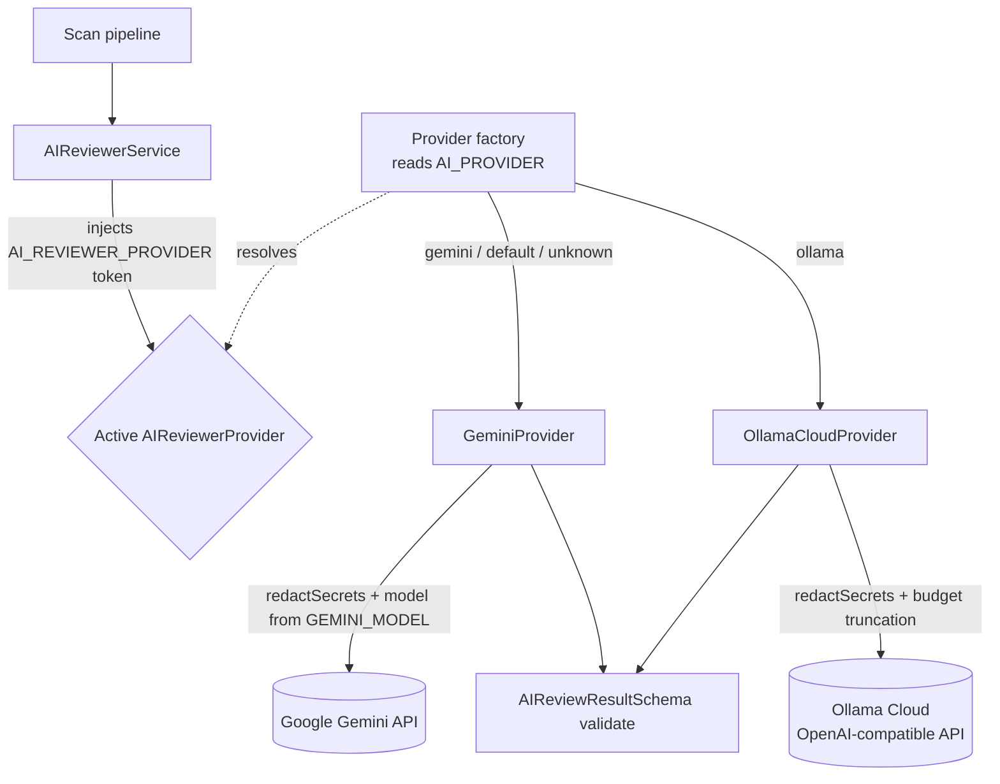
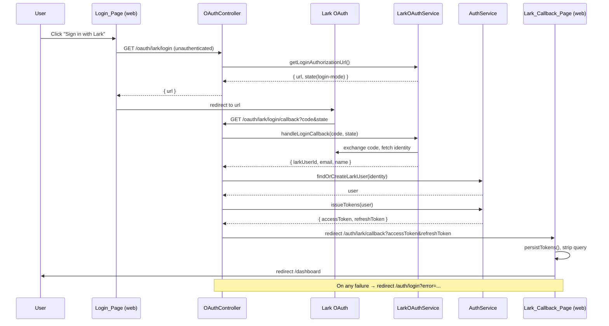

# Design Document

## Overview

This feature extends the SlopShield AI platform across three areas while reusing existing building blocks (the `AIReviewerProvider` interface, `redactSecrets`, the `capFiles`/`maxAnalyzeFiles` caps, `AuthService.issueTokens`, `LarkOAuthService`, and the `User.larkUserId` field):

- **Part A — Pluggable AI provider (Requirements 1, 2, 3):** Introduce an `OllamaCloudProvider` that implements the existing `AIReviewerProvider` interface and talks to the Ollama Cloud OpenAI-compatible chat completions API. Make the active provider selectable via an `AI_PROVIDER` environment variable using a NestJS dependency-injection (DI) token + factory, so `AIReviewerService` depends on the interface rather than a concrete class. Preserve outbound secret redaction, `AIReviewResultSchema` validation, the retry/mock-mode behavior, and per-scan cost caps.

- **Part B — Env-driven Gemini model (Requirement 4):** Ensure the Gemini model identifier is fully driven by `GEMINI_MODEL`, validated/normalized, defaults to a cost-effective free-tier flash model, and is logged on init. Document supported free-tier model values.

- **Part C — Lark login (Requirements 5, 6, 7):** Promote Lark OAuth from a settings-only "connect" flow into a first-class login method. Add an unauthenticated `lark/login` authorize endpoint and a login-mode callback that finds-or-creates a SlopShield user from the Lark identity, issues the standard JWT token pair via `AuthService`, and redirects to a new frontend `/auth/lark/callback` page that persists tokens and routes to the dashboard. The existing settings-based connect flow stays intact for notifications.

### Key Design Decisions

1. **Provider selection via DI token + factory.** Rather than `AIReviewerService` importing `GeminiProvider` directly, we introduce an injection token `AI_REVIEWER_PROVIDER` whose value is resolved by a `useFactory` that reads `AI_PROVIDER`. This keeps the service decoupled from any concrete provider and satisfies Requirement 2.5. Both concrete providers remain in the DI container so the factory can return either instance.

2. **Shared provider scaffolding.** Mock-mode fallback, the 2-retry loop, secret redaction, prompt construction, and `AIReviewResultSchema` validation are common across providers. The Ollama provider mirrors the Gemini provider's structure so behavior stays consistent and testable.

3. **Lark login as a distinct OAuth "mode".** We reuse `LarkOAuthService`'s authorization-URL/state and identity-fetch machinery but add a login-specific state flag so the callback knows to provision a user and issue tokens instead of creating a `ConnectedAccount`. This avoids duplicating the OAuth plumbing and keeps the existing connect flow untouched (Requirement 5.4).

4. **Tokens carried via redirect URL.** The login callback redirects to the frontend with `accessToken`/`refreshToken` as query parameters. This is the simplest cross-origin handoff between the API (Render) and the frontend (Vercel). **Security tradeoff:** tokens in a URL can leak via browser history, referrer headers, and server logs. We accept this tradeoff for now and mitigate by having the frontend immediately strip the query string after reading it (via `history.replaceState`) and by relying on the short access-token lifetime. This is documented as a known limitation; a future hardening would use a one-time code exchange.

## Architecture

### Part A & B — AI Provider Layer



The factory is registered in `AIReviewerModule`. `AIReviewerService` injects the provider by token. Selection precedence:

| `AI_PROVIDER` value | Resolved provider | Notes |
|---------------------|-------------------|-------|
| `"ollama"`          | `OllamaCloudProvider` | Req 2.1 |
| `"gemini"`          | `GeminiProvider`      | Req 2.2 |
| absent / blank      | `GeminiProvider`      | Default (Req 2.3) |
| unrecognized        | `GeminiProvider`      | Warn-and-continue (Req 2.4) |

Value matching is case-insensitive and trimmed for robustness.

### Part C — Lark Login Flow



## Components and Interfaces

### Part A — Ollama Cloud Provider

**`OllamaCloudProvider` (`apps/api/src/ai-reviewer/providers/ollama.provider.ts`)** — implements `AIReviewerProvider`.

- Constructor reads config via `ConfigService`:
  - `OLLAMA_API_KEY` — bearer credential; absent/blank → mock mode (Req 1.6).
  - `OLLAMA_BASE_URL` — default `https://ollama.com` (Req 1.4).
  - `OLLAMA_MODEL` — default cost-effective model `"gpt-oss:20b"` when absent/blank (Req 3.4). (A small/cost-effective model on Ollama Cloud; configurable.)
  - `OLLAMA_MAX_OUTBOUND_CHARS` — outbound content budget, default `60000` (Req 3.2).
- `reviewCode(input)`:
  1. If no API key → return deterministic mock `AIReviewResult` (Req 1.6).
  2. Build code context from `input.files`, applying `redactSecrets` to each file's content (Req 1.3).
  3. Truncate combined outbound content to `OLLAMA_MAX_OUTBOUND_CHARS` (Req 3.3).
  4. POST to `{baseUrl}/v1/chat/completions` with `Authorization: Bearer {key}`, `model`, system + user messages, and JSON-output request.
  5. Parse the assistant message content as JSON and validate against `AIReviewResultSchema` (Req 1.2, 1.8).
  6. On API error or unparseable/invalid response, retry up to 2 more times (3 attempts total); after exhaustion throw a descriptive error (Req 1.7).
- `generateFixPlan(findings, codeContext)` and `summarizeForLark(scanReport)`: mirror Gemini structure, applying `redactSecrets` to all outbound content, with mock-mode fallbacks.

**Endpoint contract (OpenAI-compatible):**

```
POST {OLLAMA_BASE_URL}/v1/chat/completions
Authorization: Bearer {OLLAMA_API_KEY}
Content-Type: application/json

{
  "model": "{OLLAMA_MODEL}",
  "messages": [
    { "role": "system", "content": "<AI_REVIEWER_SYSTEM_PROMPT>" },
    { "role": "user", "content": "<redacted, truncated, delimited file context>" }
  ],
  "temperature": 0.2,
  "stream": false,
  "response_format": { "type": "json_object" }
}
```

Response shape consumed: `choices[0].message.content` (a JSON string parsed into `AIReviewResult`).

### Part A — Provider Selection

**Injection token (`apps/api/src/ai-reviewer/ai-reviewer.constants.ts`):**
```ts
export const AI_REVIEWER_PROVIDER = Symbol("AI_REVIEWER_PROVIDER");
```

**Factory (`apps/api/src/ai-reviewer/providers/provider.factory.ts`):**
```ts
export function resolveAiProvider(
  raw: string | undefined,
  gemini: GeminiProvider,
  ollama: OllamaCloudProvider,
  logger?: { warn(msg: string): void },
): AIReviewerProvider {
  const value = (raw ?? "").trim().toLowerCase();
  if (value === "ollama") return ollama;
  if (value === "gemini" || value === "") return gemini;
  try { logger?.warn(`Unrecognized AI_PROVIDER "${raw}"; defaulting to gemini.`); }
  catch { /* never fail selection on a logging error (Req 2.4) */ }
  return gemini;
}
```

`resolveAiProvider` is a pure function so it can be property-tested independently of the DI container.

**`AIReviewerModule` registration:**
```ts
providers: [
  GeminiProvider,
  OllamaCloudProvider,
  {
    provide: AI_REVIEWER_PROVIDER,
    inject: [ConfigService, GeminiProvider, OllamaCloudProvider],
    useFactory: (config, gemini, ollama) =>
      resolveAiProvider(config.get("AI_PROVIDER"), gemini, ollama, new Logger("AIProviderFactory")),
  },
  AIReviewerService,
],
```

**`AIReviewerService` change:** replace the `GeminiProvider` constructor dependency with `@Inject(AI_REVIEWER_PROVIDER) private readonly provider: AIReviewerProvider` (Req 2.5). No call-site changes — the interface is identical.

### Part B — Env-driven Gemini Model

**`GeminiProvider` change:** introduce a small helper `resolveGeminiModel(raw)` that trims the value and returns the default `"gemini-2.5-flash"` (cost-effective free-tier flash) when absent/blank (Req 4.1, 4.2). Log the resolved model on init (already partially done — extend to always log the resolved value, Req 4.3). Documentation lists supported free-tier values `gemini-2.0-flash`, `gemini-2.5-flash`, `gemini-2.5-pro` (Req 4.4).

> Note: the existing default is `gemini-2.5-pro`. This design changes the default to a flash model to conserve free-tier quota per Requirement 4.2.

### Part C — Lark Login Backend

**`LarkOAuthService` additions:**
- `getLoginAuthorizationUrl(): { url, state }` — generates an authorization URL with a state entry flagged as login-mode (e.g. `{ mode: "login", expiresAt }`) and no associated `userId`. Reuses the existing state store + TTL + cleanup.
- `handleLoginCallback(code, state): { larkUserId, email?, name }` — validates the login-mode state, performs the same app-token → code-exchange → identity-fetch sequence, and returns the Lark identity instead of creating a `ConnectedAccount`. The existing `fetchUserInfo` is extended to also surface `email` when Lark returns it (`data.email` is optional).

The existing `getAuthorizationUrl(userId)` / `handleCallback(code, state)` connect flow is unchanged (Req 5.4).

**`AuthService` addition:**
- `findOrCreateLarkUser(identity: { larkUserId: string; email?: string; name: string }): Promise<User>`:
  1. Look up by `larkUserId`; if found, return it (Req 6.2).
  2. Else, if `email` present, look up by `email`; if found, backfill `larkUserId` on that user and return it (Req 6.2).
  3. Else create a new user populated with `larkUserId`, `email` (or a synthesized placeholder when absent), `name`, role `developer`, and a random unusable password hash (Req 6.3).
- `issueTokens` is made callable from this path (currently `private`; expose via a thin public method `loginWithUser(user)` returning `issueTokens(user)` to satisfy Req 6.4 without widening the private surface unnecessarily).

**`OAuthController` additions:**
- `GET /oauth/lark/login` (no `JwtAuthGuard`) → returns `{ url }` from `getLoginAuthorizationUrl()` (Req 5.3).
- `GET /oauth/lark/login/callback` (no guard):
  1. `handleLoginCallback(code, state)` → identity.
  2. `findOrCreateLarkUser(identity)` → user.
  3. `issueTokens(user)` → token pair (Req 6.4).
  4. Redirect to `{FRONTEND_URL}/auth/lark/callback?accessToken=...&refreshToken=...` (Req 6.5).
  5. On any failure, redirect to `{FRONTEND_URL}/auth/login?error=lark_auth_failed` (Req 6.6).

### Part C — Frontend

**`Login_Page` (`apps/web/src/app/auth/login/page.tsx`):** add a "Sign in with Lark" button below the form. On click it calls `GET /oauth/lark/login`, then `window.location.assign(url)` (Req 5.1, 5.2). It also reads an `?error=` query param to surface a Lark auth error message.

**`Lark_Callback_Page` (`apps/web/src/app/auth/lark/callback/page.tsx`, new):**
1. Read `accessToken`/`refreshToken` from the URL query.
2. If either is missing or an `?error` is present → redirect to `/auth/login?error=...` (Req 7.3).
3. Persist both tokens using the shared `persistTokens` mechanism (Req 7.1). On persist failure → redirect to `/auth/login?error=storage` and do **not** indicate success (Req 7.4).
4. Strip tokens from the URL (`history.replaceState`) and redirect to `/dashboard` (Req 7.2).

To reuse `persistTokens` and a token-driven login, `use-auth.ts` exports a small helper `useLarkCallback()` (or the page imports an exported `persistTokens`) so storage logic stays single-sourced.

## Data Models

No database schema changes are required. The existing `User.larkUserId` field is used for matching/provisioning.

**Lark identity (internal DTO):**
```ts
interface LarkIdentity {
  larkUserId: string;   // Lark open_id / user id
  email?: string;       // present when Lark returns it
  name: string;
}
```

**Provider environment configuration:**

| Variable | Purpose | Default |
|----------|---------|---------|
| `AI_PROVIDER` | Active provider selector | `gemini` |
| `GEMINI_MODEL` | Gemini model id | `gemini-2.5-flash` |
| `OLLAMA_API_KEY` | Ollama Cloud bearer key | (none → mock mode) |
| `OLLAMA_BASE_URL` | OpenAI-compatible base URL | `https://ollama.com` |
| `OLLAMA_MODEL` | Ollama model id | `gpt-oss:20b` |
| `OLLAMA_MAX_OUTBOUND_CHARS` | Per-scan outbound budget | `60000` |

The `AIReviewResult` shape is unchanged and continues to be validated by `AIReviewResultSchema` (summary, findings, recommended_tests, refactor_plan).

## Correctness Properties

*A property is a characteristic or behavior that should hold true across all valid executions of a system — essentially, a formal statement about what the system should do. Properties serve as the bridge between human-readable specifications and machine-verifiable correctness guarantees.*

The pure logic layers of this feature are suitable for property-based testing: provider selection, model resolution, file capping, outbound-budget truncation, secret redaction of outbound content, schema-validity of provider output, retry/error behavior, and Lark find-or-create provisioning. The external HTTP layers (Ollama/Lark/Google APIs) are mocked so these tests exercise our code rather than third-party services. UI presence/navigation, endpoint wiring, and documentation are covered by example/integration/smoke tests in the Testing Strategy.

### Property 1: reviewCode output always validates against the schema

*For any* well-formed model JSON response returned by a mocked Ollama Cloud API, `OllamaCloudProvider.reviewCode` SHALL return a value that successfully validates against `AIReviewResultSchema`.

**Validates: Requirements 1.2, 1.8**

### Property 2: All outbound content is secret-redacted

*For any* review input whose file contents, findings text, or report content contain secret-shaped tokens, the request body actually sent to the Ollama Cloud API SHALL contain no un-redacted secret (i.e. it equals the `redactSecrets`-applied content).

**Validates: Requirements 1.3**

### Property 3: Retry then descriptive error after exhaustion

*For any* sequence of failing responses (HTTP errors, non-JSON bodies, or schema-invalid JSON), `OllamaCloudProvider.reviewCode` SHALL make at most 3 total attempts and SHALL throw a descriptive error only after all attempts are exhausted.

**Validates: Requirements 1.7**

### Property 4: Provider selection mapping is total and resilient

*For any* string value of `AI_PROVIDER`, the provider selector SHALL return the Ollama provider when the value (trimmed, case-insensitive) is `"ollama"`, and SHALL return the Gemini provider for `"gemini"`, blank/absent, or any unrecognized value; selection SHALL never throw, even when the warning logger itself throws.

**Validates: Requirements 2.1, 2.2, 2.3, 2.4**

### Property 5: File cap is an order-preserving prefix within bound

*For any* list of files and any cap `n >= 0`, the capped list SHALL have length at most `n` and SHALL equal the first `n` elements of the original list in order.

**Validates: Requirements 3.1**

### Property 6: Outbound content never exceeds the configured budget

*For any* outbound content and any configured budget `b`, the content actually sent to the Ollama Cloud API SHALL have length at most `b`.

**Validates: Requirements 3.2, 3.3**

### Property 7: Gemini model resolution

*For any* `GEMINI_MODEL` value, the resolved model identifier SHALL be the cost-effective flash default when the value is absent, blank, or whitespace-only, and SHALL be the trimmed input value otherwise.

**Validates: Requirements 4.1, 4.2**

### Property 8: Lark provisioning is idempotent by identity

*For any* Lark identity and any prior user-store state, after `findOrCreateLarkUser` resolves, the store SHALL contain exactly one user carrying that `larkUserId`, and that same user SHALL be the one returned — whether it was matched by `larkUserId`, matched by `email`, or newly created.

**Validates: Requirements 6.2, 6.3**

## Error Handling

- **Ollama API failures (Req 1.7):** retry loop of 3 total attempts on HTTP errors, empty/non-JSON bodies, or `AIReviewResultSchema` validation failures. After exhaustion, throw `Error("Ollama review failed after multiple attempts: ...")`. `generateFixPlan`/`summarizeForLark` fall back to deterministic safe defaults like the Gemini provider rather than throwing.
- **Mock mode (Req 1.6):** absent/blank `OLLAMA_API_KEY` short-circuits to a deterministic schema-valid mock result with no network call.
- **Provider selection (Req 2.4):** unrecognized `AI_PROVIDER` logs a warning and falls back to Gemini; the selector is wrapped so a throwing logger cannot break selection.
- **Outbound budget (Req 3.3):** content exceeding `OLLAMA_MAX_OUTBOUND_CHARS` is truncated before the request; truncation is applied after redaction so secrets are never reintroduced.
- **Lark login callback (Req 6.6):** any failure in state validation, code exchange, identity fetch, provisioning, or token issuance results in a redirect to `/auth/login?error=lark_auth_failed` with no tokens emitted.
- **Frontend callback (Req 7.3, 7.4):** missing token or `?error` → redirect to `/auth/login` with a message; `persistTokens` throwing → redirect to `/auth/login?error=storage` and no dashboard navigation, so a failed storage write never presents as an authenticated session.
- **Secret safety:** all error messages avoid echoing raw file content or tokens.

## Testing Strategy

### Property-Based Tests

Use the existing `fast-check` setup (already used by the API package) with **minimum 100 iterations** per property. Each test is tagged with a comment of the form:

`// Feature: ai-providers-and-lark-login, Property {n}: {property text}`

External HTTP (`fetch`, `GoogleGenAI`, Lark API) and Prisma are mocked/in-memory so properties test our logic, not third-party services.

- **Property 1** — generate varied valid `AIReviewResult` JSON, mock the API to return them, assert `reviewCode` output parses under `AIReviewResultSchema`.
- **Property 2** — generate file contents embedding secret-shaped tokens, capture the outbound request body, assert it contains no raw secret (equals redacted content).
- **Property 3** — generate failing response sequences, assert at most 3 attempts and a thrown descriptive error after exhaustion.
- **Property 4** — generate arbitrary strings (incl. case/whitespace/unknown) plus a throwing logger; assert correct provider returned and selection never throws.
- **Property 5** — generate file lists and caps, assert prefix/length invariant on `capFiles`.
- **Property 6** — generate content of varying sizes and budgets, capture outbound body, assert length ≤ budget.
- **Property 7** — generate arbitrary `GEMINI_MODEL` values incl. blank/whitespace, assert default vs trimmed-value resolution.
- **Property 8** — generate Lark identities and prior in-memory store states (match by id, by email, no match), assert exactly one user with the `larkUserId` and that it is returned.

### Unit / Example Tests

- Ollama: correct endpoint URL + `Authorization: Bearer` header (Req 1.4, INTEGRATION); request `model` matches `OLLAMA_MODEL` (Req 1.5); mock-mode returns deterministic result and makes no call (Req 1.6); default `OLLAMA_MODEL` when blank (Req 3.4).
- Gemini: resolved model logged on init (Req 4.3).
- Lark: identity extraction with/without email from mocked responses (Req 6.1); token pair issued and persisted for a resolved user (Req 6.4); success redirect carries both tokens to `/auth/lark/callback` (Req 6.5); verification failure redirects to login with error (Req 6.6).
- Settings connect flow still creates a `ConnectedAccount` (Req 5.4, regression).

### Frontend Tests

- Login page renders "Sign in with Lark" and navigates to the returned URL on click (Req 5.1, 5.2).
- Callback page: persists both tokens and routes to `/dashboard` on valid input (Req 7.1, 7.2); redirects to login on missing token/error (Req 7.3); redirects to login with storage error and no success on persist failure (Req 7.4).

### Smoke Tests

- `OllamaCloudProvider` instantiates and exposes `reviewCode`/`generateFixPlan`/`summarizeForLark` (Req 1.1).
- `AIReviewerService` receives the `AI_REVIEWER_PROVIDER` token value rather than a concrete class (Req 2.5).
- `GET /oauth/lark/login` responds without authentication (Req 5.3).
- Documentation lists supported free-tier `GEMINI_MODEL` values (Req 4.4).

