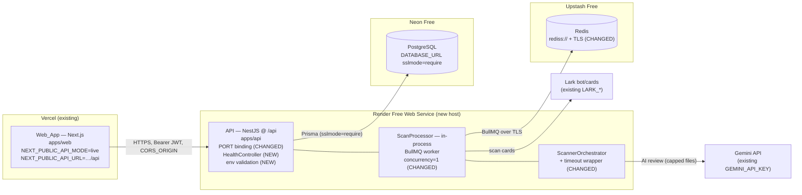

# Design Document — Backend Hosting & Live Mode

## Overview

This design deploys the SlopShield AI backend (`apps/api`, `@slopshield/api`) — a NestJS app that also runs the BullMQ scan worker in-process — to a Render Free Web Service, backs it with Neon Free PostgreSQL and Upstash Free Redis, and flips the already-deployed Vercel frontend (`apps/web`) from mock mode to live mode.

The work is mostly small, targeted code changes plus committed configuration and documentation. It closes three concrete gaps found in the real code:

1. **Port binding** — `apps/api/src/main.ts` listens on `API_PORT` only; Render injects `PORT`. (Requirement 2)
2. **Redis TLS** — the `BullModule.forRootAsync` factory in `apps/api/src/app.module.ts` parses `REDIS_URL` but never enables TLS, which Upstash requires via the `rediss://` scheme. (Requirement 5)
3. **Base-path alignment** — the API mounts everything under the `/api` global prefix while the frontend `api-client` issues paths like `/scans`. (Requirement 6)

It also adds an unauthenticated health endpoint (Requirement 1), boot-time env validation and connection error logging (Requirement 12), free-tier scan guardrails — single concurrency, per-analyzer timeouts, and a heavy-analyzer file cap (Requirement 8) — and cold-start tolerance in the frontend's TanStack Query config (Requirement 9). Provisioning is captured in a committed `render.yaml` blueprint plus a deployment document (Requirements 3, 4, 7, 10, 11).

### Findings from the real codebase (verified)

- **`JwtAuthGuard` is per-controller, not global.** A repository search found no `APP_GUARD` provider and no `app.useGlobalGuards(...)`. Each protected controller (`scans`, `projects`, `rules`, `findings`, `dashboard`, notifications) applies `@UseGuards(JwtAuthGuard)` individually; `AuthController` only guards `GET /auth/me`. **A new `HealthController` with no guard is therefore public by default — no extra work needed to make it unauthenticated.** (Requirement 1.4)
- **`main.ts`** computes `const port = process.env.API_PORT ? parseInt(...) : 3001` and already logs the port — only the resolution needs to add `PORT`. (Requirement 2)
- **Build output path.** `apps/api/tsconfig.json` uses `"module": "commonjs"`, `"outDir": "./dist"`, `"rootDir": "./src"`; `nest-cli.json` has `"sourceRoot": "src"`. `nest build` emits `apps/api/dist/main.js`. Source files import siblings with `.js` specifiers (e.g. `./app.module.js`), which resolve correctly under CommonJS Node resolution. `package.json` already defines `"start:prod": "node dist/main"`. **The correct start entry is `node dist/main.js` (equivalently `node dist/main`) from `apps/api`.** (Requirement 3.3)
- **Login flow already exists and is aligned.** `apps/web/src/app/auth/login/page.tsx` → `useLogin()` (`apps/web/src/hooks/use-auth.ts`) posts to `/auth/login` and stores `res.accessToken` in `localStorage("slopshield_token")`. The `api-client` reads the same key. **No frontend auth/token changes are needed** beyond the base-path env. (Requirement 7)
- **`QueryClient` currently uses `retry: 1`, `staleTime: 30s`, no `retryDelay`** (`apps/web/src/lib/query-client.ts`). Cold-start tolerance needs a small bump in retries and a backoff delay. (Requirement 9)
- **Repo caps already exist.** `github-ingestion.config.ts` enforces `MAX_REPO_BYTES` (100 MB) and `MAX_FILE_COUNT` (5000). The processor already slices `codeFiles` to 10 for AI review — this is generalized into a configurable `MAX_ANALYZE_FILES` cap. (Requirement 8.4)
- **Orchestrator already isolates failures** with `Promise.allSettled` and `isAvailable()` gating, but has **no timeout** — a hung ESLint/TS/Semgrep would stall the whole scan. A timeout wrapper is added. (Requirement 8.3)

---

## Architecture



Legend: **NEW** = added in this feature, **CHANGED** = modified existing code, unlabeled = existing/unchanged.

Request/data flow:

1. The Web_App (live mode) calls `${NEXT_PUBLIC_API_URL}${path}`, e.g. `https://<app>.onrender.com/api` + `/scans` → `…/api/scans`, with a bearer JWT.
2. The API validates required env at boot, connects to Neon (Prisma) and Upstash (BullMQ), and serves `/api/*`. `/api/health` is public.
3. A scan enqueues a `scan-pipeline` job; the in-process `ScanProcessor` (concurrency 1) runs `ScannerOrchestrator.runAll` (each analyzer time-boxed), bounds heavy-analyzer files via `MAX_ANALYZE_FILES`, runs Gemini AI review when configured, scores, persists, and pushes a Lark card.
4. Render health-checks `/api/health`; on idle it spins down and cold-starts (~1 min) on the next request, which the frontend retries through.

---

## Components and Interfaces

### 1. HealthController + HealthModule (NEW) — Requirement 1

A minimal public controller. Because no global guard exists, omitting `@UseGuards` makes it unauthenticated. Mounted under the `/api` global prefix → `GET /api/health`.

```typescript
// apps/api/src/health/health.controller.ts
import { Controller, Get } from "@nestjs/common";

@Controller("health") // becomes /api/health via global prefix
export class HealthController {
  private readonly startedAt = Date.now();

  @Get()
  public check(): { status: "ok"; timestamp: string; uptime: number } {
    return {
      status: "ok",
      timestamp: new Date().toISOString(),
      uptime: Math.floor((Date.now() - this.startedAt) / 1000),
    };
  }
}
```

```typescript
// apps/api/src/health/health.module.ts
import { Module } from "@nestjs/common";
import { HealthController } from "./health.controller.js";

@Module({ controllers: [HealthController] })
export class HealthModule {}
```

`HealthModule` is added to `AppModule.imports`. (Note `.js` specifiers match the existing source convention.)

### 2. Port resolution + env validation util (NEW/CHANGED) — Requirements 2, 12

A pure helper module keeps the precedence logic and required-env check testable independently of the Nest bootstrap.

```typescript
// apps/api/src/common/env.ts
export function resolvePort(env: NodeJS.ProcessEnv = process.env): number {
  const raw = env.PORT ?? env.API_PORT; // PORT precedence over API_PORT
  const parsed = raw ? parseInt(raw, 10) : NaN;
  return Number.isFinite(parsed) && parsed > 0 ? parsed : 3001; // default
}

const REQUIRED_IN_PRODUCTION = [
  "DATABASE_URL",
  "REDIS_URL",
  "JWT_SECRET",
  "CORS_ORIGIN",
] as const;

export function findMissingEnv(env: NodeJS.ProcessEnv = process.env): string[] {
  if (env.NODE_ENV !== "production") return [];
  return REQUIRED_IN_PRODUCTION.filter((k) => !env[k] || env[k]!.trim() === "");
}
```

`main.ts` calls `findMissingEnv()` and logs a descriptive error naming each missing variable before listening, and uses `resolvePort()` for the listen port (see Low-Level Design).

### 3. Redis TLS connection factory (CHANGED) — Requirement 5

The `BullModule.forRootAsync` factory derives `tls: {}` when the scheme is `rediss:`. Extracted into a pure `buildRedisConnection` helper for property testing.

```typescript
// apps/api/src/common/redis.ts
export interface RedisConnectionOptions {
  host: string;
  port: number;
  password?: string;
  tls?: Record<string, never>; // {} enables TLS in ioredis/BullMQ
  maxRetriesPerRequest: null; // required by BullMQ workers
}

export function buildRedisConnection(redisUrl: string): RedisConnectionOptions {
  const url = new URL(redisUrl);
  const conn: RedisConnectionOptions = {
    host: url.hostname,
    port: parseInt(url.port, 10) || 6379, // default port
    password: url.password || undefined,
    maxRetriesPerRequest: null,
  };
  if (url.protocol === "rediss:") {
    conn.tls = {}; // empty object => TLS enabled (SNI from host)
  }
  return conn;
}
```

The factory becomes `useFactory: (config) => ({ connection: buildRedisConnection(config.get("REDIS_URL", "redis://localhost:6379")) })`.

### 4. ScannerOrchestrator timeout wrapper + concurrency (CHANGED) — Requirement 8

A `withTimeout` wrapper races each `analyzer.analyze()` against a configurable `ANALYZER_TIMEOUT_MS`; on timeout it resolves to a failed `AnalysisResult` (never rejects), so `Promise.allSettled` keeps the scan alive with partial findings.

```typescript
// inside scanner.orchestrator.ts
private readonly analyzerTimeoutMs =
  Number(process.env.ANALYZER_TIMEOUT_MS ?? 45_000);

private async runWithTimeout(
  analyzer: StaticAnalyzer,
  context: AnalysisContext,
): Promise<AnalysisResult> {
  let timer: NodeJS.Timeout;
  const timeout = new Promise<AnalysisResult>((resolve) => {
    timer = setTimeout(
      () =>
        resolve({
          analyzerName: analyzer.name,
          success: false,
          findings: [],
          error: `Analyzer timed out after ${this.analyzerTimeoutMs}ms`,
          durationMs: this.analyzerTimeoutMs,
        }),
      this.analyzerTimeoutMs,
    );
  });
  try {
    return await Promise.race([analyzer.analyze(context), timeout]);
  } finally {
    clearTimeout(timer!);
  }
}
```

`runAll` calls `this.runWithTimeout(analyzer, context)` in place of the bare `analyzer.analyze(context)`. The existing `try/catch` + `Promise.allSettled` + `isAvailable()` gating are retained, so a timed-out, thrown, or unavailable analyzer is recorded and skipped without failing the scan.

Worker concurrency is set on the `@Processor` decorator options (`@nestjs/bullmq` forwards these to the BullMQ `Worker`):

```typescript
@Processor("scan-pipeline", { concurrency: 1 })
export class ScanProcessor extends WorkerHost { … }
```

### 5. Heavy-analyzer file cap (CHANGED) — Requirement 8.4

A configurable cap bounds files sent to the memory/CPU-heavy analyzers (TypeScript, Semgrep, AI review). The existing hard-coded `.slice(0, 10)` for AI review is generalized.

```typescript
// apps/api/src/common/env.ts (continued)
export function capFiles<T>(files: T[], max: number): T[] {
  return max >= 0 ? files.slice(0, max) : files;
}
export const maxAnalyzeFiles = (): number =>
  Number(process.env.MAX_ANALYZE_FILES ?? 50);
```

The processor uses `capFiles(codeFiles, maxAnalyzeFiles())` for AI review, and passes a capped file list into the orchestrator context for the heavy analyzers.

### 6. render.yaml blueprint (NEW) — Requirements 3, 4

Committed at repo root; see Low-Level Design for the full file. Build installs at the root (pnpm workspace), builds workspace deps first via Turbo's `^build`, generates the Prisma client, and migrates on deploy; start runs the compiled entry from `apps/api`.

### 7. Frontend QueryClient retry (CHANGED) — Requirement 9

`makeQueryClient` gets a higher retry count and an exponential `retryDelay` so the first request survives a ~1 min Render cold start.

### 8. Frontend base-path note (config) — Requirement 6

**Decision: no code change required.** The operator sets `NEXT_PUBLIC_API_URL = https://<app>.onrender.com/api` (including `/api`, no trailing slash). `api-client` concatenates `${config.apiUrl}${path}` → `…/api` + `/scans` = `…/api/scans`. `config.ts` already `.trim()`s the value. As a low-cost defensive guarantee we document that the URL must not end with a slash; optionally `config.ts` could strip a trailing slash (`apiUrl.replace(/\/$/, "")`), but this is left out to keep the change minimal and is recorded as the chosen tradeoff.

---

## Low-Level Design

### `apps/api/src/main.ts` — PORT + env validation (Requirements 2, 12)

```typescript
import { resolvePort, findMissingEnv } from "./common/env.js";
// …
async function bootstrap(): Promise<void> {
  const logger = new Logger("Bootstrap");

  const missing = findMissingEnv();
  if (missing.length > 0) {
    logger.error(
      `Missing required environment variable(s) in production: ${missing.join(", ")}`,
    );
    throw new Error(`Missing required env: ${missing.join(", ")}`);
  }

  const app = await NestFactory.create(AppModule, {
    logger: ["error", "warn", "log", "debug", "verbose"],
  });

  app.use(helmet());
  app.use(compression());

  const corsOrigin = process.env.CORS_ORIGIN || "http://localhost:3000";
  app.enableCors({
    origin: corsOrigin,
    credentials: true,
    methods: ["GET", "POST", "PUT", "PATCH", "DELETE", "OPTIONS"],
    allowedHeaders: ["Content-Type", "Authorization", "X-Request-ID"],
  });

  app.setGlobalPrefix("api");
  app.useGlobalFilters(new HttpExceptionFilter());
  app.useGlobalInterceptors(new LoggingInterceptor());

  const port = resolvePort(); // PORT ?? API_PORT ?? 3001
  await app.listen(port, "0.0.0.0"); // bind all interfaces for Render
  logger.log(`🛡️  SlopShield AI API listening on port ${port} (prefix /api)`);
  logger.log(`📊 Environment: ${process.env.NODE_ENV || "development"}`);
  logger.log(`🌐 CORS origin: ${corsOrigin}`);
}
```

### `apps/api/src/app.module.ts` — Redis TLS factory (Requirement 5)

```typescript
import { buildRedisConnection } from "./common/redis.js";
// …
BullModule.forRootAsync({
  imports: [ConfigModule],
  inject: [ConfigService],
  useFactory: (config: ConfigService) => ({
    connection: buildRedisConnection(
      config.get<string>("REDIS_URL", "redis://localhost:6379"),
    ),
  }),
}),
```

Also add `HealthModule` to `imports`. Prisma connection error logging is added in `PrismaService.onModuleInit` (try/catch around `$connect()` logging a descriptive error — Requirement 12.2); Redis connection error logging via a BullMQ `connection`/ioredis `error` listener (Requirement 12.3).

### `apps/api/src/health/health.controller.ts`

(Full code shown in Components §1.)

### `apps/api/src/scanner/scanner.orchestrator.ts` — timeout wrapper

(Full `runWithTimeout` shown in Components §4; `runAll` swaps `analyzer.analyze(context)` for `this.runWithTimeout(analyzer, context)`.)

### `apps/api/src/scan/scan.processor.ts` — concurrency + file cap

```typescript
@Processor("scan-pipeline", { concurrency: 1 })
export class ScanProcessor extends WorkerHost {
  // …
  // Stage 3 (SCANNING): bound heavy-analyzer input
  analyzableFiles = capFiles(
    classified.filter((f) => f.fileType !== "dependency").map((f) => f.path),
    maxAnalyzeFiles(),
  );
  staticFindings = await this.orchestrator.runAll({
    scanDir,
    files: analyzableFiles,
    scanId,
  });
  // …
  // Stage 4 (AI review): generalized cap replaces hard-coded slice(0, 10)
  codeFiles = classified.filter(
    (f) => f.fileType === "frontend" || f.fileType === "backend",
  );
  aiFiles = capFiles(codeFiles, maxAnalyzeFiles());
  // …use aiFiles instead of codeFiles
}
```

> Note: in `QUEUE_MODE=memory` the `concurrency` option is inert (the in-memory `queueProvider` calls `processor.process` directly), so local dev is unaffected.

### `render.yaml` (repo root) — Requirements 3, 4

```yaml
services:
  - type: web
    name: slopshield-api
    runtime: node
    plan: free
    region: oregon
    rootDir: . # build from monorepo root so pnpm workspaces resolve
    healthCheckPath: /api/health
    buildCommand: |
      corepack enable
      pnpm install --frozen-lockfile
      pnpm --filter @slopshield/api... build      # builds @slopshield/shared + scanner-plugins first (Turbo ^build)
      pnpm --filter @slopshield/api exec prisma generate
    preDeployCommand: pnpm --filter @slopshield/api exec prisma migrate deploy
    startCommand: node apps/api/dist/main.js
    envVars:
      - key: NODE_VERSION
        value: 20.18.0
      - key: NODE_ENV
        value: production
      - key: DATABASE_URL
        sync: false
      - key: REDIS_URL
        sync: false
      - key: JWT_SECRET
        sync: false
      - key: GEMINI_API_KEY
        sync: false
      - key: LARK_APP_ID
        sync: false
      - key: LARK_APP_SECRET
        sync: false
      - key: LARK_WEBHOOK_VERIFICATION_TOKEN
        sync: false
      - key: LARK_DEFAULT_CHAT_ID
        sync: false
      - key: CORS_ORIGIN
        sync: false
      - key: ANALYZER_TIMEOUT_MS
        value: "45000"
      - key: MAX_ANALYZE_FILES
        value: "50"
```

Notes:

- The `pnpm --filter @slopshield/api... build` selector (note the trailing `...`) builds `@slopshield/api` **and its workspace dependencies** (`@slopshield/shared`, `@slopshield/scanner-plugins`) first, matching Turbo's `^build` dependency. This guarantees `apps/api/dist/main.js` exists at start.
- `preDeployCommand` runs `prisma migrate deploy` on each deploy; if it exits non-zero the deploy fails (Requirement 12.4). Equivalently the migrate may be chained into `startCommand` with `&&` for hosts without a pre-deploy hook; `preDeployCommand` is preferred because it runs once per deploy rather than on every cold start.
- **Dashboard-equivalent settings** (if not using the blueprint): Environment = Node; Build Command and Start Command as above; Health Check Path = `/api/health`; Node version via `NODE_VERSION` env or `.nvmrc`; Root Directory = repo root; add each env var under Environment with the `production` `NODE_ENV` and `CORS_ORIGIN` = Vercel origin.

### Neon connection nuance (Requirement 4)

- App `DATABASE_URL` uses the **pooled** Neon connection string (host contains `-pooler`) with `?sslmode=require` — best for many short-lived serverless-style connections.
- `prisma migrate deploy` should run against the **direct (non-pooled)** connection (PgBouncer transaction pooling can break migration advisory locks/DDL). Capture this by setting `directUrl` in `schema.prisma` (optional) or by having the `preDeployCommand` use a `DIRECT_DATABASE_URL`. Minimum viable path: a single pooled URL with `sslmode=require` works for the small migration set here; the nuance is documented so the operator can split URLs if a migration hangs.

### `apps/web/src/lib/query-client.ts` — cold-start retries (Requirement 9)

```typescript
export function makeQueryClient(): QueryClient {
  return new QueryClient({
    defaultOptions: {
      queries: {
        staleTime: 30 * 1000,
        retry: 3, // survive ~1 min Render cold start (was 1)
        retryDelay: (attempt) => Math.min(1000 * 2 ** attempt, 15_000),
        refetchOnWindowFocus: false,
      },
    },
  });
}
```

While retries are in flight the query stays in its pending/loading state, so the UI shows a loader rather than an error during wake (Requirement 9.1–9.2).

---

## Data Models

**No Prisma schema change.** The existing `postgresql` datasource via `DATABASE_URL` and the migrations under `apps/api/prisma/migrations` are the source of truth and apply unchanged to Neon. The only model-adjacent concern is the connection string (TLS/pooling), handled via env, not schema.

### Environment Variable Contract

| Variable                          | Where             | Required (prod)  | Example / Note                                          |
| --------------------------------- | ----------------- | ---------------- | ------------------------------------------------------- |
| `PORT`                            | Render (injected) | provided by host | Render sets this; takes precedence over `API_PORT`      |
| `API_PORT`                        | API               | no               | Local fallback; `3001` default if both unset            |
| `DATABASE_URL`                    | Render            | yes              | Neon pooled URL + `?sslmode=require`                    |
| `DIRECT_DATABASE_URL`             | Render (migrate)  | optional         | Neon direct (non-pooled) URL for `migrate deploy`       |
| `REDIS_URL`                       | Render            | yes              | Upstash `rediss://…` → TLS enabled                      |
| `JWT_SECRET`                      | Render            | yes              | 64-char random string                                   |
| `GEMINI_API_KEY`                  | Render            | no (degrades)    | Enables AI review when present                          |
| `LARK_APP_ID`                     | Render            | no               | Lark bot/cards                                          |
| `LARK_APP_SECRET`                 | Render            | no               | Lark bot/cards                                          |
| `LARK_WEBHOOK_VERIFICATION_TOKEN` | Render            | no               | Lark webhook                                            |
| `LARK_DEFAULT_CHAT_ID`            | Render            | no               | Lark default chat                                       |
| `CORS_ORIGIN`                     | Render            | yes              | Vercel origin (no trailing slash)                       |
| `NODE_ENV`                        | Render            | yes              | `production`                                            |
| `ANALYZER_TIMEOUT_MS`             | Render            | no               | Default `45000`                                         |
| `MAX_ANALYZE_FILES`               | Render            | no               | Default `50`                                            |
| `NODE_OPTIONS`                    | Render            | no               | Optional `--max-old-space-size=460` on 512 MB free tier |
| `NEXT_PUBLIC_API_MODE`            | Vercel            | yes (web)        | `live`                                                  |
| `NEXT_PUBLIC_API_URL`             | Vercel            | yes (web)        | `https://<app>.onrender.com/api` (include `/api`)       |

No credential values are committed; `.env` is gitignored and `.env.example` carries names/placeholders only (Requirement 10).

---

## Correctness Properties

_A property is a characteristic or behavior that should hold true across all valid executions of a system — essentially, a formal statement about what the system should do. Properties serve as the bridge between human-readable specifications and machine-verifiable correctness guarantees._

These properties target the pure, input-varying logic extracted in this design. Provider provisioning, documentation, CORS/JWT wiring, and external-service connections are verified by integration/smoke/example tests (see Testing Strategy), not property tests.

### Property 1: Port precedence

_For any_ environment, `resolvePort(env)` returns the numeric value of `PORT` when `PORT` is a valid positive integer; otherwise the value of `API_PORT` when it is a valid positive integer; otherwise `3001`.

**Validates: Requirements 2.1, 2.2, 2.3**

### Property 2: Redis URL → connection derivation and TLS decision

_For any_ well-formed `REDIS_URL`, `buildRedisConnection(url)` derives `host`, `password` (omitted when absent), and `port` (defaulting to `6379` when no explicit port), AND sets `tls` to an object **if and only if** the URL scheme is `rediss:` (no `tls` for `redis:`).

**Validates: Requirements 5.1, 5.2, 5.3, 5.4**

### Property 3: Live base-path join is exactly one `/api/...`

_For any_ base URL that ends with `/api` and has no trailing slash, and _any_ request path beginning with a single `/`, the concatenation `base + path` contains no double slashes outside the protocol and yields exactly one `/api/<path>` segment.

**Validates: Requirements 6.2**

### Property 4: Analyzer timeout/failure degrades gracefully

_For any_ set of analyzers where some succeed quickly, some throw, some are unavailable, and some hang past `ANALYZER_TIMEOUT_MS`, `ScannerOrchestrator.runAll` resolves (never rejects) and the returned findings are exactly the union of the fast-succeeding analyzers' findings, with hung/failed/unavailable analyzers excluded.

**Validates: Requirements 8.3, 8.5**

### Property 5: Heavy-analyzer file cap is bounded and order-preserving

_For any_ list of files and any non-negative cap `n`, `capFiles(files, n)` returns at most `n` elements, all drawn from the input in their original order (a prefix of the input).

**Validates: Requirements 8.4**

### Property 6: Missing-required-env detection in production

_For any_ environment with `NODE_ENV === "production"`, `findMissingEnv(env)` returns exactly the set of required variables that are absent or blank (and an empty list when all are present); for any non-production environment it returns an empty list.

**Validates: Requirements 12.1**

---

## Error Handling

| Failure                                        | Detection                                                            | Behavior                                                                               | Requirement |
| ---------------------------------------------- | -------------------------------------------------------------------- | -------------------------------------------------------------------------------------- | ----------- |
| Missing required env at boot                   | `findMissingEnv()` in `main.ts`                                      | Log error naming each missing variable; throw to abort boot (non-zero exit)            | 12.1        |
| Neon DB connection failure                     | try/catch around Prisma `$connect()` in `PrismaService.onModuleInit` | Log descriptive DB connection error (host redacted)                                    | 12.2        |
| Upstash Redis connection failure               | ioredis/BullMQ `error` event listener                                | Log descriptive Redis connection error                                                 | 12.3        |
| `prisma migrate deploy` fails                  | `preDeployCommand` exit code                                         | Deploy fails with non-zero status; migration error in deploy logs                      | 12.4        |
| Analyzer hangs/throws/unavailable              | `runWithTimeout` + `Promise.allSettled` + `isAvailable()`            | Analyzer recorded as failed/skipped; scan continues with partial findings              | 8.3, 8.5    |
| Gemini absent or AI review error               | existing try/catch + `GEMINI_API_KEY` gate                           | Deterministic analyzer findings still produced and saved                               | 8.6         |
| Render cold start (request fails while waking) | TanStack Query retry policy                                          | Loading state shown; request retried (≥1, up to 3 with backoff) before surfacing error | 9.1, 9.2    |
| Live mode with empty `NEXT_PUBLIC_API_URL`     | `assertLiveConfig()` (existing)                                      | Throw descriptive config error; `fetch` never called                                   | 6.5         |
| Unauthorized request to protected route        | `JwtAuthGuard` (existing, per-controller)                            | HTTP 401                                                                               | 7.4         |

---

## Testing Strategy

CI (`.github/workflows/ci.yml`) runs whole-monorepo `format:check`, `build`, `typecheck`, and `lint` on Node 20 with pnpm; **all changes must keep CI green.** New tests live beside existing ones and run under the API's Jest (`fast-check` is already a devDependency) and the web app's test setup.

### Property-based tests (PBT applies — pure, input-varying logic)

Use `fast-check`, **minimum 100 iterations** per property. Each test is tagged `// Feature: backend-hosting-live-mode, Property <n>: <text>`.

| Property                 | Test focus                                                      | Generators                                                                                           |
| ------------------------ | --------------------------------------------------------------- | ---------------------------------------------------------------------------------------------------- |
| 1 — Port precedence      | `resolvePort`                                                   | `{ PORT?, API_PORT? }` with numeric, empty, non-numeric, and absent values                           |
| 2 — Redis derivation/TLS | `buildRedisConnection`                                          | URLs varying scheme (`redis:`/`rediss:`), explicit/omitted port, with/without password, random hosts |
| 3 — Base-path join       | join model of `${apiUrl}${path}`                                | bases ending `/api` (no trailing slash) + paths with single leading `/`                              |
| 4 — Graceful degradation | `runWithTimeout` + `runAll` with mock analyzers and fake timers | arrays of mock analyzers: fast-success / throw / unavailable / hang                                  |
| 5 — File cap             | `capFiles`                                                      | random arrays + non-negative caps (including 0 and cap > length)                                     |
| 6 — Env validation       | `findMissingEnv`                                                | env objects with random subsets of required keys removed; `NODE_ENV` prod vs non-prod                |

### Unit / example tests

- `HealthController.check()` returns `{ status: "ok", timestamp, uptime }` (1.3).
- Bootstrap logs the chosen port (2.4) — spy on `Logger`.
- Orchestrator registers the expected analyzer suite (8.1); processor still persists static findings when `GEMINI_API_KEY` is absent (8.6).
- `@Processor` options expose `concurrency: 1` (8.2).
- Existing `api-client.live.test.ts` already covers live-mode fetch (6.3) and empty-URL throw without fetch (6.5) — keep passing.
- QueryClient default retry resolves to ≥1 and `retryDelay` increases (9.2).
- Prisma/Redis connect rejection emits a descriptive log (12.2, 12.3) — mock-based.

### Integration tests (Nest + supertest)

- `GET /api/health` → 200, healthy JSON, **no** Authorization header required (1.1, 1.2, 1.4).
- `OPTIONS` preflight with `Origin: <CORS_ORIGIN>` echoes the origin with credentials (7.1).
- Protected route without bearer → 401; with valid bearer → processed (7.3, 7.4).
- `POST /api/auth/login` with seeded creds → `accessToken` (7.2), against a test Postgres.
- `prisma migrate deploy` against a throwaway Postgres applies all migrations (4.3); boot connects with a valid `DATABASE_URL` (4.4).

### Smoke / inspection (not unit-tested)

- `render.yaml` parses and contains `buildCommand`, `startCommand`, `healthCheckPath`, and the env var names (3.x).
- Deployment doc completeness and env-name listing (3.6, 7.5, 9.3, 10.2–10.3, 11.x).
- Repo contains no committed secret values (10.1).
- Live Upstash/Neon connections (5.5, 4.4 end-to-end) and the live-mode flip are operator-performed and verified manually, not in CI.

---

## Deployment

1. **Provision** Neon (Postgres), Upstash (Redis, copy the `rediss://` URL), and a Render account.
2. **Render service** from the committed `render.yaml` (or dashboard-equivalent settings): runtime Node `20.x`, root dir = repo root, build/preDeploy/start commands as above, health check `/api/health`.
3. **Env vars** on Render: all `sync: false` secrets plus `NODE_ENV=production` and `CORS_ORIGIN=<Vercel origin>`. `DATABASE_URL` includes `?sslmode=require`; `REDIS_URL` is the `rediss://` URL.
4. **Migrate** runs automatically via `preDeployCommand` (`prisma migrate deploy`); a non-zero exit fails the deploy. Seed demo users (`alice/bob/charlie/admin @example.com`, password `password123`) if needed.
5. **Verify** `GET /api/health` returns 200 and `POST /api/auth/login` issues a JWT.
6. **Live-mode flip** on Vercel: set `NEXT_PUBLIC_API_MODE=live` and `NEXT_PUBLIC_API_URL=https://<app>.onrender.com/api` (include `/api`, no trailing slash), then redeploy. The mock banner disappears and data loads from the API.
7. **Cold start**: document that Render Free spins down after ~15 min idle and wakes in ~1 min; the first request may be slow but the frontend retries through it.

### Memory note (Render Free ~512 MB)

Concurrency `1` keeps a single scan in memory. Optionally set `NODE_OPTIONS=--max-old-space-size=460` to cap V8 heap below the container limit. Very large repositories may still approach OOM under the heavy analyzers; the file cap mitigates this, and reliable full scans on large repos are a **Stage 2** concern.

### Stage 2 upgrade path (future, out of scope)

Always-on paid Render/Railway workers, paid PostgreSQL/Redis, a separately extracted worker process (instead of in-process), and custom domains for the API and Web_App.

---

## Out of Scope

- Stage 2 production hosting (paid always-on workers, paid Postgres/Redis).
- Extracting the scan worker into a separate process/service (it runs in-process with guardrails this milestone).
- Custom domains for the API or Web_App.
- Operator creation of provider accounts and execution of hosted provisioning (performed by following the deployment doc).
