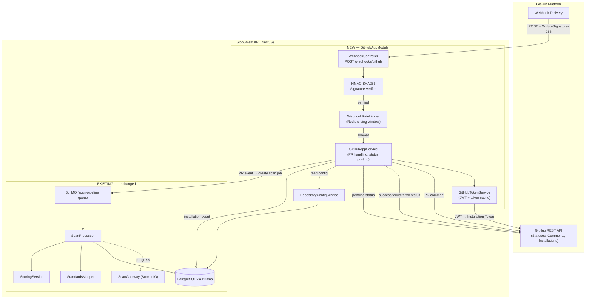

# Design Document

## Overview

This feature adds **automated GitHub PR status checks** to SlopShield AI by implementing a GitHub App integration layer that receives webhook events, triggers the existing scan pipeline, and posts commit statuses and PR comments back to GitHub. The system transforms SlopShield from a manually triggered tool into an automated quality gate that integrates directly into the GitHub pull request workflow.

The architecture introduces a new `GitHubAppModule` containing:

1. **WebhookController** — receives GitHub webhook POSTs, verifies HMAC-SHA256 signatures, and dispatches events asynchronously.
2. **GitHubAppService** — orchestrates installation lifecycle, PR event handling, scan triggering, status posting, and comment posting.
3. **GitHubTokenService** — manages JWT generation and Installation Token caching with proactive refresh.
4. **WebhookRateLimiter** — enforces per-installation and global concurrency limits on scan-triggering events.
5. **RepositoryConfigService** — manages per-repository configuration (threshold, scan mode, auto-block toggle).

The scan itself flows through the **existing, unchanged** `scan-pipeline` BullMQ queue and `ScanProcessor`. PR-triggered scans produce the same findings, scoring, and reports as manual scans. The new layer adds a post-processing hook: when a scan completes for a PR-triggered job, the system posts the appropriate commit status and PR comment.

### Key Design Decisions

| Decision | Choice | Rationale |
|----------|--------|-----------|
| Webhook processing model | Acknowledge immediately, process via BullMQ | GitHub requires response within 10s; async processing prevents timeouts |
| Status posting trigger | Event-driven via BullMQ job completion listener | Decouples status posting from scan pipeline; pipeline remains source-type-agnostic |
| Token management | In-memory cache with 5-min-before-expiry refresh | Installation tokens expire in 1 hour; caching avoids repeated JWT exchange per API call |
| Rate limiting approach | Redis-backed sliding window per installation + global semaphore | Consistent across API instances; survives restarts |
| Scan supersession | Cancel previous pending job on `synchronize` | Prevents wasted compute on outdated commits |
| Neutral status on failure | GitHub `error` state (not `failure`) | Distinguishes scanner issues from deliberate code quality failures in branch protection |

## Architecture



**Component Status:**
- **NEW**: `WebhookController`, `GitHubAppService`, `GitHubTokenService`, `WebhookRateLimiter`, `RepositoryConfigService`, Prisma models (`GitHubInstallation`, `RepositoryConfig`, `PrScanMetadata`), environment config validation.
- **EXISTING (unchanged)**: BullMQ queue, `ScanProcessor`, `ScoringService`, `StandardsMapper`, `ScanGateway`, REST endpoints, Prisma `ScanJob`/`Finding` models.
- **MODIFIED (minimal)**: `ScanProcessor` emits a `scan.completed` event (NestJS EventEmitter) with the scan ID after the scoring stage, which `GitHubAppService` listens to for posting statuses and comments.

## Components and Interfaces

### WebhookController (new)

Located at `apps/api/src/github-app/webhook.controller.ts`. Handles incoming GitHub webhook HTTP requests.

```typescript
import { Controller, Post, Req, Res, RawBodyRequest, HttpCode } from '@nestjs/common';
import { Request, Response } from 'express';

@Controller('webhooks/github')
export class WebhookController {
  constructor(
    private readonly githubAppService: GitHubAppService,
    private readonly rateLimiter: WebhookRateLimiter,
  ) {}

  /**
   * Receives all GitHub webhook events. Verifies HMAC-SHA256 signature,
   * acknowledges immediately with 200, and dispatches async processing.
   * Returns 401 on invalid signature, 503 if webhook secret not configured,
   * 429 if rate-limited.
   */
  @Post()
  @HttpCode(200)
  async handleWebhook(
    @Req() req: RawBodyRequest<Request>,
    @Res() res: Response,
  ): Promise<void>;
}
```

### GitHubAppService (new)

Located at `apps/api/src/github-app/github-app.service.ts`. Core orchestration service.

```typescript
@Injectable()
export class GitHubAppService {
  /**
   * Handle a verified pull_request event. Extracts PR metadata, applies
   * rate limiting, creates scan job, posts pending status.
   */
  async handlePullRequestEvent(payload: PullRequestEventPayload): Promise<void>;

  /**
   * Handle installation created/deleted events.
   */
  async handleInstallationEvent(payload: InstallationEventPayload): Promise<void>;

  /**
   * Handle installation_repositories added/removed events.
   */
  async handleInstallationRepositoriesEvent(payload: InstallationReposEventPayload): Promise<void>;

  /**
   * Called when a PR-triggered scan completes. Posts commit status and PR comment.
   * Listens to 'scan.completed' event from ScanProcessor.
   */
  @OnEvent('scan.completed')
  async onScanCompleted(event: { scanId: string }): Promise<void>;

  /**
   * Determine the commit status state based on score, threshold, and auto-block.
   * Pure function suitable for property testing.
   */
  determineCommitStatus(
    score: number,
    threshold: number,
    statusResult: string,
    autoBlockEnabled: boolean,
  ): 'success' | 'failure' | 'error';

  /**
   * Build the PR comment markdown body from scan results.
   * Pure function suitable for property testing.
   */
  buildPrCommentBody(scanResult: ScanResultSummary): string;

  /**
   * Post a commit status to GitHub with retry logic (3 attempts, exponential backoff).
   */
  async postCommitStatus(params: PostStatusParams): Promise<void>;

  /**
   * Post or update a PR comment with scan summary.
   */
  async postOrUpdatePrComment(params: PostCommentParams): Promise<void>;
}
```

### GitHubTokenService (new)

Located at `apps/api/src/github-app/github-token.service.ts`. Manages GitHub App authentication.

```typescript
@Injectable()
export class GitHubTokenService {
  /** In-memory cache: installationId → { token, expiresAt } */
  private tokenCache = new Map<number, { token: string; expiresAt: Date }>();

  /**
   * Generate a JWT signed with the App's private key.
   * Claims: iss=APP_ID, iat=now-60s, exp=now+10min.
   */
  generateAppJwt(): string;

  /**
   * Get an installation token, serving from cache if valid (>5min until expiry).
   * On cache miss or near-expiry, exchanges JWT for a new token via GitHub API.
   */
  async getInstallationToken(installationId: number): Promise<string>;

  /**
   * Validate that required GitHub App credentials are present.
   * Returns { status: 'configured' | 'skipped' | 'error', message?: string }.
   */
  validateCredentials(): { status: string; message?: string };
}
```

### WebhookRateLimiter (new)

Located at `apps/api/src/github-app/webhook-rate-limiter.service.ts`. Redis-backed rate limiting.

```typescript
@Injectable()
export class WebhookRateLimiter {
  /**
   * Check if a scan-triggering event from the given installation is allowed.
   * Enforces per-installation limit (default 60/hour) and global concurrent limit (default 10).
   * Returns { allowed: boolean; reason?: 'per-installation' | 'global-limit' | 'queue-full' }.
   */
  async checkAllowed(installationId: number): Promise<RateLimitResult>;

  /**
   * Record that a scan has started (increments global concurrent count).
   */
  async recordScanStart(installationId: number): Promise<void>;

  /**
   * Record that a scan has completed (decrements global concurrent count).
   */
  async recordScanEnd(installationId: number): Promise<void>;

  /**
   * Check if an event type is exempt from rate limiting.
   * Installation lifecycle events are always exempt.
   */
  isExempt(eventType: string): boolean;
}
```

### RepositoryConfigService (new)

Located at `apps/api/src/github-app/repository-config.service.ts`.

```typescript
@Injectable()
export class RepositoryConfigService {
  /** Default config applied when no per-repo config exists */
  static readonly DEFAULTS = {
    scanThreshold: 70,
    scanMode: 'full' as ScanMode,
    autoBlockEnabled: true,
  };

  /**
   * Get config for a repository, returning defaults if none exists.
   */
  async getConfig(repoFullName: string): Promise<RepositoryConfig>;

  /**
   * Create or update a repository's config. Validates threshold [0,100]
   * and scanMode against allowed values. Records change in AuditLog.
   */
  async upsertConfig(repoFullName: string, update: Partial<RepositoryConfigInput>): Promise<RepositoryConfig>;

  /**
   * Validate that a scan threshold is an integer in [0, 100].
   * Pure function suitable for property testing.
   */
  validateThreshold(value: unknown): number;

  /**
   * Validate that a scan mode is one of the allowed values.
   * Pure function suitable for property testing.
   */
  validateScanMode(value: unknown): ScanMode;
}
```

### Webhook Signature Verification (new utility)

Located at `apps/api/src/github-app/webhook-signature.ts`. Pure function for HMAC verification.

```typescript
import { createHmac, timingSafeEqual } from 'crypto';

/**
 * Verify a GitHub webhook HMAC-SHA256 signature.
 * Returns true if the signature matches, false otherwise.
 * Uses timing-safe comparison to prevent timing attacks.
 *
 * @param payload - Raw request body bytes
 * @param signature - Value of X-Hub-Signature-256 header (format: "sha256=<hex>")
 * @param secret - The configured webhook secret
 */
export function verifyWebhookSignature(
  payload: Buffer,
  signature: string,
  secret: string,
): boolean;

/**
 * Compute the expected HMAC-SHA256 signature for a payload.
 * Returns the hex digest prefixed with "sha256=".
 */
export function computeWebhookSignature(payload: Buffer, secret: string): string;
```

### Event Dispatch Types

```typescript
/** Recognized GitHub webhook event types and their dispatch targets */
export type GitHubEventType = 'pull_request' | 'installation' | 'installation_repositories';

/** PR event actions that trigger a scan */
export const SCAN_TRIGGERING_ACTIONS = ['opened', 'synchronize', 'reopened'] as const;

/** Allowed scan modes for repository configuration */
export type ScanMode = 'full' | 'fast' | 'security-only' | 'frontend-only' | 'backend-only';
export const ALLOWED_SCAN_MODES: ScanMode[] = ['full', 'fast', 'security-only', 'frontend-only', 'backend-only'];

/** Parameters for posting a commit status */
export interface PostStatusParams {
  installationId: number;
  owner: string;
  repo: string;
  sha: string;
  state: 'pending' | 'success' | 'failure' | 'error';
  description: string;
  targetUrl: string;
  context: string; // Always 'slopshield/scan'
}

/** Summary data used to build PR comments */
export interface ScanResultSummary {
  scanId: string;
  overallScore: number;
  statusResult: string;
  findings: Array<{ title: string; severity: string; category: string; standardReference?: string }>;
  criticalCount: number;
  highCount: number;
  mediumCount: number;
  lowCount: number;
  infoCount: number;
  reportUrl: string;
}
```

## Data Models

### New Prisma Models

```prisma
// ---------------------------------------------------------------------------
// GitHubInstallation — Tracks GitHub App installations on orgs/users
// ---------------------------------------------------------------------------
model GitHubInstallation {
  id               String   @id @default(uuid())
  installationId   Int      @unique @map("installation_id")
  accountLogin     String   @map("account_login")
  accountType      String   @map("account_type") // "Organization" | "User"
  active           Boolean  @default(true)
  repositories     String[] // Array of "owner/repo" full names
  createdAt        DateTime @default(now()) @map("created_at")
  updatedAt        DateTime @updatedAt @map("updated_at")

  repositoryConfigs RepositoryConfig[]

  @@map("github_installations")
}

// ---------------------------------------------------------------------------
// RepositoryConfig — Per-repository scan configuration
// ---------------------------------------------------------------------------
model RepositoryConfig {
  id               String   @id @default(uuid())
  repoFullName     String   @unique @map("repo_full_name") // "owner/repo"
  installationId   String?  @map("installation_id")
  scanThreshold    Int      @default(70) @map("scan_threshold")
  scanMode         String   @default("full") @map("scan_mode")
  autoBlockEnabled Boolean  @default(true) @map("auto_block_enabled")
  createdAt        DateTime @default(now()) @map("created_at")
  updatedAt        DateTime @updatedAt @map("updated_at")

  installation GitHubInstallation? @relation(fields: [installationId], references: [id])

  @@map("repository_configs")
}

// ---------------------------------------------------------------------------
// PrScanMetadata — Links a ScanJob to its PR context
// ---------------------------------------------------------------------------
model PrScanMetadata {
  id              String   @id @default(uuid())
  scanJobId       String   @unique @map("scan_job_id")
  installationId  Int      @map("installation_id")
  repoFullName    String   @map("repo_full_name")
  prNumber        Int      @map("pr_number")
  headSha         String   @map("head_sha")
  headBranch      String   @map("head_branch")
  commentId       Int?     @map("comment_id") // GitHub comment ID for updates
  statusPosted    String?  @map("status_posted") // last posted status state
  createdAt       DateTime @default(now()) @map("created_at")
  updatedAt       DateTime @updatedAt @map("updated_at")

  @@index([repoFullName, prNumber])
  @@index([installationId])
  @@map("pr_scan_metadata")
}
```

### Existing Model Usage

The existing `ScanJob` model is used without modification:
- `sourceType` = `"repository"` for PR-triggered scans
- `sourceRef` = constructed repository URL with SHA reference
- `triggerType` = `"github-pr"` (new value, existing column)
- `scanMode` = from `RepositoryConfig` or default `"full"`
- `failureReason` = populated on scan failure (column already exists)

The `AuditLog` model is used for recording installation lifecycle events, config changes, and failure events via the existing `AuditService`.

### Data Flow on PR Event

1. Webhook received → signature verified → event dispatched
2. `GitHubAppService.handlePullRequestEvent`:
   - Check installation is active
   - Check rate limit
   - Read `RepositoryConfig` (or apply defaults)
   - Cancel any existing pending scan for same PR (supersession)
   - Create `ScanJob` with `triggerType: "github-pr"`
   - Create `PrScanMetadata` linking scan to PR
   - Post `pending` commit status
   - Enqueue on `scan-pipeline` queue
3. `ScanProcessor.process` runs unchanged
4. `ScanProcessor` emits `scan.completed` event
5. `GitHubAppService.onScanCompleted`:
   - Load `PrScanMetadata` for the scan
   - If not a PR scan, return early
   - Load `RepositoryConfig`
   - Call `determineCommitStatus(score, threshold, statusResult, autoBlockEnabled)`
   - Post commit status (with retry)
   - Build and post/update PR comment

## Correctness Properties

*A property is a characteristic or behavior that should hold true across all valid executions of a system — essentially, a formal statement about what the system should do. Properties serve as the bridge between human-readable specifications and machine-verifiable correctness guarantees.*

### Property 1: Webhook HMAC-SHA256 verification correctness

*For any* random payload (Buffer) and any random secret (string), `verifyWebhookSignature(payload, computeWebhookSignature(payload, secret), secret)` returns `true`; and for any signature produced with a *different* secret or any mutated payload byte, `verifyWebhookSignature` returns `false`.

**Validates: Requirements 1.2, 1.3**

### Property 2: Event dispatch routing correctness

*For any* webhook event type string, if the type is in `{'pull_request', 'installation', 'installation_repositories'}` it is dispatched to the corresponding handler; if the type is any other string (including empty), the controller acknowledges with 200 and triggers no side effects. Additionally, for `pull_request` events, only actions in `{'opened', 'synchronize', 'reopened'}` trigger a scan; all other actions are acknowledged without scan creation.

**Validates: Requirements 1.5, 1.6, 2.6**

### Property 3: PR event payload extraction and scan job metadata

*For any* valid `pull_request` webhook payload containing a repository full name, PR number, head SHA, and head branch, the created `PrScanMetadata` record correctly stores all four fields, and the associated `ScanJob` has `sourceType = "repository"`, `triggerType = "github-pr"`, and a `sourceRef` containing the repository URL with the head SHA as ref.

**Validates: Requirements 2.1, 2.2, 2.3, 10.5**

### Property 4: Score-to-status mapping

*For any* integer score in [0, 100] and any integer threshold in [0, 100], `determineCommitStatus(score, threshold, statusResult, autoBlockEnabled)` returns `'success'` when `score >= threshold` and `statusResult !== 'blocked'`; returns `'failure'` when `score < threshold` and `statusResult !== 'blocked'`; returns `'failure'` when `statusResult === 'blocked'` and `autoBlockEnabled === true` (regardless of score); and returns the score-vs-threshold result when `statusResult === 'blocked'` and `autoBlockEnabled === false`.

**Validates: Requirements 3.2, 3.3, 3.4, 3.5, 5.6**

### Property 5: Commit status target_url correctness

*For any* scan ID string, all commit statuses (pending, success, failure, error) include a `target_url` that matches the pattern `{WEB_APP_BASE_URL}/scans/{scanId}` and is a valid URL.

**Validates: Requirements 3.6, 7.4**

### Property 6: PR comment completeness

*For any* `ScanResultSummary` with a non-negative score, a non-empty statusResult, and an array of 0+ findings, `buildPrCommentBody(summary)` produces a markdown string that contains: the overall score value, the verdict string, counts for each severity level, a link matching the reportUrl, and (when findings exist) the titles/severities/categories of up to 5 highest-severity findings. When findings have `standardReference` values, those references appear in the output.

**Validates: Requirements 4.1, 4.2, 4.3, 4.4**

### Property 7: Scan supersession on synchronize

*For any* sequence of `synchronize` PR events for the same PR number with distinct head SHAs, after processing all events only the scan job for the *last* SHA has status `queued` or in-progress; all earlier scan jobs for that PR are in status `cancelled`.

**Validates: Requirements 2.5**

### Property 8: Inactive installation blocks scan processing

*For any* PR event referencing an installation that is marked `active: false` or does not exist in the database, or a repository that has been removed from an installation's repository list, no `ScanJob` is created and no commit status is posted.

**Validates: Requirements 6.2, 6.5, 6.6**

### Property 9: Installation persistence correctness

*For any* `installation.created` event payload containing an installation ID, account login, account type, and repository list, the persisted `GitHubInstallation` record matches all provided fields exactly. For any `installation_repositories` event adding repositories, the installation's repository list grows to include all added repos.

**Validates: Requirements 6.1, 6.4**

### Property 10: Scan failure produces neutral/error status

*For any* PR-triggered scan that terminates with status `failed` (for any failure reason string), the system posts a commit status with state `'error'` (not `'failure'`) and a description that contains the word "error" or "could not", distinguishing it from a deliberate code quality `failure` verdict.

**Validates: Requirements 7.1, 7.3**

### Property 11: Per-installation rate limiting

*For any* sequence of N scan-triggering webhook events from the same installation within the configured time window, the first `RATE_LIMIT_PER_INSTALLATION` events are allowed and all subsequent events are rejected with 429. Installation lifecycle events (`installation`, `installation_repositories`) are never rate-limited regardless of the current count.

**Validates: Requirements 8.1, 8.2, 8.7**

### Property 12: Repository config validation

*For any* value submitted as `scanThreshold`, `validateThreshold` accepts it if and only if it is an integer in the range [0, 100] inclusive. *For any* value submitted as `scanMode`, `validateScanMode` accepts it if and only if it is one of `'full'`, `'fast'`, `'security-only'`, `'frontend-only'`, or `'backend-only'`.

**Validates: Requirements 5.3, 5.4**

### Property 13: Default config application

*For any* repository full name that has no `RepositoryConfig` record in the database, `getConfig(repoFullName)` returns a config with `scanThreshold = 70`, `scanMode = 'full'`, and `autoBlockEnabled = true`.

**Validates: Requirements 5.2**

### Property 14: JWT generation correctness

*For any* GitHub App ID and private key, `generateAppJwt()` produces a JWT whose `iss` claim equals the App ID, whose `iat` claim is within 60 seconds of the current time, whose `exp` claim is within 10 minutes of `iat`, and which can be verified with the corresponding public key.

**Validates: Requirements 9.1**

### Property 15: Token cache respects expiry boundary

*For any* cached installation token with expiration time T, `getInstallationToken` returns the cached token when called at any time before `T - 5 minutes`, and fetches a fresh token when called at or after `T - 5 minutes`.

**Validates: Requirements 9.2**

### Property 16: Readiness endpoint reports correct GitHub App status

*For any* combination of environment configuration (all credentials present, some missing, feature disabled), the readiness endpoint reports exactly one of `'configured'` (all present and valid), `'skipped'` (feature disabled), or `'error'` (enabled but credentials missing).

**Validates: Requirements 11.7**

## Error Handling

### Webhook Reception Errors

| Scenario | Response | Side Effect |
|----------|----------|-------------|
| Missing `X-Hub-Signature-256` header | 401 Unauthorized | None |
| Invalid HMAC signature | 401 Unauthorized | None |
| Webhook secret not configured | 503 Service Unavailable | None |
| Rate limit exceeded (per-installation) | 429 Too Many Requests | Log event |
| Global concurrent limit + queue full | 429 Too Many Requests | Log event |
| Malformed JSON body | 400 Bad Request | None |
| Unrecognized event type | 200 OK | None (acknowledged) |

### Scan Processing Errors

| Scenario | Commit Status | PR Comment | Audit Log |
|----------|---------------|------------|-----------|
| Scan completes successfully | `success` or `failure` (score-based) | Posted with summary | No |
| Scan fails (internal error) | `error` with failure description | Not posted | Yes |
| Scan timeout | `error` with timeout description | Not posted | Yes |
| Installation token generation fails | `error` with auth error description | Not posted | Yes |
| GitHub API rate limit on status posting | Retry 3x with exponential backoff | Deferred | On final failure |

### Retry Strategy for GitHub API Calls

```typescript
const RETRY_CONFIG = {
  maxAttempts: 3,
  baseDelayMs: 1000,
  // Exponential backoff: 1s, 2s, 4s
  getDelay: (attempt: number) => 1000 * Math.pow(2, attempt),
};
```

When all retries are exhausted for commit status posting:
- Log the failure as an error with full context (scan ID, SHA, installation ID)
- Record in audit log for operator visibility
- The scan job remains in its terminal state (completed/failed) — it does not revert

### Graceful Degradation Hierarchy

1. **Scan failure/timeout** → Post `error` status, skip PR comment
2. **Token generation failure** → Post `error` status using cached token if available, otherwise log and skip
3. **Status posting failure (after retries)** → Log error, audit, do not block pipeline
4. **Comment posting failure** → Log warning, do not affect status or pipeline
5. **Rate limiter Redis unavailable** → Allow the request through (fail-open for availability)

### Non-Blocking Failures

These failures are logged but never propagate to block the scan pipeline:
- PR comment posting failures (Req 4.6)
- Audit log write failures
- Rate limiter Redis connectivity issues
- Socket.IO broadcast failures

## Testing Strategy

### Dual Testing Approach

This feature uses both **property-based tests** and **example-based tests** for comprehensive coverage.

**Property-Based Testing Library:** `fast-check` (already a dev dependency in the API package)

**Configuration:**
- Minimum 100 iterations per property test
- Each property test references its design document property number
- Tag format: `Feature: github-pr-status-checks, Property {N}: {title}`

### Property-Based Tests

The following pure functions and decision logic are tested with property-based tests:

1. **Webhook signature verification** (Property 1)
   - `verifyWebhookSignature` round-trip: compute then verify
   - Mutation detection: any bit flip in payload or signature → rejection

2. **Event dispatch routing** (Property 2)
   - Random event types dispatched or acknowledged correctly
   - PR action filtering

3. **Score-to-status mapping** (Property 4)
   - `determineCommitStatus` with random scores, thresholds, auto-block states

4. **PR comment body construction** (Property 6)
   - `buildPrCommentBody` with random scan results → contains all required fields

5. **Repository config validation** (Property 12)
   - `validateThreshold` accepts [0,100], rejects everything else
   - `validateScanMode` accepts only allowed strings

6. **Default config application** (Property 13)
   - Any repo without config → defaults returned

7. **JWT generation** (Property 14)
   - Claims correctness for random App IDs

8. **Token cache boundary** (Property 15)
   - Cache hit/miss based on time relative to expiry

9. **Readiness status determination** (Property 16)
   - Environment states → correct status string

### Example-Based Unit Tests

- Webhook with missing signature header → 401
- Webhook with unconfigured secret → 503
- Installation token generation failure → neutral status posted
- PR comment GitHub API failure → scan continues
- Scan timeout → cancellation + error status
- Status posting retry exhaustion → error logged
- Installation deletion → data retained, processing stopped
- Rate limit response includes correct headers

### Integration Tests

- End-to-end webhook reception → scan enqueue → status posting (mocked GitHub API)
- Installation created → repos queryable → PR events accepted
- Scan completion event → status + comment posted
- Supersession: two synchronize events → first scan cancelled
- Rate limiting: exceed limit → 429, then window expires → allowed again
- Repository config CRUD via API with audit log verification

### Test File Locations

```
apps/api/src/github-app/
├── webhook-signature.property.spec.ts      (Property 1)
├── event-dispatch.property.spec.ts         (Property 2)
├── commit-status-mapping.property.spec.ts  (Property 4)
├── pr-comment-builder.property.spec.ts     (Property 6)
├── scan-supersession.property.spec.ts      (Property 7)
├── repo-config-validation.property.spec.ts (Property 12, 13)
├── jwt-generation.property.spec.ts         (Property 14)
├── token-cache.property.spec.ts            (Property 15)
├── readiness-status.property.spec.ts       (Property 16)
├── webhook.controller.spec.ts              (unit examples)
├── github-app.service.spec.ts              (unit examples)
├── github-app.integration.spec.ts          (integration)
├── rate-limiter.spec.ts                    (unit + integration)
└── installation-lifecycle.spec.ts          (integration)
```
