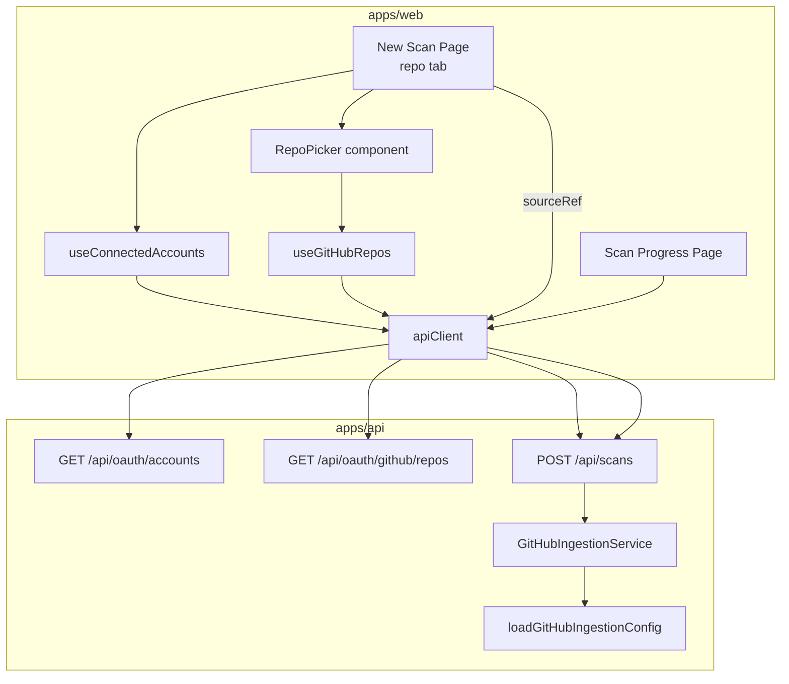

# Design Document

## Overview

This feature delivers three pragmatic fixes to the SlopShield AI scan flow:

1. **Connected GitHub repository picker** on the New Scan page's "Git Repo" tab. When the user has a connected GitHub account, the page loads their repositories and lets them pick one to auto-fill the scan source. The manual URL input remains as a fallback.
2. **Raised, validated, configurable repository size limit** in the GitHub ingestion config, with a clearer "too large" error message that states the configured limit in megabytes.
3. **Surfacing the real ingestion failure reason** on the scan progress page instead of a hardcoded generic message.

The work spans the Next.js frontend (`apps/web`) and the NestJS backend (`apps/api`). The backend endpoints needed already exist (`GET /api/oauth/accounts`, `GET /api/oauth/github/repos`); the frontend simply needs to call them. The backend changes are limited to ingestion config parsing and one error message string.

### Goals

- Let connected users browse and select a repository without copying a URL.
- Keep the manual URL fallback working unchanged.
- Make large-repo failures actionable: a higher default limit, configurable, with an informative message.
- Show users the actual reason their scan failed.

### Non-Goals

- No changes to the OAuth connect/disconnect flow.
- No changes to the scan pipeline, fetch/extract security model, or the repository validation logic.
- No new backend endpoints.

## Architecture



The frontend changes follow the existing TanStack Query hook pattern (`apps/web/src/hooks/`). Two new read hooks wrap `apiClient.get`. The repo tab gains a presentational `RepoPicker` block. The progress page reads `scan.failureReason` (already returned by the scan read API) instead of rendering a fixed string.

The backend changes are isolated to `github-ingestion.config.ts` (parsing/validation + raised default) and one error message in `github-ingestion.service.ts`. Because the service constructs its message from `this.config.maxRepoBytes`, no signature changes are required.

## Components and Interfaces

### Frontend

#### `useConnectedAccounts` hook (new) — `apps/web/src/hooks/use-oauth.ts`

Wraps `GET /api/oauth/accounts`. Mirrors `useProjects`.

```typescript
export interface ConnectedAccount {
  provider: string;
  displayName: string;
  status: string;
  createdAt: string;
}

export function useConnectedAccounts() {
  return useQuery({
    queryKey: ["oauth", "accounts"],
    queryFn: () => apiClient.get<ConnectedAccount[]>("/oauth/accounts"),
  });
}
```

A small derived helper determines GitHub connectivity:

```typescript
export function isGitHubConnected(accounts: ConnectedAccount[] | undefined): boolean {
  return (accounts ?? []).some(
    (a) => a.provider === "github" && a.status === "connected",
  );
}
```

#### `useGitHubRepos` hook (new) — `apps/web/src/hooks/use-oauth.ts`

Wraps `GET /api/oauth/github/repos`. Only fetches when GitHub is connected (`enabled` flag), so it never fires for disconnected users.

```typescript
export interface GitHubRepo {
  id: number;
  full_name: string;
  private: boolean;
  html_url: string;
}

export function useGitHubRepos(enabled: boolean) {
  return useQuery({
    queryKey: ["oauth", "github", "repos"],
    queryFn: () => apiClient.get<GitHubRepo[]>("/oauth/github/repos"),
    enabled,
  });
}
```

#### `RepoPicker` block — within the repo tab of `apps/web/src/app/scans/new/page.tsx`

Rendered above the existing manual URL input on the Git Repo tab. Behavior:

- While `useConnectedAccounts` is loading: show a loading indicator for connection status; the manual URL input is still shown (Req 1.5).
- If GitHub is not connected: render nothing extra (only the manual input remains). (Req 1.3, 1.4)
- If connected: render the repository list from `useGitHubRepos`.
  - Loading: spinner inside the picker (Req 2.2).
  - Error: render `error.message` from the API client (Req 2.7).
  - Empty array: "No repositories found" message (Req 2.6).
  - Success: a list of selectable buttons, each showing `full_name` and a visibility label ("Private" when `private` is `true`, "Public" otherwise) (Req 2.3–2.5).

Each repository is a native `<button>` with `aria-pressed` reflecting selection, and a selected style applied in addition to the accessible attribute (Req 3.2). Selecting a repo sets `sourceRef` to its `html_url` and records the selected repo id for highlight (Req 3.1).

#### New Scan page state changes

The repo tab already owns `sourceRef`. We add:

- `selectedRepoId: number | null` — which repo button is active (drives `aria-pressed` and styling).
- Selecting a repo sets both `selectedRepoId` and `sourceRef = repo.html_url`.
- Editing the manual input updates `sourceRef` and clears `selectedRepoId` (so a manual edit "wins" and de-selects the list item).

Submit logic for the repo tab (Req 3.3, 3.4, 4.3) stays keyed on `sourceRef`:

- If `sourceRef.trim()` is empty → show "Please select a repository or provide a URL." and do **not** call the scan API.
- Otherwise → `POST /api/scans` with `sourceType: "repository"`, `sourceRef`, `scanMode`, optional `projectId`. This naturally covers both the selected-repo case (`sourceRef` = `html_url`) and the manual case (`sourceRef` = typed value).

#### Scan Progress Page — `apps/web/src/app/scans/[id]/progress/page.tsx`

The failed-state block currently renders a hardcoded message. It will instead read `scan.failureReason`:

- If `status === "failed"` and `scan.failureReason` is a non-empty string → display that text (Req 7.1).
- Otherwise (failed with empty/absent reason) → display the existing generic failure message (Req 7.2).

`scan` is already available from `useScan(scanId)` and carries `failureReason` (confirmed in `scan.service.api-surface.spec.ts`).

### Backend

#### `loadGitHubIngestionConfig` — `apps/api/src/scan/github-ingestion.config.ts`

The `maxRepoBytes` parsing is replaced with a validated parse:

```typescript
const DEFAULT_MAX_REPO_BYTES = 262_144_000; // 250 MB
const MIN_MAX_REPO_BYTES = 1_048_576; // 1 MB

function parseMaxRepoBytes(raw: string | undefined): number {
  if (raw === undefined) return DEFAULT_MAX_REPO_BYTES;
  const value = Number(raw);
  if (!Number.isInteger(value) || value < MIN_MAX_REPO_BYTES) {
    return DEFAULT_MAX_REPO_BYTES;
  }
  return value;
}
```

Rules (Req 5.1–5.3):
- Unset → 250 MB default.
- Integer ≥ 1 MB → that value.
- Below 1 MB, non-positive, non-integer, or non-numeric (`Number("abc")` → `NaN`) → 250 MB default.

`Number("")` is `0`, which is `< MIN_MAX_REPO_BYTES`, so empty string also falls back to default. The other config fields are unchanged.

#### `GitHubIngestionService.fetchTarball` too-large error — `apps/api/src/scan/github-ingestion.service.ts`

The `"too-large"` error message is rebuilt from `this.config.maxRepoBytes`, expressed in MB (Req 6.1, 6.2). The byte cap enforcement logic (Req 5.4) is unchanged — it already aborts when `received > max`.

```typescript
const maxMb = Math.floor(max / (1024 * 1024));
// ...
new GitHubIngestionError(
  "too-large",
  `Repository exceeds the configured size limit of ${maxMb} MB.`,
)
```

The downstream mapping of `GitHubIngestionError.message` to `scan.failureReason` (in `ScanService`) is unchanged, so the improved message flows to the frontend automatically.

## Data Models

No persistence schema changes. Types used by the new frontend code:

```typescript
// Connected account (subset of GET /api/oauth/accounts)
interface ConnectedAccount {
  provider: string;      // e.g. "github"
  displayName: string;
  status: string;        // e.g. "connected"
  createdAt: string;
}

// Repository (GET /api/oauth/github/repos)
interface GitHubRepo {
  id: number;
  full_name: string;     // "owner/name"
  private: boolean;
  html_url: string;      // used as sourceRef
}
```

Backend config model (`GitHubIngestionConfig`) is unchanged in shape; only the parsing/validation of `maxRepoBytes` and its default value change.

## Correctness Properties

*A property is a characteristic or behavior that should hold true across all valid executions of a system — essentially, a formal statement about what the system should do. Properties serve as the bridge between human-readable specifications and machine-verifiable correctness guarantees.*

Most of this feature is UI rendering, interaction wiring, and simple API plumbing, which is best covered by example-based component tests (see Testing Strategy). A few pieces are pure logic with meaningful input variation and are captured as properties below.

### Property 1: GitHub connection detection

*For any* list of connected accounts, `isGitHubConnected` returns `true` if and only if the list contains at least one account with `provider` equal to `"github"` and `status` equal to `"connected"`.

**Validates: Requirements 1.2, 1.3**

### Property 2: Repository size limit parsing

*For any* raw `MAX_REPO_BYTES` value, `parseMaxRepoBytes` returns the input value when it is an integer greater than or equal to 1048576 (1 MB), and returns the default of 262144000 (250 MB) for every other input (unset, non-numeric, non-integer, non-positive, or below 1 MB).

**Validates: Requirements 5.1, 5.2, 5.3**

### Property 3: Too-large error states the configured limit

*For any* configured `maxRepoBytes`, the message of the `"too-large"` `GitHubIngestionError` contains the limit expressed in megabytes (`floor(maxRepoBytes / 1048576)`) and indicates that the repository exceeds the configured size limit.

**Validates: Requirements 6.1, 6.2**

### Property 4: Failed-scan message selection

*For any* failed scan, the Scan_Progress_Page displays the `failureReason` text when it is a non-empty string, and displays the generic failure message when `failureReason` is empty, whitespace-only, or absent.

**Validates: Requirements 7.1, 7.2**

## Error Handling

### Frontend

- **Accounts request fails**: `useConnectedAccounts` error is treated as "not connected" — the picker is hidden and the manual URL input remains usable. This keeps the repo tab functional even if `/oauth/accounts` is unavailable.
- **Repo list request fails**: the `RepoPicker` renders `error.message` from the `ApiError` thrown by the API client (Req 2.7). The manual input remains available as a fallback.
- **Empty repo list**: a "No repositories found" message is shown (Req 2.6); not treated as an error.
- **Submit with no source**: the existing inline error banner shows "Please select a repository or provide a URL." and the scan API is not called (Req 3.4).

### Backend

- **Invalid `MAX_REPO_BYTES`**: never throws — `parseMaxRepoBytes` silently falls back to the 250 MB default for any invalid input (Req 5.3), so a misconfigured environment cannot crash ingestion config loading.
- **Repository too large**: the existing `GitHubIngestionError("too-large", ...)` flow is preserved; only the message changes. `ScanService` continues to map the error message to `failureReason` on the failed scan job, which the progress page then surfaces.

## Testing Strategy

### Dual approach

- **Unit / component tests** cover the UI rendering, interaction wiring, payload shapes, and the small label/predicate helpers.
- **Property-based tests** cover the four pure-logic properties above.

### Property-based testing

PBT applies to the pure logic in this feature (connection predicate, byte-limit parser, error-message formatting, failed-state message selection). It does **not** apply to the React rendering, query wiring, or the streaming byte-cap enforcement (already covered by the existing `github-ingestion.resource-bounds.property.spec.ts`).

- Library: **fast-check** (already used across the API specs, e.g. `scan-failure-status.property.spec.ts`) for both backend and frontend property tests.
- Each property test runs a **minimum of 100 iterations**.
- Each property test is tagged with a comment referencing the design property:
  - Format: `// Feature: github-repo-picker-and-scan-fixes, Property {number}: {property_text}`
- Each correctness property is implemented by a **single** property-based test:
  - **P1** (`use-oauth`): generate random account arrays (varying provider/status, including github with non-connected status and non-github connected accounts); assert `isGitHubConnected` equals the existence of a qualifying account.
  - **P2** (`github-ingestion.config`): generate unset, non-numeric strings, non-integers, values `< 1MB`, non-positive values, and integers `>= 1MB`; assert `parseMaxRepoBytes` returns the input for valid integers and the 250 MB default otherwise.
  - **P3** (`github-ingestion.service`): construct the service with random valid `maxRepoBytes`; trigger the too-large path (stream exceeding the cap) or unit-test the message builder directly; assert the message contains `floor(max/1048576)` and the "configured size limit" phrasing.
  - **P4** (progress page): render the failed state with random `failureReason` values (non-empty, empty, whitespace, undefined); assert the reason is shown when non-empty and the generic message otherwise.

### Example-based / component tests

Using React Testing Library for the frontend:

- Repo tab renders the manual URL input in connected, disconnected, and loading states (Req 1.4, 1.5, 4.1).
- Accounts query fires on repo-tab render (Req 1.1); repos query fires only when connected (Req 2.1).
- Picker loading spinner (Req 2.2), empty-state message (Req 2.6), and error message (Req 2.7) render correctly.
- Repo list renders `full_name` and visibility labels; `visibilityLabel(true) === "Private"`, `visibilityLabel(false) === "Public"` (Req 2.3–2.5).
- Selecting a repo sets `sourceRef` to `html_url` and applies `aria-pressed="true"` plus selected styling (Req 3.1, 3.2).
- Starting a scan posts `sourceType: "repository"` with the selected `html_url` (Req 3.3) or the manual value (Req 4.3); manual edits update `sourceRef` (Req 4.2).
- Empty/whitespace source with no selection shows the validation message and does not call the scan API (Req 3.4).

Backend example/integration tests:

- `parseMaxRepoBytes` boundary cases: exactly `1048576`, `1048575`, `0`, `-1`, `"abc"`, `""`, unset (complements P2).
- Too-large message snapshot for a representative cap (complements P3).

### Test placement

- Frontend hooks/components: colocated `*.test.tsx` / `*.property.test.tsx` under `apps/web/src/`.
- Backend: `*.spec.ts` / `*.property.spec.ts` under `apps/api/src/scan/`, alongside existing ingestion specs.
