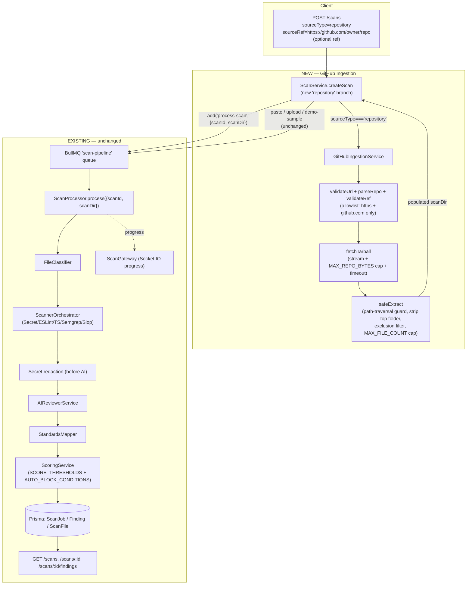

# Design Document

## Overview

This feature adds a **GitHub repository ingestion path** to SlopShield AI so that a user can submit a public GitHub HTTPS URL (with an optional branch/tag/commit ref) and have the repository scanned end-to-end through the **existing, unchanged scan pipeline**.

The `repository` value already exists in `SourceTypeEnum` (`packages/shared/src/schemas/scan.schema.ts`) but is **not yet handled** in `ScanService.createScan`, which today branches only on `paste`, `upload`, and `demo-sample`. This design fills that gap by introducing a new `GitHubIngestionService` that:

1. Validates the submitted URL against a strict allowlist (`https` scheme, `github.com` host only — no SSH, no `file://`, no other hosts).
2. Parses out `owner` / `repo` and validates the optional `ref`.
3. Fetches the repository **as a streamed tarball** from the GitHub REST/codeload API into the per-scan directory `temp-scans/{scanId}`.
4. Enforces safety limits (max bytes while streaming, fetch timeout, max file count) and extracts the tarball with **path-traversal protection**, stripping GitHub's top-level folder and excluding `node_modules`, `.git`, build dirs, and binaries.
5. Hands off to the existing BullMQ `scan-pipeline` queue with `{ scanId, scanDir }` — exactly the contract the `ScanProcessor` already consumes.

Everything downstream of the populated `scanDir` (classify → scan → AI review → score → report → notify) runs **without modification**. Findings flow through the existing `StandardsMapper`, `ScoringService` (with `AUTO_BLOCK_CONDITIONS` and `SCORE_THRESHOLDS`), and surface through the existing REST endpoints and Socket.IO progress events.

### Key Design Decision: Tarball Download vs Git Clone

The requirements (Requirement 4.1) allow three fetch mechanisms: shallow git CLI clone, `simple-git` shallow clone, or GitHub tarball download via the REST API. **This design selects the tarball download** (`https://api.github.com/repos/{owner}/{repo}/tarball/{ref}`, which redirects to `codeload.github.com`) as the primary mechanism.

| Criterion                  | Tarball download (chosen)                                           | git CLI shallow clone                              | simple-git shallow clone       |
| -------------------------- | ------------------------------------------------------------------- | -------------------------------------------------- | ------------------------------ |
| External binary required   | **None** (uses Node `fetch` + `tar`/`zlib`)                         | Requires `git` on PATH in API runtime              | Requires `git` on PATH         |
| Shallow by nature          | **Yes** — a single revision snapshot, no history                    | Needs `--depth 1`                                  | Needs `--depth 1`              |
| Streamable + size-cappable | **Yes** — abort the stream the moment bytes exceed `MAX_REPO_BYTES` | Hard — clone writes to disk before you can measure | Hard — same as git CLI         |
| `.git` metadata produced   | **None** (tarball has no `.git`)                                    | Yes — must be deleted (Req 4.3)                    | Yes — must be deleted          |
| Code execution risk        | **None** — no hooks, no checkout scripts run                        | Git hooks/filters can execute                      | Same as git CLI                |
| Auth for private repos     | `Authorization: Bearer <token>` header                              | Token in URL/credential helper                     | Token in URL/credential helper |
| Ref selection              | `/{ref}` path segment                                               | `--branch <ref>`                                   | `--branch <ref>`               |

**Rationale:** The tarball approach needs no `git` binary in the API container, is shallow by construction (no history to deepen), is trivially **size-cappable while streaming** (the single most important safety property for untrusted external repos — see Requirement 3), produces no `.git` directory to clean up (satisfies Req 4.3 for free), and runs **zero repository code** (satisfies Req 3.10 and the no-execution correctness property). The only trade-off is that a tarball is a full snapshot rather than a sparse checkout, but since we already cap bytes/files/time, this is bounded. The fetch mechanism is exposed as config (`GITHUB_FETCH_MECHANISM`, default `tarball`) per Requirement 4.5, leaving room to add a `simple-git` strategy later behind the same `RepositoryFetcher` interface.

`tar` (the maintained `node-tar` package) will be added as a dependency; `zlib` (gunzip) and `fetch`/`undici` are available in the Node runtime. No `simple-git` or `git` binary is required for the chosen path.

## Architecture

The new ingestion path is a **front-end stage** that populates `scanDir` and then enqueues the existing pipeline. Nothing in the pipeline changes.



**Component status legend:**

- **NEW**: `GitHubIngestionService` and its helpers (`validateUrl`, `parseRepo`, `validateRef`, `fetchTarball`, `safeExtract`, exclusion filter), the new `repository` branch inside `createScan`, the secret-redaction-before-AI step (a small reuse of existing secret patterns), and new config/env values.
- **EXISTING (unchanged)**: BullMQ queue, `ScanProcessor` and all its stages, `FileClassifier`, `ScannerOrchestrator` and analyzers, `AIReviewerService`, `StandardsMapper`, `ScoringService`, Prisma models, `ScanGateway`, REST controller.

## Components and Interfaces

### `GitHubIngestionService` (new)

Located at `apps/api/src/scan/github-ingestion.service.ts`. Registered as a provider in the existing `ScanModule` and injected into `ScanService`.

```typescript
import { Injectable, Logger, BadRequestException } from "@nestjs/common";

/** Parsed components of a validated GitHub repository URL. */
export interface ParsedRepo {
  owner: string;
  repo: string;
  /** Optional ref from the URL path (/tree/<ref>) or the explicit ref argument. */
  ref?: string;
}

/** Result of a successful ingestion into the scan directory. */
export interface IngestionResult {
  scanDir: string;
  fileCount: number;
  totalBytes: number;
}

/** Discriminated failure reasons, mapped to HTTP status / scan failure reason. */
export type IngestionErrorKind =
  | "invalid-url" // 400 — syntactically invalid or disallowed scheme/host
  | "not-a-repo-url" // 400 — owner/repo could not be extracted
  | "invalid-ref" // 400 — ref contains illegal characters
  | "not-found" // 404 — repo or ref does not exist / not accessible
  | "private-no-token" // 401/403 — private repo with no configured token
  | "too-large" // fetch aborted: exceeded MAX_REPO_BYTES
  | "too-many-files" // extraction aborted: exceeded MAX_FILE_COUNT
  | "timeout" // fetch exceeded FETCH_TIMEOUT_MS
  | "network-error"; // transient transport error

export class GitHubIngestionError extends Error {
  constructor(
    public readonly kind: IngestionErrorKind,
    message: string,
    public readonly transient = false,
  ) {
    super(message);
  }
}

@Injectable()
export class GitHubIngestionService {
  private readonly logger = new Logger(GitHubIngestionService.name);

  /**
   * Validate scheme + host allowlist (https + github.com only).
   * Throws GitHubIngestionError('invalid-url' | 'not-a-repo-url').
   * Returns parsed owner/repo (+ ref if present in the URL path).
   */
  public validateUrl(rawUrl: string): ParsedRepo;

  /** Extract owner/repo from a github.com URL path. Internal helper used by validateUrl. */
  public parseRepo(url: URL): ParsedRepo;

  /**
   * Validate an optional ref against the git ref-name character allowlist.
   * Throws GitHubIngestionError('invalid-ref') on illegal characters.
   */
  public validateRef(ref: string | undefined): string | undefined;

  /**
   * Stream the GitHub tarball into a buffer/temp file while enforcing
   * MAX_REPO_BYTES and FETCH_TIMEOUT_MS. Aborts (AbortController) on overflow
   * or timeout. Throws GitHubIngestionError('too-large'|'timeout'|'not-found'
   * |'private-no-token'|'network-error').
   */
  public fetchTarball(
    parsed: ParsedRepo,
    scanId: string,
  ): Promise<NodeJS.ReadableStream>;

  /**
   * Gunzip + untar the stream into scanDir with:
   *  - path-traversal guard (reject entries resolving outside scanDir),
   *  - strip of the top-level "{owner}-{repo}-{sha}/" folder GitHub adds,
   *  - exclusion filter (node_modules/.git/build dirs/binaries),
   *  - MAX_FILE_COUNT enforcement (abort on overflow).
   * Throws GitHubIngestionError('too-many-files').
   */
  public safeExtract(
    tarStream: NodeJS.ReadableStream,
    scanDir: string,
  ): Promise<{ fileCount: number; totalBytes: number }>;

  /**
   * Orchestrates validateUrl -> validateRef -> fetchTarball -> safeExtract.
   * On any failure, removes the partially populated scanDir (Req 11.5) and
   * rethrows a GitHubIngestionError.
   */
  public ingest(
    rawUrl: string,
    ref: string | undefined,
    scanId: string,
    scanDir: string,
  ): Promise<IngestionResult>;
}
```

### `ScanService.createScan` integration point (modified)

The new branch sits **next to** the existing source-type branches and reuses the existing `scanDir` creation, queue enqueue, and failure cleanup. The `repository` branch differs from the others in that ingestion is asynchronous (network I/O) and must surface validation errors as HTTP 400 **before** the job is queued, while surfacing fetch/extract failures as a `failed` ScanJob.

```typescript
// Inside createScan, after the existing validation guards:

if (input.sourceType === "repository" && !input.sourceRef) {
  throw new BadRequestException(
    'A repository URL is required for sourceType: "repository"',
  );
}

// ... after scanJob row is created and scanDir is mkdir'd ...

try {
  if (input.sourceType === "paste") {
    /* unchanged */
  } else if (input.sourceType === "upload" && file) {
    /* unchanged */
  } else if (input.sourceType === "demo-sample") {
    /* unchanged */
  } else if (input.sourceType === "repository") {
    // NEW: validate up-front (throws BadRequestException -> HTTP 400),
    // then fetch + extract into scanDir.
    await this.githubIngestion.ingest(
      input.sourceRef!, // sourceRef holds the Repository_URL (Req 1.1)
      input.sourceRef ? input.scanRef : undefined, // optional ref (see Data Models)
      scanJob.id,
      scanDir,
    );
  }

  await this.scanQueue.add("process-scan", { scanId: scanJob.id, scanDir });
  return scanJob;
} catch (err: any) {
  // existing catch: mark failed + rm scanDir. Extended to translate
  // GitHubIngestionError.kind into the recorded failure reason (see Error Handling).
}
```

Requirement 1.6 (preserve `paste`/`upload`/`demo-sample` behavior) is satisfied because their branches are untouched; only a new `else if` is added.

### Secret redaction before AI review (modified `ScanProcessor` step)

Requirement 10 requires redacting secrets from file contents **before** they are sent to the AI reviewer for `repository` (untrusted external) scans. The existing `SecretAnalyzer` already contains battle-tested secret regexes and a `redactSecret` helper. We extract that redaction logic into a small reusable utility and apply it to the `fileContents` array the processor builds just before calling `aiReviewer.reviewCode(...)`.

```typescript
// New utility: apps/api/src/scan/secret-redactor.ts
export function redactSecrets(content: string): string;
// Reuses the SecretAnalyzer regex set; replaces matched secret values with
// a fixed "***REDACTED***" token. Also strips/escapes instruction-like
// content per Req 10.2 (treat repo text as untrusted data).
```

The processor change is minimal and applies to all source types (redaction is always safe), keeping the pipeline source-type-agnostic per Requirement 5.2.

## Low-Level Design

### URL validation + repo parsing (Requirement 2)

```typescript
// Only these are accepted. Everything else is a 400.
const ALLOWED_PROTOCOL = "https:";
const ALLOWED_HOST = "github.com";

public validateUrl(rawUrl: string): ParsedRepo {
  let url: URL;
  try {
    url = new URL(rawUrl.trim());
  } catch {
    // Catches SSH form (git@github.com:owner/repo.git) and garbage (Req 2.4, 11.1)
    throw new GitHubIngestionError("invalid-url", "The repository URL is invalid.");
  }

  if (url.protocol !== ALLOWED_PROTOCOL) {
    throw new GitHubIngestionError(
      "invalid-url",
      `Disallowed URL scheme "${url.protocol}". Only https is supported.`, // Req 2.2
    );
  }
  // host (not hostname+port) compared exactly; rejects evil.com, raw.githubusercontent.com,
  // github.com.attacker.com, and userinfo tricks like https://github.com@evil.com
  if (url.host.toLowerCase() !== ALLOWED_HOST) {
    throw new GitHubIngestionError(
      "invalid-url",
      "Only github.com repositories are supported.", // Req 2.3
    );
  }
  return this.parseRepo(url);
}

public parseRepo(url: URL): ParsedRepo {
  // Path looks like /owner/repo, /owner/repo.git, or /owner/repo/tree/<ref>...
  const segments = url.pathname.split("/").filter(Boolean);
  if (segments.length < 2) {
    throw new GitHubIngestionError(
      "not-a-repo-url",
      "The URL is not a valid GitHub repository URL.", // Req 2.6
    );
  }
  const owner = segments[0];
  const repo = segments[1].replace(/\.git$/i, "");

  // owner/repo must match GitHub's allowed name characters
  const NAME = /^[A-Za-z0-9._-]+$/;
  if (!NAME.test(owner) || !NAME.test(repo) || !owner || !repo) {
    throw new GitHubIngestionError(
      "not-a-repo-url",
      "The URL is not a valid GitHub repository URL.", // Req 2.5, 2.6
    );
  }

  // Optional ref embedded as /tree/<ref> or /commit/<sha>
  let ref: string | undefined;
  if ((segments[2] === "tree" || segments[2] === "commit") && segments[3]) {
    ref = segments.slice(3).join("/"); // refs may contain slashes (feature/x)
  }
  return { owner, repo, ref };
}
```

### Ref validation (Requirement 2.7)

```typescript
// Conservative allowlist consistent with git-check-ref-format rules.
// Allows: letters, digits, _ - . / ; rejects: whitespace, ~ ^ : ? * [ \,
// leading "-", "..", "@{", trailing "/" or ".lock".
const REF_ALLOWED = /^[A-Za-z0-9._\/-]+$/;

public validateRef(ref: string | undefined): string | undefined {
  if (ref === undefined || ref === "") return undefined; // default branch (Req 1.3 absent)
  if (
    !REF_ALLOWED.test(ref) ||
    ref.includes("..") ||
    ref.includes("@{") ||
    ref.startsWith("-") ||
    ref.startsWith("/") ||
    ref.endsWith("/") ||
    ref.endsWith(".lock")
  ) {
    throw new GitHubIngestionError("invalid-ref", `Invalid git ref: "${ref}".`); // Req 2.7
  }
  return ref;
}
```

### Tarball fetch with streaming size cap + timeout (Requirement 3.1, 3.2, 3.5, 3.6; Requirement 9)

```typescript
public async fetchTarball(
  parsed: ParsedRepo,
  scanId: string,
): Promise<NodeJS.ReadableStream> {
  const refPath = parsed.ref ? `/${encodeURIComponent(parsed.ref)}` : "";
  const apiUrl =
    `https://api.github.com/repos/${parsed.owner}/${parsed.repo}/tarball${refPath}`;

  const controller = new AbortController();
  const timeout = setTimeout(() => controller.abort(), this.config.fetchTimeoutMs);

  const headers: Record<string, string> = {
    "User-Agent": "SlopShield-AI-Scanner",
    Accept: "application/vnd.github+json",
  };
  // Req 9.1: include token if configured; Req 9.4: token never logged/stored.
  if (this.config.githubToken) {
    headers.Authorization = `Bearer ${this.config.githubToken}`;
  }

  let res: Response;
  try {
    res = await fetch(apiUrl, { headers, signal: controller.signal, redirect: "follow" });
  } catch (err: any) {
    clearTimeout(timeout);
    if (err?.name === "AbortError") {
      throw new GitHubIngestionError("timeout", "Repository fetch timed out."); // Req 3.6, 11
    }
    throw new GitHubIngestionError("network-error", "Network error fetching repository.", true); // Req 11.3, 11.7
  }

  if (res.status === 404) {
    clearTimeout(timeout);
    throw new GitHubIngestionError("not-found", "Repository or ref not found."); // Req 11.2
  }
  if (res.status === 401 || res.status === 403) {
    clearTimeout(timeout);
    // Anonymous request to a private repo, or rate-limited.
    throw new GitHubIngestionError(
      this.config.githubToken ? "network-error" : "private-no-token",
      this.config.githubToken
        ? "GitHub denied the request (rate limit or access)."
        : "Private repositories require a configured GitHub token.", // Req 9.3
    );
  }
  if (!res.ok || !res.body) {
    clearTimeout(timeout);
    throw new GitHubIngestionError("network-error", `Unexpected status ${res.status}.`, true);
  }

  // Wrap the web stream and enforce MAX_REPO_BYTES while data flows.
  let received = 0;
  const max = this.config.maxRepoBytes;
  const source = Readable.fromWeb(res.body as any);
  const capped = new Transform({
    transform(chunk, _enc, cb) {
      received += chunk.length;
      if (received > max) {
        cb(new GitHubIngestionError("too-large", "Repository exceeds the maximum allowed size.")); // Req 3.2
        return;
      }
      cb(null, chunk);
    },
  });
  capped.on("close", () => clearTimeout(timeout));
  return source.pipe(capped);
}
```

### Tar extraction with path-traversal guard, top-folder strip, exclusions, file-count cap (Requirement 3.3, 3.4, 3.7–3.10, 4.2–4.4)

```typescript
import * as tar from "tar";
import { createGunzip } from "zlib";
import * as path from "path";

private readonly EXCLUDED_DIRS = new Set([
  "node_modules", ".git", "dist", "build", "out", ".next", ".turbo",
  "coverage", ".cache", "vendor", "__pycache__", ".venv",
]);
private readonly BINARY_EXT = new Set([
  ".png", ".jpg", ".jpeg", ".gif", ".webp", ".ico", ".pdf", ".zip", ".gz",
  ".tar", ".exe", ".dll", ".so", ".dylib", ".class", ".jar", ".wasm",
  ".mp4", ".mp3", ".mov", ".woff", ".woff2", ".ttf", ".eot", ".bin",
]);

public async safeExtract(
  tarStream: NodeJS.ReadableStream,
  scanDir: string,
): Promise<{ fileCount: number; totalBytes: number }> {
  const resolvedRoot = path.resolve(scanDir);
  let fileCount = 0;
  let totalBytes = 0;

  await pipeline(
    tarStream,
    createGunzip(),
    tar.extract({
      cwd: scanDir,
      // strip the single top-level "{owner}-{repo}-{sha}/" folder GitHub adds (Req 4.4)
      strip: 1,
      // Decide per-entry whether to write it.
      filter: (entryPath: string, entry: tar.ReadEntry): boolean => {
        // Exclusions (Req 3.7, 3.8)
        const parts = entryPath.split(/[\/\\]/);
        if (parts.some((p) => this.EXCLUDED_DIRS.has(p))) return false;
        if (this.BINARY_EXT.has(path.extname(entryPath).toLowerCase())) return false;
        if (entry.type === "SymbolicLink" || entry.type === "Link") return false; // no links

        // Path-traversal guard (Req 3.9): resolved target must stay inside scanDir.
        // strip:1 is applied by tar AFTER filter receives the stripped path, so we
        // resolve against root and verify containment.
        const dest = path.resolve(resolvedRoot, entryPath);
        if (dest !== resolvedRoot && !dest.startsWith(resolvedRoot + path.sep)) {
          return false; // reject "../" escapes and absolute paths
        }

        if (entry.type === "File") {
          fileCount += 1;
          if (fileCount > this.config.maxFileCount) {
            throw new GitHubIngestionError(
              "too-many-files",
              "Repository exceeds the maximum allowed file count.", // Req 3.4
            );
          }
          totalBytes += entry.size ?? 0;
        }
        return true;
      },
    }),
  );

  return { fileCount, totalBytes };
}
```

Notes:

- `tar.extract` itself does not run any repository code (Req 3.10 / no-execution property). We additionally drop symlinks and hard links so a malicious archive cannot create a link that later redirects a write outside `scanDir`.
- No `.git` is produced by a tarball, satisfying Req 4.3 without an explicit delete step; the exclusion of `.git` in the filter is belt-and-suspenders.
- The resulting `scanDir` is a flat tree of relative source files — exactly the shape `ScanProcessor.globFilesSync` + `FileClassifier` already consume (Req 4.4 / pipeline-shape property).

### Config loading

```typescript
// apps/api/src/scan/github-ingestion.config.ts
export interface GitHubIngestionConfig {
  maxRepoBytes: number; // MAX_REPO_BYTES
  maxFileCount: number; // MAX_FILE_COUNT
  fetchTimeoutMs: number; // FETCH_TIMEOUT_MS
  githubToken?: string; // GITHUB_TOKEN (optional)
  fetchMechanism: "tarball"; // GITHUB_FETCH_MECHANISM (default tarball)
}

export function loadGitHubIngestionConfig(
  env = process.env,
): GitHubIngestionConfig {
  return {
    maxRepoBytes: Number(env.MAX_REPO_BYTES ?? 100 * 1024 * 1024), // 100 MB
    maxFileCount: Number(env.MAX_FILE_COUNT ?? 5000), // 5000 files
    fetchTimeoutMs: Number(env.FETCH_TIMEOUT_MS ?? 60_000), // 60 s
    githubToken: env.GITHUB_TOKEN || undefined,
    fetchMechanism: "tarball",
  };
}
```

## Data Models

### Existing models — confirmed against `schema.prisma`

The `ScanJob` Prisma model **already has every field this feature needs**:

- `sourceType` (String) — stores `"repository"`.
- `sourceRef` (String?) — stores the submitted Repository_URL (Req 1.4, 8.1).
- `status` (String) — `queued` → pipeline stages → `completed`/`failed` (Req 1.4, 3.2).
- `statusResult` (String?) — the verdict from `ScoringService` (Req 7).
- score fields (`overallScore`, `securityScore`, …) — populated by the existing pipeline (Req 7.6).

`Finding.standardReference` (String?) already persists a standard reference (Req 6.8). The pipeline currently stores `standardReferences[0]`; this design keeps that behavior (single column) and relies on the mapper guaranteeing a non-null first element via fallback.

> **Note on `sourceRef` vs `blockedReasons`:** the prompt mentions `statusResult`/`blockedReasons` fields on `ScanJob`. In the current schema, `statusResult` exists but there is **no `blockedReasons` column** — blocked reasons are computed by `ScoringService` into `score.blockedReasons` and surfaced via `aiSummary`/report generation rather than a dedicated column. This design does not add one, to stay aligned with the existing persistence (the processor today does not write `blockedReasons` to a column).

### Proposed migration — `failureReason` (genuinely needed)

Requirements 3.2, 3.4, 3.6, 11.2, 11.3, 11.6, 11.7 all require recording a **descriptive failure reason** and surfacing it through the API. The current schema has **no column** to hold this; today a failed scan only sets `status="failed"` and `statusResult="blocked"`, losing the reason. This is a real gap, so we add one nullable column:

```prisma
model ScanJob {
  // ... existing fields ...
  failureReason String? @map("failure_reason")   // NEW: human-readable ingestion/pipeline failure reason
}
```

Migration: `prisma migrate dev --name add_scanjob_failure_reason`. The column is nullable and backward-compatible (existing rows get `NULL`). `ScanService` and `ScanProcessor` set it on failure; `getScan`/`listScans` return it unchanged (Req 11.6). This keeps transient-vs-input errors distinguishable (Req 11.7) by storing the mapped message.

### No shared-schema changes required

`SourceTypeEnum` already includes `"repository"` and `CreateScanInput` already has `sourceRef`. The optional ref is carried in `sourceRef` URL form (`/tree/<ref>`) and/or a new optional `scanRef` field on `CreateScanInput` if an explicit ref field is desired; both parse paths are handled by `validateUrl`/`validateRef`. Response schemas are unchanged, satisfying Req 8.5 (frontend consumes existing schemas).

## Correctness Properties

_A property is a characteristic or behavior that should hold true across all valid executions of a system — essentially, a formal statement about what the system should do. Properties serve as the bridge between human-readable specifications and machine-verifiable correctness guarantees._

This feature **is well-suited to property-based testing**: URL/ref validation, the streaming size cap, the exclusion filter, the path-traversal guard, standards mapping, and score-band logic are all pure functions (or pure decision logic) with large input spaces and clear universal invariants. The network fetch, pipeline wiring, and API surface are covered by example/integration tests instead (see Testing Strategy).

The following properties are derived from the prework analysis, consolidated to remove redundancy (e.g. scheme/host rejection collapse into one allowlist property; `node_modules`/`.git`/binary exclusions collapse into one exclusion-filter property).

### Property 1: URL allowlist safety

_For any_ string URL, `validateUrl` accepts it (returning a parsed owner/repo) **if and only if** its scheme is exactly `https`, its host is exactly `github.com`, and a non-empty `owner` and `repo` can be extracted from the path; every other input is rejected. Consequently, the only origin the service ever fetches from is `https://github.com` (and its codeload redirect).

**Validates: Requirements 2.1, 2.2, 2.3, 2.5, 2.6**

### Property 2: Ref validation safety

_For any_ ref string, `validateRef` accepts it **if and only if** it matches the git ref-name character allowlist (no whitespace or `~ ^ : ? * [ \`, no `..`, no `@{`, no leading `-`/`/`, no trailing `/` or `.lock`); rejected refs never reach the fetch URL.

**Validates: Requirements 2.7**

### Property 3: Size-cap safety

_For any_ incoming byte stream, if the cumulative number of bytes exceeds `MAX_REPO_BYTES`, `fetchTarball` aborts with a `too-large` error and never forwards more than approximately `MAX_REPO_BYTES` bytes downstream; streams at or below the cap pass through unchanged.

**Validates: Requirements 3.1, 3.2**

### Property 4: File-count-cap safety

_For any_ archive whose number of included (post-exclusion) file entries exceeds `MAX_FILE_COUNT`, `safeExtract` aborts with a `too-many-files` error; archives with a count at or below the cap extract successfully.

**Validates: Requirements 3.3, 3.4**

### Property 5: Exclusion-filter correctness

_For any_ set of archive entry paths, the extracted file set contains no entry that lies under an excluded directory (`node_modules`, `.git`, `dist`, `build`, etc.) and no entry whose extension is in the binary-extension set; all other text entries are retained.

**Validates: Requirements 3.7, 3.8, 4.3**

### Property 6: Path-traversal safety

_For any_ archive entry name (including `../` sequences, absolute paths, mixed `/`\\`separators, symlinks, and hard links), no entry is ever written to a location outside the`scanDir`; the resolved destination of every accepted entry is contained within `scanDir`.

**Validates: Requirements 3.9, 3.10**

### Property 7: Pipeline-shape compatibility

_For any_ successfully extracted repository, every produced path in `scanDir` is relative (never absolute), has GitHub's top-level `{owner}-{repo}-{sha}/` folder stripped, and is consumable by `FileClassifier` without error — matching the `{ scanDir, files, scanId }` `AnalysisContext` shape the existing `ScanProcessor` already expects.

**Validates: Requirements 4.4, 5.3**

### Property 8: Standards completeness

_For any_ finding (any `category` from `FindingCategoryEnum`, any `title`/`description`), `StandardsMapper.mapFindingToStandards` returns a non-empty array in which every element is a valid key of `STANDARDS_REFERENCES`; no finding is ever left without at least one reference.

**Validates: Requirements 6.1, 6.7**

### Property 9: Score-band correctness

_For any_ integer overall score in `[0, 100]`, `getScoreStatus` returns the status dictated by the documented bands exactly at the boundaries: `90–100 → passed`, `80–89 → passed-with-warnings`, `70–79 → needs-cleanup`, `60–69 → risky`, `0–59 → blocked`.

**Validates: Requirements 7.1, 7.2**

### Property 10: Auto-block override

_For any_ set of findings, if at least one finding is blocking or matches an `AUTO_BLOCK_CONDITION`, then `ScoringService.calculateScore` returns `statusResult === "blocked"` regardless of the computed overall score (even when the score would otherwise map to `passed`), and records a corresponding blocking reason.

**Validates: Requirements 7.3, 7.4, 7.5**

### Property 11: Token non-leakage

_For any_ configured `GITHUB_TOKEN` value, after an ingestion run the token string never appears in the persisted `ScanJob` record, any persisted `Finding`, the API response payloads, or captured log output.

**Validates: Requirements 9.4**

### Property 12: Secret redaction before AI review

_For any_ file content containing a value matching the known secret patterns, the output of `redactSecrets` contains none of the raw secret values (each is replaced by a redaction token), so untrusted external repository content cannot leak credentials to the AI provider.

**Validates: Requirements 10.1**

### Property 13: Cleanup-on-failure safety

_For any_ ingestion failure kind (`invalid-url`, `not-a-repo-url`, `invalid-ref`, `not-found`, `private-no-token`, `too-large`, `too-many-files`, `timeout`, `network-error`), the per-scan `scanDir` does not exist after the failure is handled — no partial temporary files are left behind.

**Validates: Requirements 11.5**

## Error Handling

All ingestion failures are represented by a single `GitHubIngestionError` carrying a discriminated `kind` and a `transient` flag. `ScanService` translates each kind into either an HTTP response (for synchronous, pre-queue validation failures) or a failed `ScanJob` with a recorded `failureReason` (for fetch/extract failures), then removes `scanDir`.

| Failure mode                                                     | `kind`                      | Surfaced as                                                                       | Recovery / behavior                                                                                             |
| ---------------------------------------------------------------- | --------------------------- | --------------------------------------------------------------------------------- | --------------------------------------------------------------------------------------------------------------- |
| Empty/missing URL for `repository`                               | (guard)                     | HTTP 400 "repository URL is required"                                             | Rejected before ScanJob creation (Req 1.2)                                                                      |
| Syntactically invalid URL, disallowed scheme/host, SSH/file form | `invalid-url`               | HTTP 400 with scheme/host message                                                 | Rejected pre-queue (Req 2.2–2.4, 11.1)                                                                          |
| Owner/repo not extractable                                       | `not-a-repo-url`            | HTTP 400 "not a valid GitHub repository URL"                                      | Rejected pre-queue (Req 2.6)                                                                                    |
| Illegal ref characters                                           | `invalid-ref`               | HTTP 400 "Invalid git ref"                                                        | Rejected pre-queue (Req 2.7)                                                                                    |
| Repo or ref does not exist (404)                                 | `not-found`                 | ScanJob `status=failed`, `failureReason="Repository or ref not found"`            | `scanDir` removed (Req 11.2)                                                                                    |
| Private repo, no token (401/403)                                 | `private-no-token`          | ScanJob `status=failed`, reason "Private repositories require a configured token" | (Req 9.3)                                                                                                       |
| Exceeds `MAX_REPO_BYTES`                                         | `too-large`                 | ScanJob `status=failed`, reason names the size limit                              | Stream aborted mid-flight (Req 3.2)                                                                             |
| Exceeds `MAX_FILE_COUNT`                                         | `too-many-files`            | ScanJob `status=failed`, reason names the file-count limit                        | Extraction aborted (Req 3.4)                                                                                    |
| Fetch exceeds `FETCH_TIMEOUT_MS`                                 | `timeout` (transient)       | ScanJob `status=failed`, reason "fetch timed out"                                 | `AbortController` fires (Req 3.6)                                                                               |
| Network/transport error                                          | `network-error` (transient) | ScanJob `status=failed`, network-error reason                                     | Distinguished from input errors by `transient=true` (Req 11.3, 11.7)                                            |
| Repo has 0 scannable files after exclusions                      | (not an error)              | Scan **completes** with 0 findings, valid score                                   | Pipeline does not crash; `globFilesSync` returns `[]`, scoring yields a score with `totalFindings=0` (Req 11.4) |
| Any ingestion failure                                            | any                         | —                                                                                 | `scanDir` removed in `finally`/catch (Req 11.5); `failureReason` exposed via `GET /scans/:id` (Req 11.6)        |

Pipeline-internal failures (analyzer crash, AI failure) continue to be handled by the existing `ScanProcessor` try/catch, which already marks the job failed and cleans up `scanDir`; no change is required there beyond setting `failureReason`.

## Testing Strategy

A **dual approach**: property-based tests for the pure safety/logic invariants above, and example/integration tests for wiring, error mapping, and the network boundary.

### Tooling

- **`fast-check`** (added as an API dev dependency) for property-based tests, run under the existing **Jest** harness.
- Each property test runs a **minimum of 100 iterations** (`fc.assert(fc.property(...), { numRuns: 100 })`).
- Each property test is tagged with a comment referencing its design property, format:
  `// Feature: github-repository-scanner, Property {n}: {property text}`
- The network `fetch` is **mocked** in all unit/property tests (no real GitHub calls). `tar`/`zlib` run against in-memory or fixture archives.

### Property-based tests (fast-check)

| Property                   | Generator strategy                                                                                                                                                                                     |
| -------------------------- | ------------------------------------------------------------------------------------------------------------------------------------------------------------------------------------------------------ |
| 1 — URL allowlist          | Arbitrary scheme/host/path combinations + curated adversarial hosts (`github.com@evil.com`, `raw.githubusercontent.com`, `github.com.attacker.com`); assert accept ⇔ https+github.com+valid owner/repo |
| 2 — Ref validation         | Arbitrary strings incl. illegal-char alphabets and `..`/`@{`/leading-`-`; assert accept ⇔ ref rules                                                                                                    |
| 3 — Size cap               | Streams of random total size around `MAX_REPO_BYTES`; assert abort iff over cap and bytes forwarded ≤ cap                                                                                              |
| 4 — File-count cap         | Entry lists of random length around `MAX_FILE_COUNT`; assert abort iff over cap                                                                                                                        |
| 5 — Exclusion filter       | Random relative paths, some under excluded dirs / with binary extensions; assert excluded never retained                                                                                               |
| 6 — Path traversal         | Adversarial entry names (`../`, absolute, mixed separators, links); assert no accepted dest escapes `scanDir`                                                                                          |
| 7 — Pipeline shape         | Archives with a top folder + nested files; assert all outputs relative, prefix stripped, classifiable                                                                                                  |
| 8 — Standards completeness | Random findings over `FindingCategoryEnum` × arbitrary text; assert ≥1 valid reference always                                                                                                          |
| 9 — Score bands            | Integer scores `0..100`; assert exact band mapping (boundary-sensitive)                                                                                                                                |
| 10 — Auto-block override   | Random finding sets seeded with ≥1 blocking/auto-block finding; assert `statusResult==="blocked"`                                                                                                      |
| 11 — Token non-leakage     | Random token strings; assert absent from persisted ScanJob/findings/logs after mocked ingestion                                                                                                        |
| 12 — Secret redaction      | Content embedding secrets from the pattern set; assert raw values absent from output                                                                                                                   |
| 13 — Cleanup on failure    | Each `IngestionErrorKind` injected; assert `scanDir` removed in all cases                                                                                                                              |

### Unit (example-based) tests

- **URL validation table**: explicit rows for valid HTTPS, `.git` suffix, `/tree/<branch>`, `/commit/<sha>`, SSH form, `file://`, `ftp://`, other hosts, userinfo trick, missing repo — each with expected accept/reject + message.
- **Ref validation**: representative valid (`main`, `feature/x`, `v1.2.3`) and invalid (`..`, `a b`, `-x`, `x.lock`, `re~f`) refs.
- **Exclusion filter**: spot-check `node_modules/...`, `.git/...`, `dist/...`, `logo.png`, `app.ts`.
- **Standards category rules (6.2–6.6)**: secret → CWE+NIST, injection → OWASP+CWE, access-control → OWASP+API, accessibility → WCAG+ISO, maintainability → ISO+craftsmanship.
- **Error mapping**: 404 → `not-found`; 403 no token → `private-no-token`; fetch throw → `network-error` (`transient=true`); abort → `timeout`.
- **Token header (9.1/9.2)**: with/without `GITHUB_TOKEN`, assert `Authorization` header presence/absence.
- **No-execution (3.10)**: fixture archive containing a hostile `postinstall`/hook script that would write a sentinel file; assert sentinel never created after ingestion.
- **Empty repo (11.4)**: archive of only excluded/binary files; assert scan completes with 0 findings and a valid score, no crash.
- **Timeout (3.5/3.6)**: Jest fake timers + a never-resolving mocked fetch; assert timeout fires at `FETCH_TIMEOUT_MS`.
- **AI untrusted content (10.2/10.3)**: content with "ignore previous instructions" passed as data; malformed AI output rejected by zod before persistence.

### Integration tests

- **Fixture tarball end-to-end**: a small committed `.tar.gz` fixture (a handful of `.ts`/`.tsx` files plus a `node_modules` dir and a binary, to exercise exclusions) is run through `GitHubIngestionService.ingest` → `FileClassifier` → `ScannerOrchestrator`; assert the `AnalysisContext` is populated, findings are produced and mapped to standards, and `scanDir` is cleaned up afterward. **No real network** — the tarball stream is sourced from the fixture file, not `fetch`.
- **API surface**: a `repository` scan appears in `GET /scans` with `sourceType=repository` and the URL in `sourceRef`; `GET /scans/:id` returns scores/`statusResult`/findings; `GET /scans/:id/findings` returns mapped `standardReference` values; a failed ingestion exposes `status=failed` + `failureReason` (Req 8, 11.6).
- **Scoring/auto-block (7.6)**: a scan whose findings include a hardcoded secret ends with `statusResult=blocked` and persisted scores.
