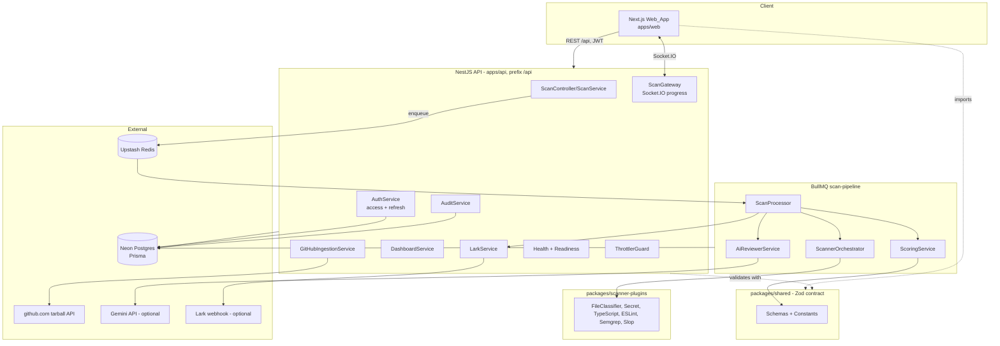
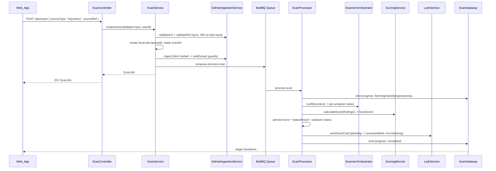

# Design Document

## Overview

This design hardens **SlopShield AI** from a partly mock/demo system into a real, production-grade DevSecOps quality gate. It is **incremental and evidence-driven**: every design decision traces to a finding in `root-cause-audit.md` (codes A1–A5, B1–B8, C1–C5) and to the EARS acceptance criteria in `requirements.md` (Requirements 1–12).

The audit confirms the live deployment already works at the API level: the NestJS backend on Render, Neon Postgres, Upstash Redis, authentication, CORS, and an end-to-end real GitHub scan (`octocat/Hello-World`, score 98, findings persisted) all function. Importantly, much of the hardening described here is **already present in the codebase** (e.g. `GitHubIngestionService` with zip-slip/size/ref guards, `ScannerOrchestrator` with per-analyzer timeout isolation, `findMissingEnv`, secret redaction, scoring bands). This design therefore documents the target architecture, identifies the **specific remaining gaps** against that target, and defines the contracts and correctness properties that keep the system honest.

The work is organized around the six production gap areas called out in the requirements introduction:

1. **Frontend↔API contract** (Req 3, 8) — the UI must speak the exact shared Zod contract: `sourceType: "repository"`, shared dashboard shapes, a real rerun endpoint, and distinct loading/empty/error states. *(A1, A2, B7, B8)*
2. **Session longevity** (Req 1) — persist and use the refresh token, silent-refresh on 401, distinct access/refresh secrets. *(A3, C4)*
3. **Environment validation and readiness** (Req 11) — hard-require core env in production, never hard-fail on optional integrations, expose a readiness endpoint reporting `configured | skipped | error`. *(A4, C4)*
4. **Scanner robustness** (Req 4, 5, 6, 7) — safe repo intake, per-analyzer status (`ran | skipped | failed`), bundled ESLint config, repo-aware TypeScript, optional Semgrep, prompt-injection-resistant AI, documented scoring semantics. *(A5, B3, B6, C1)*
5. **Lark delivery truthfulness** (Req 9) — record `pending` before send, update to `success`/`failed` from the real response, real author + report URL, never block scan completion. *(B1, B2)*
6. **Security hardening** (Req 10) — request validation, rate limiting, Helmet, CORS allowlist, audit logging, secret redaction, safe error responses. *(B4, B5)*

Plus **testing and deployment readiness** (Req 12) — regression tests for each fixed defect, non-watch CI, health/readiness endpoints, and accurate operational docs.

### Design Principles

- **Shared schema is the single source of truth.** Every cross-boundary shape (`CreateScanInput`, `ScanScore`, `Finding`, dashboard types, Lark summary) lives in `packages/shared` as a Zod schema. The API validates against it at the boundary; the Web_App imports the same constants and types instead of free-typing strings.
- **No broad rewrites.** Changes are surgical edits to existing services and the addition of small, well-scoped components (e.g. `AuditService`, readiness endpoint, analyzer-status recording).
- **Live mode uses real data only.** Mock data is permitted exclusively behind explicit local demo mode and is hard-blocked in production unless `ALLOW_MOCK_IN_PRODUCTION` is set.
- **Fail safe, degrade visibly.** Optional integrations (Gemini, GitHub token, Lark, Semgrep) never crash the system; their absence is reported truthfully through readiness and analyzer status rather than silently.

## Architecture

### System Context



### Request and Scan Lifecycle



### Module Responsibilities and Gaps

| Area | Existing component | State today (per audit) | Target change |
| --- | --- | --- | --- |
| Auth/session | `AuthService`, `use-auth.ts`, `api-client.ts` | Access+refresh issued by API; web stores only `accessToken`; refresh never used; insecure secret fallbacks | Persist refresh; silent-refresh-once on 401 then retry; logout revokes refresh; remove insecure literal defaults; distinct secrets |
| Scan contract | `scan.schema.ts`, `scan/new/page.tsx`, `ScanController` | UI sends `sourceType:"git"`; API does not Zod-validate body at boundary | UI uses shared `SourceTypeEnum` constant `"repository"`; API validates body against `CreateScanInputSchema`; add `POST /scans/:id/rerun` |
| Repo intake | `GitHubIngestionService`, `scan.service.ts` (ZIP) | GitHub path fully guarded; ZIP upload path uses unguarded `extractAllTo` | Route ZIP through a shared `safeExtract`-style guard (zip-slip/size/count/symlink) |
| Scanner robustness | `ScannerOrchestrator`, analyzers | Per-analyzer timeout + failure isolation present; per-analyzer status not persisted; ESLint uses repo config; TS ignores repo tsconfig | Record `AnalyzerStatus`; bundled ESLint flat config; repo-aware TS w/ lenient fallback + lower confidence; Semgrep `skipped` by default |
| AI review | `AiReviewerService`, gemini provider, prompts | Zod validation + redaction present; prompts lack untrusted-data framing | Add injection-guard framing to all prompts incl. fix-plan + Lark summary |
| Scoring | `ScoringService`, shared constants | Bands + autoblock implemented; category label mapping undocumented (`frontend = accessibility`) | Document category semantics in shared; align UI labels; ensure autoblock bypasses band assignment |
| Dashboard | `DashboardService`, `dashboard/page.tsx` | API returns `{totalScans, avgScore, blockedCount, passedCount}`; UI reads `blockedScans/passedScans/...` | Define shared dashboard types; API + UI + mock all conform |
| Lark | `LarkService`, `card-builder.ts` | Records `success` before POST; hardcoded author + localhost URL | Create `pending` then update from response; derive author + report URL from real data/env |
| Env/readiness | `common/env.ts`, `HealthController` | `findMissingEnv` covers core 4; no readiness endpoint; refresh secret not guarded | Keep core-required; add refresh-secret prod guard; add `GET /api/health/ready` + startup integration summary |
| Security | `main.ts`, `app.module.ts` | No throttler, no audit log model | Add `@nestjs/throttler`, Helmet, CORS allowlist, `AuditLog` model + `AuditService` |

## Components and Interfaces

### 1. Shared Contract (`packages/shared`)

The contract additions/clarifications that everything else depends on.

```typescript
// New: shared source-type constant so the string is never free-typed (Req 3.2, A1)
export const SOURCE_TYPE = {
  PASTE: "paste",
  UPLOAD: "upload",
  REPOSITORY: "repository",
  DEMO_SAMPLE: "demo-sample",
} as const satisfies Record<string, SourceType>;

// New: dashboard contract types (Req 8.1, A2)
export const DashboardSummarySchema = z.object({
  totalScans: z.number().int().min(0),
  averageScore: z.number().min(0).max(100),
  blockedScans: z.number().int().min(0),
  passedScans: z.number().int().min(0),
  warningScans: z.number().int().min(0),
});
export type DashboardSummary = z.infer<typeof DashboardSummarySchema>;

export const DashboardTrendPointSchema = z.object({
  scanId: z.string(),
  date: z.string(), // YYYY-MM-DD
  score: z.number().min(0).max(100),
});
export type DashboardTrendPoint = z.infer<typeof DashboardTrendPointSchema>;

export const TopIssueSchema = z.object({
  category: FindingCategoryEnum,
  title: z.string(),
  count: z.number().int().min(0),
});
export type TopIssue = z.infer<typeof TopIssueSchema>;

export const StandardViolationSchema = z.object({
  standard: z.string(),
  count: z.number().int().min(0),
});
export type StandardViolation = z.infer<typeof StandardViolationSchema>;

// New: analyzer status contract (Req 5.1, A5)
export const AnalyzerStatusEnum = z.enum(["ran", "skipped", "failed"]);
export type AnalyzerStatus = z.infer<typeof AnalyzerStatusEnum>;

export const AnalyzerCoverageSchema = z.object({
  analyzer: FindingSourceEnum, // eslint | typescript | secret-scanner | semgrep | ...
  status: AnalyzerStatusEnum,
  findingCount: z.number().int().min(0),
  durationMs: z.number().int().min(0),
  reason: z.string().optional(), // why skipped/failed
});
export type AnalyzerCoverage = z.infer<typeof AnalyzerCoverageSchema>;
```

`CategoryScores` already exists. To resolve C1, the design **documents** the category mapping in the shared package (a doc-comment + an exported `CATEGORY_SCORE_SEMANTICS` map) so the API columns and Web_App labels agree that `frontend` is sourced from `accessibility` raw score, `security` is the mean of backend+frontend security, and `architecture` is the mean of backend+frontend architecture.

### 2. Authentication and Session (Req 1)

**API (`AuthService`)** already issues `{ accessToken, refreshToken, user }` on login/register, hashes with Argon2, and exposes `refreshToken(token)`. Target changes:

- **Refresh-token revocation (Req 1.5, 1.7):** add a `RefreshToken` (or reuse a `revokedAt`/jti) record so logout invalidates a refresh token and the refresh endpoint rejects revoked/invalid/expired tokens with 401. Refresh tokens carry a `jti` claim; `refreshToken()` checks the store before issuing a new access token.
- **Distinct secrets, no insecure defaults in prod (Req 1.11, 11.3, C4):** remove `"fallback_secret"`/`"fallback_refresh_secret"` literal defaults from prod code paths; `JWT_SECRET` and `REFRESH_SECRET` must be present and distinct in production (enforced by env validation).
- **Role guard (Req 1.12):** role-restricted endpoints reject unauthorized roles with 403 via the existing guard/decorator.

**Web_App (`use-auth.ts`, `api-client.ts`)** target changes:

- **Persist both tokens (Req 1.8):** `useLogin`/`useRegister` store `accessToken` and `refreshToken`. If `localStorage.setItem` throws (quota/limitation), treat login as failed and surface an error rather than proceeding authenticated (Req 1.8a).
- **Silent refresh once (Req 1.9, 1.10):** the api-client interceptor, on a live-mode 401 due to expired access token, calls `/auth/refresh` exactly once; on success it stores the new access token and retries the original request; on failure it clears tokens and redirects to `/auth/login`.
- **Protected-route redirect (Req 1.13):** unauthenticated navigation to a protected route redirects to login.

```typescript
// api-client refresh interceptor (live mode) — single-flight refresh
async function handle401AndRetry(originalRequest: () => Promise<Response>) {
  const refreshed = await tryRefreshOnce(); // calls POST /auth/refresh with stored refreshToken
  if (!refreshed) { clearTokens(); redirectToLogin(); throw new ApiError(401, "Session expired"); }
  return originalRequest(); // retry exactly once with new access token
}
```

### 3. Live vs Mock Mode (Req 2)

`config.ts` resolves mode from `NEXT_PUBLIC_API_MODE`. Target rules:

- In `live`, all data comes from the real API; mock rendering is unreachable (Req 2.1, 2.2, 2.2a) — `config.isMock` is hard-`false` whenever mode is `live`, regardless of other flags.
- In production with mode `mock`, refuse mock unless `ALLOW_MOCK_IN_PRODUCTION` is set; when permitted, render a visible mock indicator (Req 2.4, 2.5).
- `mock-resolver` emits a `console.warn` for any unmodeled mutation (Req 2.6, C2).

### 4. Scan Contract and Rerun (Req 3)

- Web scan-creation submits `sourceType: SOURCE_TYPE.REPOSITORY` from the shared constant (Req 3.1, 3.2).
- API validates the create-scan body against `CreateScanInputSchema` at the controller boundary (a `ZodValidationPipe`), rejecting non-conforming bodies with 400 (Req 3.3, 10.1). Because the endpoint is multipart, validation runs after the controller assembles the typed input object.
- New `POST /scans/:id/rerun` (Req 3.4, 3.5, B7): loads the original ScanJob, creates a new `queued` ScanJob referencing the same `sourceType`/`sourceRef`/`scanMode`/`projectId`, enqueues it, and returns the new job.
- Web scan views render distinct loading, empty, and error states, with a retry affordance on error (Req 3.6, 3.7, B8).

### 5. GitHub Repository Intake (Req 4)

`GitHubIngestionService` already implements the target behavior: `validateUrl` (https + github.com only), `validateRef` (git-ref allowlist), `fetchTarball` (shallow tarball, `AbortController` timeout, `MAX_REPO_BYTES` streaming cap, token-aware, no shell), `safeExtract` (strip top folder, exclude binaries/`.git`/build dirs, reject symlinks, path-traversal guard, `MAX_FILE_COUNT`), and `ingest` (orchestration + scanDir cleanup on failure). No code executes from the repo.

**Gap to close (B3):** the **ZIP upload** path in `scan.service.ts` uses `new AdmZip(...).extractAllTo(scanDir, true)` without guards. Target: extract a shared `safeExtractArchive(entries, scanDir)` helper enforcing the same per-entry path-confinement, symlink rejection, max-file-count, and max-bytes rules, and route both GitHub tar entries and ZIP entries through it. Any entry escaping the Scan_Directory fails the entire scan immediately (Req 4.8, 4.8a). Scan_Directory cleanup happens on every terminal/intermediate state (Req 4.10, 4.10a) in both `ScanService` and `ScanProcessor`.

### 6. Scanner Pipeline Robustness (Req 5)

`ScannerOrchestrator.runAll` already isolates failures via `Promise.allSettled` + per-analyzer timeout. Target changes:

- **Record `AnalyzerCoverage` per analyzer (Req 5.1, 5.2, 5.8):** `runAll` returns `{ findings, coverage: AnalyzerCoverage[] }`; `ScanProcessor` persists coverage to the ScanJob so the API can report it. `ran` when it completed, `failed` when it threw/timed out/returned `success:false`, `skipped` when `isAvailable()` is false.
- **ESLint bundled flat config (Req 5.3):** the ESLint analyzer always uses a bundled baseline flat config (`useEslintrc:false` / explicit `overrideConfig`), never the scanned repo's config.
- **Repo-aware TypeScript (Req 5.4, 5.5, 5.6):** when the repo has a `tsconfig.json`, parse and respect it; otherwise fall back to a lenient baseline. Diagnostics from inferred/fallback config get lower `confidence` (and reduced severity) than diagnostics from the repo's own config.
- **Optional Semgrep (Req 5.7):** when the Semgrep CLI or rule registry is unavailable, record `skipped` rather than failing the scan.

### 7. AI Reviewer and Standards Mapping (Req 6)

`AiReviewerService` already gates on a Gemini key, validates output against a Zod schema, and redacts secrets. Target changes:

- **Graceful skip without key (Req 6.1, 6.2):** keep Gemini-when-configured, skip-and-continue otherwise.
- **Schema-validate then discard invalid (Req 6.3, 6.4):** invalid AI output is discarded and not persisted.
- **Redact before send (Req 6.5):** the `SecretRedactor` runs on content for review *and* for `generateFixPlan`/`summarizeForLark`.
- **Prompt-injection framing (Req 6.6, B6):** every prompt (system, fix-plan, Lark-summary) frames repository content as untrusted data delimited from instructions, and explicitly instructs the model to ignore instructions embedded in that content.
- **Standards mapping with fallback (Req 6.7, 6.8):** `StandardsMapper` assigns each applicable finding ≥1 `Standard_Reference` from OWASP/CWE/NIST SSDF/ISO 25010/WCAG 2.2, and a documented fallback reference when nothing else matches so every finding carries at least one.

### 8. Scoring Engine (Req 7)

`ScoringService.calculateScore` computes per-category raw scores, maps them into `CategoryScores`, computes the weighted overall, evaluates auto-block conditions, and assigns the verdict. Target clarifications/fixes:

- **Autoblock bypasses bands (Req 7.3, 7.3a):** when any persisted finding matches an `AutoBlockCondition` (or is `blocking`), set `statusResult = "blocked"` and record `blockedReasons`, **without** consulting the score bands. The current code computes `getScoreStatus` then overrides; the design makes the bypass explicit so band assignment is never the source of the verdict when blocked.
- **Documented bands (Req 7.2):** 90–100 passed, 80–89 passed-with-warnings, 70–79 needs-cleanup, 60–69 risky, 0–59 blocked — sourced from `SCORE_THRESHOLDS`.
- **Shared shape (Req 7.4, 7.5, C1):** output conforms to `ScanScoreSchema`; category semantics documented in shared.
- **Persist (Req 7.6):** `ScanProcessor` writes overall, per-category, and `statusResult` onto the ScanJob row.

### 9. Reports and Dashboard (Req 8)

- `DashboardService` returns shapes conforming to the new shared dashboard types (`DashboardSummary` with `blockedScans/passedScans/warningScans/averageScore/totalScans`, `DashboardTrendPoint`, `TopIssue` with `title`, `StandardViolation`) (Req 8.1, 8.2).
- Web dashboard reads those exact fields (Req 8.3). Reports render persisted score/verdict/findings (Req 8.4); filter/sort apply to real findings (Req 8.5); finding detail shows severity/category/recommendation/standardReferences (Req 8.6); history/timeline show real ScanJob records (Req 8.7).
- On scan completion the Web_App invalidates cached dashboard and scan-list queries (Req 8.8).
- `ScanGateway` emits Socket.IO progress per stage; the Web_App subscribes on mount and unsubscribes on unmount (Req 8.9).

### 10. Lark Truthfulness (Req 9)

Rework `LarkService.sendScanCard`:

1. If webhook not configured → record `LarkEvent` `skipped`, return (Req 9.2).
2. Build the card from real data: `author` from the scan's `startedBy` user, `reportUrl` from `PUBLIC_WEB_URL` (fallback `CORS_ORIGIN`) — never `"Developer"` or `localhost` (Req 9.1, 9.7, B2).
3. Create `LarkEvent` as `pending` **before** the POST (Req 9.3).
4. On success response → update to `success`; on non-success/throw → update to `failed` (Req 9.4, 9.4a, 9.5).
5. `ScanProcessor` completes the scan regardless of Lark outcome (Req 9.6).

### 11. Security Hardening (Req 10)

- **Validation (Req 10.1):** global `ZodValidationPipe` rejects non-conforming payloads with 400.
- **Rate limiting (Req 10.2, 10.3, B4):** `@nestjs/throttler` global default + tighter named limits on `/auth/login` and `POST /scans`; exceed → 429.
- **Helmet (Req 10.4):** applied to all responses in `main.ts`.
- **CORS allowlist (Req 10.5):** requests allowed only if origin matches `CORS_ORIGIN` allowlist.
- **Audit logging (Req 10.6, B5):** new `AuditLog` Prisma model + `AuditService.record({ actor, action, target, ip, timestamp })`, called from login, scan creation, report view, Lark send, false-positive marking, admin role changes.
- **Redaction + safe errors (Req 10.7, 10.8, 10.9):** `SecretRedactor` applied to logs and responses; a global exception filter returns safe errors without stack traces/internals; structured logs for requests and security actions.

### 12. Environment Validation and Readiness (Req 11)

- `findMissingEnv` keeps requiring `DATABASE_URL`, `REDIS_URL`, `JWT_SECRET`, `CORS_ORIGIN` in production; missing → fail startup recording the variable (Req 11.1, 11.2).
- Add a production check that `REFRESH_SECRET` is present and distinct from `JWT_SECRET`, with no insecure literal fallback in prod (Req 11.3, C4).
- Optional Gemini/GitHub/Lark vars never block startup (Req 11.4).
- One-time startup log summarizes each Integration as `configured | skipped | error` (Req 11.5).
- New `GET /api/health/ready` reports each Integration status without hard-failing; unconfigured optional integrations report `skipped` (Req 11.6, 11.7).

```typescript
// Readiness contract (shared)
export type IntegrationStatus = "configured" | "skipped" | "error";
export interface ReadinessReport {
  gemini: IntegrationStatus;
  githubToken: IntegrationStatus;
  lark: IntegrationStatus;
}
```

### 13. Testing and Deployment Readiness (Req 12)

- Unit/integration/e2e tests cover each fixed defect (Req 12.1); regression tests fail if a defect is reintroduced (Req 12.6).
- CI runs web tests in non-watch single-run mode (`vitest run`) (Req 12.2, C3).
- `GET /api/health` returns 200 when healthy, error status when unhealthy (Req 12.3, 12.3a); `GET /api/health/ready` returns per-integration readiness (Req 12.4).
- Deployment docs describe env vars, steps, runbook, rollback, and known limitations (Req 12.5).

## Data Models

### Prisma additions / changes

```prisma
// New: revocable refresh tokens (Req 1.5, 1.7)
model RefreshToken {
  id        String   @id @default(uuid())
  jti       String   @unique           // claim embedded in the refresh JWT
  userId    String
  user      User     @relation(fields: [userId], references: [id])
  revokedAt DateTime?
  expiresAt DateTime
  createdAt DateTime @default(now())
  @@index([userId])
}

// New: security audit trail (Req 10.6, B5)
model AuditLog {
  id        String   @id @default(uuid())
  actorId   String?                      // null for anonymous/system actions
  action    String                       // "login" | "scan.create" | "report.view" | "lark.send" | "finding.false-positive" | "user.role-change"
  target    String?                      // affected resource id
  ipAddress String?
  metadata  Json?
  createdAt DateTime @default(now())
  @@index([actorId])
  @@index([action])
}

// Changed: persist per-analyzer coverage on the scan (Req 5.8)
model ScanJob {
  // ...existing fields...
  analyzerCoverage Json?   // AnalyzerCoverage[] serialized per shared schema
  failureReason    String?
}

// Existing LarkEvent.status now ranges over "pending" | "success" | "failed" | "skipped" (Req 9.3–9.5)
```

### Shared types summary

| Type | Source | Purpose | Requirements |
| --- | --- | --- | --- |
| `CreateScanInput` / `CreateScanInputSchema` | scan.schema.ts | Create-scan boundary validation | 3.3, 10.1 |
| `SOURCE_TYPE` constant | scan.schema.ts (new) | Non-free-typed source type | 3.2 |
| `ScanScore` / `CategoryScores` | score.schema.ts | Scoring output shape + semantics | 7.4, 7.5 |
| `Finding` | finding.schema.ts | Atomic issue unit | 8.6, 6.7 |
| `DashboardSummary`, `DashboardTrendPoint`, `TopIssue`, `StandardViolation` | new | Dashboard contract | 8.1–8.3 |
| `AnalyzerStatus`, `AnalyzerCoverage` | new | Scanner coverage reporting | 5.1, 5.8 |
| `ReadinessReport`, `IntegrationStatus` | new | Readiness endpoint contract | 11.6, 12.4 |
| Lark summary payload | lark.schema.ts | Real-data card contract | 9.1, 9.7 |

## Correctness Properties

*A property is a characteristic or behavior that should hold true across all valid executions of a system — essentially, a formal statement about what the system should do. Properties serve as the bridge between human-readable specifications and machine-verifiable correctness guarantees.*

The properties below are derived from the acceptance-criteria prework and consolidated to remove redundancy (for example, complementary "accept/reject" criteria are expressed as a single allowlist property, and "compute/persist/conform-to-schema" criteria are merged). Each property is universally quantified and must be implemented as a single property-based test running a minimum of 100 iterations, tagged `Feature: production-grade-system, Property {n}: {text}`.

**Authentication and Session**

### Property 1: Passwords are stored only as Argon2 hashes, never plaintext

*For any* valid email and password used to register a user, the persisted password value is an Argon2 hash that verifies against the original password, is never equal to the plaintext, and never appears in any returned user profile.

**Validates: Requirements 1.2, 1.3**

### Property 2: Refresh-token lifecycle is sound

*For any* user, a freshly issued, non-revoked, non-expired Refresh_Token can be exchanged for a new valid Access_Token, and *for any* refresh token that is invalid, tampered, expired, or revoked (including one revoked by logout), the refresh endpoint rejects it with HTTP 401.

**Validates: Requirements 1.5, 1.6, 1.7**

### Property 3: Access and refresh tokens use distinct secrets

*For any* user, the issued Access_Token verifies only under `JWT_SECRET` and the Refresh_Token verifies only under `REFRESH_SECRET`; cross-verifying either token with the other secret fails.

**Validates: Requirements 1.11**

### Property 4: Silent refresh happens at most once per 401

*For any* sequence of API responses where an authenticated request returns 401 due to an expired Access_Token, the Web_App api-client calls the refresh endpoint exactly once; on refresh success it retries the original request once with the new token, and on refresh failure it clears stored tokens.

**Validates: Requirements 1.9, 1.10**

### Property 5: Role-restricted endpoints reject unauthorized roles

*For any* user whose role is not authorized for a role-restricted endpoint, the API rejects the request with HTTP 403, while an authorized role is permitted.

**Validates: Requirements 1.12**

### Property 6: Live mode forces real data only

*For any* combination of environment configuration in which `NEXT_PUBLIC_API_MODE` equals `live`, `config.isMock` resolves to `false` and the mock resolver is never invoked for any API method or path.

**Validates: Requirements 2.1, 2.2**

### Property 7: Production refuses mock without explicit opt-in

*For any* environment, the Web_App permits Mock_Mode in production only when `ALLOW_MOCK_IN_PRODUCTION` is explicitly set; in production with mode `mock` and no opt-in, Mock_Mode is refused.

**Validates: Requirements 2.4**

**Scan Contract and Rerun**

### Property 8: Create-scan accepts a body iff it conforms to the shared schema

*For any* request payload, the API accepts the create-scan request if and only if it parses successfully against `CreateScanInputSchema` (with `sourceType` drawn from the shared `SOURCE_TYPE` constant), and otherwise rejects it with HTTP 400.

**Validates: Requirements 3.1, 3.2, 3.3, 10.1**

### Property 9: Rerun preserves source parameters

*For any* existing ScanJob, activating rerun creates a new ScanJob with status `queued`, a distinct id, and `sourceType`, `sourceRef`, `scanMode`, and `projectId` equal to the original.

**Validates: Requirements 3.4, 3.5**

**GitHub Repository Intake**

### Property 10: Repository URL allowlist

*For any* candidate Repository_URL, the GitHub_Ingestion_Service accepts it if and only if its scheme is `https` and its host is exactly `github.com` (rejecting other schemes, other hosts, userinfo tricks, and internal/SSRF targets) and otherwise rejects it as invalid input.

**Validates: Requirements 4.1, 4.2, 4.11**

### Property 11: Git ref allowlist

*For any* candidate ref, the GitHub_Ingestion_Service accepts it if and only if it matches the git ref-name character allowlist and contains none of the forbidden sequences (`..`, `@{`, leading `-` or `/`, trailing `/` or `.lock`), preventing injection through the ref.

**Validates: Requirements 4.3, 4.11**

### Property 12: Extraction confines all paths within the scan directory

*For any* archive (GitHub tarball or uploaded ZIP) containing entries with arbitrary paths (including `../` sequences, absolute paths, and symlinks), every file actually written resolves to a path inside the Scan_Directory; if any entry's resolved path escapes the Scan_Directory the entire scan fails immediately and no escaping entry is written.

**Validates: Requirements 4.8**

### Property 13: Excluded content never reaches the scan directory

*For any* archive, no `.git` metadata, no excluded directory (e.g. `node_modules`, build output), and no binary-extension file is present in the Scan_Directory after extraction.

**Validates: Requirements 4.7**

### Property 14: Resource bounds are enforced

*For any* fetched repository or archive that exceeds the maximum repository size, maximum file count, maximum per-file size, or fetch-timeout, the GitHub_Ingestion_Service aborts the operation, marks the ScanJob `failed`, and records a descriptive reason.

**Validates: Requirements 4.5, 4.6**

### Property 15: Scan directory is always cleaned up

*For any* terminal or non-success outcome of a scan (completed, failed, timed out, or cancelled), the Scan_Worker removes the Scan_Directory and its temporary contents.

**Validates: Requirements 4.10**

**Scanner Pipeline Robustness**

### Property 16: Every analyzer has exactly one recorded status and failures are isolated

*For any* set of analyzers with arbitrary outcomes (succeed, throw, time out, or unavailable), the Scanner_Orchestrator records exactly one Analyzer_Status of `ran`, `skipped`, or `failed` for each analyzer, a single analyzer's failure never aborts the scan, the remaining analyzers still run, and the recorded coverage is persisted and retrievable unchanged.

**Validates: Requirements 5.1, 5.2, 5.8**

### Property 17: Inferred TypeScript diagnostics carry lower confidence

*For any* TypeScript diagnostic, a diagnostic produced from inferred or fallback configuration is assigned a strictly lower confidence than the same diagnostic produced from the repository's own `tsconfig.json`.

**Validates: Requirements 5.6**

**AI Reviewer and Standards Mapping**

### Property 18: AI output is persisted iff schema-valid

*For any* AI review output, the AI_Reviewer persists the resulting findings/summary if and only if the output passes its Zod schema validation; invalid output is discarded and the scan continues.

**Validates: Requirements 6.3, 6.4**

### Property 19: Secrets are redacted from all outbound content

*For any* content containing detectable secrets, every outbound payload — content sent to the AI provider (including fix-plan and Lark-summary prompts), log output, and API responses — contains none of the original secret values.

**Validates: Requirements 6.5, 10.7**

### Property 20: Every finding carries at least one standard reference

*For any* finding produced by a scan, after the Standards_Mapper runs the finding's `standardReferences` is non-empty, using a documented fallback reference when no specific standard matches.

**Validates: Requirements 6.7, 6.8**

**Scoring Engine**

### Property 21: Scoring output is well-formed, schema-conformant, and round-trips through persistence

*For any* set of persisted findings, the Scoring_Service produces a score object that conforms to `ScanScoreSchema` (overall and per-category scores within 0–100, severity counts matching the findings), and the persisted overall/per-category/verdict reloaded from the ScanJob equals the computed values.

**Validates: Requirements 7.1, 7.4, 7.6**

### Property 22: Verdict follows the documented score bands

*For any* overall score from 0 to 100 with no auto-block condition present, the assigned Status_Result equals the band for that score: 90–100 `passed`, 80–89 `passed-with-warnings`, 70–79 `needs-cleanup`, 60–69 `risky`, 0–59 `blocked`.

**Validates: Requirements 7.2**

### Property 23: Auto-block overrides bands entirely

*For any* set of findings in which at least one finding matches an Auto_Block_Condition (or is marked blocking), the Status_Result is `blocked` with non-empty blocked reasons regardless of the overall score (including a score that would otherwise band as `passed`), and the band-based assignment is bypassed.

**Validates: Requirements 7.3**

**Reports and Dashboard**

### Property 24: Dashboard endpoints return shared-conformant shapes

*For any* set of scans and findings, the responses of the dashboard summary, trend, top-issues, and standards endpoints parse successfully against their shared schemas (`DashboardSummary`, `DashboardTrendPoint`, `TopIssue`, `StandardViolation`).

**Validates: Requirements 8.1, 8.2**

**Lark Truthfulness**

### Property 25: Lark delivery status reflects the real outcome

*For any* webhook response (2xx success, non-2xx, or thrown transport error), the LarkEvent is created as `pending` before sending and ends as `success` if and only if the response indicates success, and `failed` otherwise.

**Validates: Requirements 9.3, 9.4, 9.5**

### Property 26: Lark cards carry real data, never placeholders

*For any* completed scan with a configured webhook, the built card's author is derived from the scan's initiating user and the report URL is derived from the public web URL configuration; the card never contains the hardcoded `"Developer"` author or a `localhost` report URL.

**Validates: Requirements 9.1, 9.7**

### Property 27: Lark outcome never blocks scan completion

*For any* Lark delivery outcome (success, failure, skip, or thrown error), the Scan_Worker still drives the scan to a completed state.

**Validates: Requirements 9.6**

**Security Hardening**

### Property 28: Rate limiting rejects requests beyond the configured limit

*For any* number of requests N to a rate-limited endpoint (`/auth/login` or `POST /scans`) within the configured window, requests beyond the configured limit are rejected with HTTP 429.

**Validates: Requirements 10.2, 10.3**

### Property 29: CORS allows an origin iff it is on the allowlist

*For any* request origin, the API permits the cross-origin request if and only if the origin matches the configured `CORS_ORIGIN` allowlist.

**Validates: Requirements 10.5**

### Property 30: Security-relevant actions are audit-logged

*For any* security-relevant action (login, scan creation, report view, Lark send, false-positive marking, admin role change), the API writes an Audit_Log entry capturing actor, action, target, IP address, and timestamp.

**Validates: Requirements 10.6**

### Property 31: Unexpected errors produce safe responses

*For any* unexpected error thrown while handling a request, the API response body excludes stack traces and internal implementation details.

**Validates: Requirements 10.8**

**Environment Validation and Readiness**

### Property 32: Required-env detection is correct in production

*For any* environment map, in a production environment `findMissingEnv` returns exactly the set of required variables (`DATABASE_URL`, `REDIS_URL`, `JWT_SECRET`, `CORS_ORIGIN`) that are absent or blank (an empty set outside production), and a non-empty result causes startup to fail recording the missing names.

**Validates: Requirements 11.1, 11.2**

### Property 33: Refresh secret must be present and distinct in production

*For any* pair of `JWT_SECRET` and `REFRESH_SECRET` values in a production environment, startup succeeds if and only if `REFRESH_SECRET` is present and distinct from `JWT_SECRET`, with no insecure literal fallback accepted.

**Validates: Requirements 11.3**

### Property 34: Readiness reports a valid status per integration and never hard-fails

*For any* environment configuration, the Readiness_Endpoint returns a status in `{configured, skipped, error}` for each of Gemini, GitHub token, and Lark without throwing; an absent optional integration is reported as `skipped` and a present, valid one as `configured`. Startup also succeeds for any presence/absence of these optional keys.

**Validates: Requirements 11.4, 11.6, 11.7, 12.4**

## Error Handling

| Failure | Detection | Handling | Requirements |
| --- | --- | --- | --- |
| Invalid create-scan body | `ZodValidationPipe` at controller boundary | HTTP 400 with safe message | 3.3, 10.1 |
| Invalid repo URL / ref | `validateUrl` / `validateRef` (sync, pre-job) | HTTP 400 before any ScanJob row created | 4.1–4.3, 4.11 |
| Repo not found / private without token | `fetchTarball` status mapping | HTTP 404 (not-found / private masked as not-found) | 4.6 |
| Over-size / over-count / timeout | streaming cap, file-count cap, `AbortController` | abort, mark ScanJob `failed`, record reason, clean scanDir | 4.5, 4.6, 4.10 |
| Path traversal / symlink entry | `safeExtract` path-confinement + link rejection | fail entire scan immediately, nothing written outside scanDir | 4.8, 4.8a |
| Single analyzer throws / times out | `Promise.allSettled` + per-analyzer timeout race | record `failed`, continue other analyzers, scan proceeds | 5.1, 5.2 |
| Semgrep CLI / registry unavailable | `isAvailable()` check | record `skipped`, no scan failure | 5.7 |
| Missing Gemini key | config check | skip live AI, continue | 6.2 |
| Invalid AI output | Zod validation | discard output, continue scan | 6.4 |
| Auth 401 (expired access) | api-client interceptor | silent refresh once → retry, else clear + redirect | 1.9, 1.10 |
| Token storage failure | try/catch around `setItem` | treat login as failed, show error | 1.8a |
| Refresh invalid/revoked/expired | `refreshToken()` store + verify | HTTP 401 | 1.7 |
| Lark webhook non-success / throw | response check + catch | LarkEvent `failed`, scan still completes | 9.5, 9.6 |
| Missing required prod env | `findMissingEnv` at boot | fail startup, log missing names | 11.1, 11.2 |
| Refresh secret missing/equal in prod | env validation | fail startup | 11.3 |
| Unexpected request error | global exception filter | safe response, no stack/internals, structured log | 10.8, 10.9 |
| Rate limit exceeded | `ThrottlerGuard` | HTTP 429 | 10.2, 10.3 |
| Disallowed CORS origin | CORS allowlist | request blocked | 10.5 |

All errors that surface to clients are redacted of secrets and stripped of internal details (Req 10.7, 10.8). Ingestion errors are modeled as a discriminated `GitHubIngestionError` with a `transient` flag so transient transport errors are distinguishable from invalid-input errors.

## Testing Strategy

Property-based testing **is appropriate** for this feature: the bulk of the hardening concerns pure functions and clear input/output logic (URL/ref validation, archive extraction guards, scoring bands and auto-block, schema conformance, redaction, env validation, readiness, rate-limit/CORS decisions). The repository already contains an extensive property-test suite (e.g. `scoring.bands.property.spec.ts`, `scoring.autoblock.property.spec.ts`, `github-ingestion.service.traversal.property.spec.ts`, `github-ingestion.service.size.property.spec.ts`, `github-ingestion.service.url.property.spec.ts`, `secret-redactor.property.spec.ts`, `env.resolveport.property.spec.ts`, `standards-mapper.property.spec.ts`, web `api-client.*.property.test.ts`). This strategy extends that suite to cover the remaining gaps.

### Dual approach

- **Property tests** (≥100 iterations each) implement the 34 correctness properties above. Use the existing PBT libraries already in the repo: **fast-check** with Jest on the API/shared packages and with Vitest on the Web_App. Do not hand-roll generators where existing fixture/arbitrary helpers exist.
- **Unit tests** cover concrete examples and edge cases that are not universally quantified: login/register happy paths (1.1, 1.4), `/auth/me`, token persistence on the web (1.8) and its quota-failure edge (1.8a), mock-mode demo serving (2.3), mock indicator (2.5), unmodeled-mutation warning (2.6), UI loading/empty/error states and retry (3.6, 3.7), Scan_Mode scoping (4.4), no-code-execution structural check (4.9), ESLint bundled config (5.3), repo `tsconfig` respected (5.4) and lenient fallback (5.5), Semgrep skipped (5.7), Gemini selection (6.1) and graceful skip (6.2), prompt-injection resistance (6.6), report/dashboard/finding-detail/history rendering (8.3–8.7), cache invalidation (8.8), Socket.IO progress subscribe/unsubscribe (8.9), Lark skip-when-unconfigured (9.2) and pending-before-send ordering (9.3).
- **Integration / e2e tests** cover wiring that does not vary meaningfully with input: real `repository` scan triggers ingestion end-to-end, health endpoint 200/unhealthy (12.3, 12.3a), readiness endpoint (12.4), Helmet headers present (10.4), structured logs (10.9), and the startup integration summary (11.5).
- **Smoke / config checks** cover documentation and CI: shared dashboard/category-semantics types exist (7.5, 8.1), CI runs web tests with `vitest run` (12.2), regression tests fail against known-bad implementations (12.6), and deployment docs accuracy (12.5).

### Property test requirements

- A property-based testing library is used (fast-check); property testing is not implemented from scratch.
- Each property test runs a minimum of **100 iterations**.
- Each property test is tagged with a comment referencing its design property in the form **`Feature: production-grade-system, Property {number}: {property_text}`**.
- Each of the 34 correctness properties is implemented by a single property-based test.

### Regression coverage (Req 12.1, 12.6)

Every audit finding gets a regression test that fails if the defect is reintroduced: `sourceType:"git"` regression (A1 → Property 8), dashboard shape mismatch (A2 → Property 24), refresh not used (A3 → Properties 2, 4), env readiness (A4 → Property 34), analyzer robustness (A5 → Properties 16, 17), Lark status lie (B1 → Property 25), Lark placeholder data (B2 → Property 26), ZIP zip-slip (B3 → Property 12), rate limiting (B4 → Property 28), audit logging (B5 → Property 30), prompt injection (B6 → unit test for 6.6), rerun endpoint (B7 → Property 9), frontend error state (B8 → unit tests for 3.6/3.7), scoring semantics (C1 → Properties 22, 23), refresh-secret guard (C4 → Property 33).
