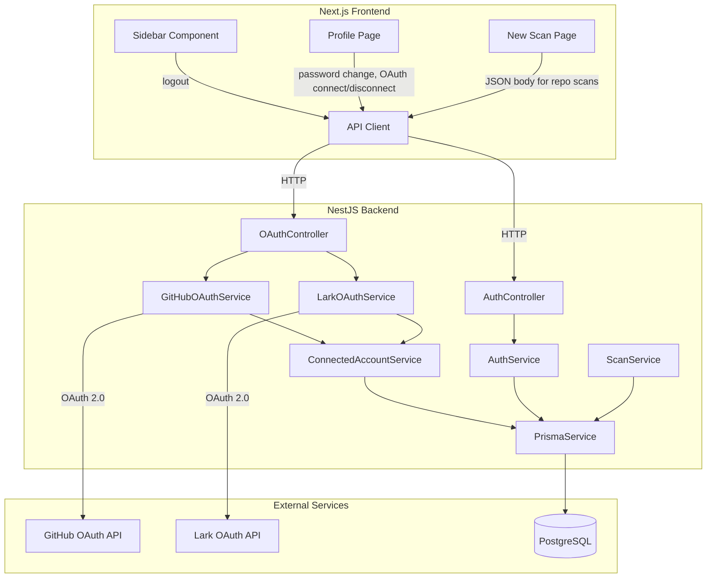

# Design Document: User Experience & OAuth

## Overview

This feature addresses six areas of the SlopShield AI platform: adding a logout button to the UI sidebar, building a user profile/settings page, fixing the git repository scan 400 error (wrong content type from frontend), fixing demo sample failures in production (incorrect path resolution), implementing GitHub OAuth for private repository access, and implementing Lark OAuth for company notifications.

The design maintains the existing architectural patterns — NestJS modules on the backend with Prisma for data access, Next.js pages/components on the frontend communicating via the existing `apiClient` fetch wrapper.

## Architecture



## Components and Interfaces

### Backend Components

#### 1. AuthController (Extended)

New endpoint added to the existing `apps/api/src/auth/auth.controller.ts`:

```typescript
@UseGuards(JwtAuthGuard)
@Put('password')
async changePassword(@Req() req, @Body() body: ChangePasswordDto): Promise<AuthTokenPairResponse>
```

#### 2. AuthService (Extended)

New method in `apps/api/src/auth/auth.service.ts`:

```typescript
async changePassword(userId: string, currentPassword: string, newPassword: string): Promise<{ accessToken: string; refreshToken: string }>
```

Logic:
1. Fetch user by ID
2. Verify `currentPassword` against stored hash using argon2
3. If verification fails → throw `UnauthorizedException("Current password is incorrect")`
4. Hash `newPassword` with argon2
5. Update user record with new hash
6. Revoke all existing refresh tokens for the user (`revokedAt = new Date()`)
7. Issue and return a fresh token pair

#### 3. OAuthController (New Module)

Location: `apps/api/src/oauth/oauth.controller.ts`

```typescript
@Controller('oauth')
export class OAuthController {
  @UseGuards(JwtAuthGuard)
  @Get('github/authorize')
  getGitHubAuthUrl(@Req() req): { url: string }

  @Get('github/callback')
  handleGitHubCallback(@Query('code') code: string, @Query('state') state: string): RedirectResponse

  @UseGuards(JwtAuthGuard)
  @Delete('github/disconnect')
  disconnectGitHub(@Req() req): { success: boolean }

  @UseGuards(JwtAuthGuard)
  @Get('github/repos')
  listGitHubRepos(@Req() req): GitHubRepo[]

  @UseGuards(JwtAuthGuard)
  @Get('lark/authorize')
  getLarkAuthUrl(@Req() req): { url: string }

  @Get('lark/callback')
  handleLarkCallback(@Query('code') code: string, @Query('state') state: string): RedirectResponse

  @UseGuards(JwtAuthGuard)
  @Delete('lark/disconnect')
  disconnectLark(@Req() req): { success: boolean }
}
```

#### 4. GitHubOAuthService (New)

Location: `apps/api/src/oauth/github-oauth.service.ts`

Responsibilities:
- Generate GitHub authorization URL with `repo` and `read:user` scopes plus CSRF state
- Exchange authorization code for access token via `POST https://github.com/login/oauth/access_token`
- Fetch GitHub user profile via `GET https://api.github.com/user`
- List user repositories via `GET https://api.github.com/user/repos`
- Store/delete Connected_Account records via ConnectedAccountService

State parameter is stored temporarily in a server-side cache (Redis via BullMQ's existing connection) keyed by `oauth:state:{stateValue}` with a 10-minute TTL containing the userId.

#### 5. LarkOAuthService (New)

Location: `apps/api/src/oauth/lark-oauth.service.ts`

Responsibilities:
- Generate Lark authorization URL with required scopes and CSRF state
- Exchange authorization code for access + refresh tokens via Lark's token endpoint
- Fetch Lark user identity
- Handle token refresh when access token expires
- Store/delete Connected_Account records via ConnectedAccountService

#### 6. ConnectedAccountService (New)

Location: `apps/api/src/oauth/connected-account.service.ts`

```typescript
@Injectable()
export class ConnectedAccountService {
  async create(data: CreateConnectedAccountInput): Promise<ConnectedAccount>
  async findByUserAndProvider(userId: string, provider: string): Promise<ConnectedAccount | null>
  async findAllByUser(userId: string): Promise<ConnectedAccountDisplay[]>
  async disconnect(userId: string, provider: string): Promise<void>
  async markDisconnected(userId: string, provider: string): Promise<void>
  async getDecryptedToken(userId: string, provider: string): Promise<{ accessToken: string; refreshToken?: string }>
}
```

Token encryption uses Node.js `crypto.createCipheriv` with AES-256-GCM. The encryption key is sourced from the `OAUTH_ENCRYPTION_KEY` environment variable (32 bytes, hex-encoded). The IV is randomly generated per encryption and stored alongside the ciphertext.

#### 7. ScanService (Bug Fixes)

**Demo samples fix**: Change the path resolution from `path.join(process.cwd(), "demo-samples", demoId)` to use `path.join(__dirname, '../../demo-samples', demoId)` with a fallback to `process.cwd()` for development. The `nest-cli.json` compiler options will include `demo-samples` as an asset to copy into `dist/`.

**Repository scan fix**: No backend change needed — the backend already handles JSON bodies. The bug is in the frontend sending FormData for repo scans.

### Frontend Components

#### 8. Sidebar (Updated)

Location: `apps/web/src/components/layout/sidebar.tsx`

Changes:
- Fetch authenticated user data via the existing `useMe()` hook
- Display real user name and email in the footer section (replacing hardcoded "Developer" / "dev@example.com")
- Add a logout button (using the `LogOut` icon already imported) that calls the backend logout endpoint with the stored refresh token, clears localStorage, and redirects to `/auth/login`
- On network failure during logout, still clear tokens and redirect (graceful degradation)

#### 9. Profile Page (New)

Location: `apps/web/src/app/profile/page.tsx`

Sections:
- **Account Info**: Display name, email, role, creation date (from `GET /auth/me`)
- **Change Password**: Form with current password, new password, confirm password fields
- **Connected Accounts**: Show GitHub and Lark connection status with Connect/Disconnect buttons

#### 10. New Scan Page (Bug Fix)

Location: `apps/web/src/app/scans/new/page.tsx`

Fix: The `repo` tab currently sends a plain object through `createScanMutation.mutateAsync(body)`. The `apiClient.post` already sends plain objects as JSON (the `Content-Type: application/json` header is set when body is not FormData). The issue is confirmed to be on the frontend correctly — the current code already sends JSON for repo scans. 

After re-reading the code: the frontend code for the `repo` tab constructs a plain object (not FormData), and `apiClient.post` sends it as JSON. The 400 error is likely caused by the Zod schema validation on the backend which assembles the body from `body.sourceRef` — but in the controller, the `assembled` object reads `body.sourceRef` which would be `undefined` if the JSON body key doesn't match what the controller expects. Looking at the controller, it reads `body.sourceRef` directly — this should work for JSON bodies. The actual issue may be that the scan controller uses `FileInterceptor('file')` which expects `multipart/form-data` and may not properly parse JSON bodies when the interceptor is active.

**Root cause**: The `@UseInterceptors(FileInterceptor("file"))` on the `createScan` endpoint forces multer to attempt multipart parsing. When a JSON body arrives, multer may still consume the request stream, causing `body` fields to be empty strings or undefined.

**Fix**: Conditionally apply the file interceptor, or create a separate endpoint for file uploads, or use a custom interceptor that only activates multer when `Content-Type` is `multipart/form-data`. The cleanest approach: modify the frontend to always use FormData for all scan types (consistent with how the controller already parses it), OR modify the controller to handle both content types properly.

**Chosen approach**: The simplest fix aligning with the requirements is to ensure the frontend sends repo scans as JSON and the backend handles both formats. Since the controller already has logic to assemble from `body` fields (which works for both parsed multipart and JSON), the actual fix is ensuring the NestJS `FileInterceptor` doesn't interfere with JSON requests. We'll add a custom guard/interceptor that only activates multer when the request Content-Type is multipart. Alternatively, we remove the interceptor and use a middleware that conditionally applies multer.

**Pragmatic fix**: Create a conditional file interceptor that skips multer processing when Content-Type is `application/json`.

## Data Models

### ConnectedAccount (New Prisma Model)

```prisma
model ConnectedAccount {
  id                String    @id @default(uuid())
  userId            String    @map("user_id")
  provider          String    // "github" | "lark"
  providerAccountId String    @map("provider_account_id")
  accessToken       String    @map("access_token")   // AES-256-GCM encrypted
  refreshToken      String?   @map("refresh_token")  // AES-256-GCM encrypted
  tokenExpiresAt    DateTime? @map("token_expires_at")
  displayName       String    @map("display_name")
  status            String    @default("connected")  // "connected" | "disconnected"
  createdAt         DateTime  @default(now()) @map("created_at")
  updatedAt         DateTime  @updatedAt @map("updated_at")

  user User @relation(fields: [userId], references: [id], onDelete: Cascade)

  @@unique([userId, provider])
  @@index([userId])
  @@map("connected_accounts")
}
```

The `User` model gains a new relation:

```prisma
connectedAccounts ConnectedAccount[]
```

### ChangePasswordDto

```typescript
import { z } from 'zod';

export const ChangePasswordSchema = z.object({
  currentPassword: z.string().min(1, 'Current password is required'),
  newPassword: z.string().min(8, 'New password must be at least 8 characters'),
});

export type ChangePasswordDto = z.infer<typeof ChangePasswordSchema>;
```

### ConnectedAccountDisplay (API Response Type)

```typescript
interface ConnectedAccountDisplay {
  provider: string;       // "github" | "lark"
  displayName: string;
  status: string;         // "connected" | "disconnected"
  createdAt: string;      // ISO-8601
}
```

### Environment Variables (New)

| Variable | Purpose | Required |
|----------|---------|----------|
| `GITHUB_OAUTH_CLIENT_ID` | GitHub OAuth App client ID | For GitHub OAuth |
| `GITHUB_OAUTH_CLIENT_SECRET` | GitHub OAuth App client secret | For GitHub OAuth |
| `GITHUB_OAUTH_CALLBACK_URL` | Callback URL for GitHub OAuth | For GitHub OAuth |
| `LARK_OAUTH_APP_ID` | Lark OAuth App ID | For Lark OAuth |
| `LARK_OAUTH_APP_SECRET` | Lark OAuth App Secret | For Lark OAuth |
| `LARK_OAUTH_CALLBACK_URL` | Callback URL for Lark OAuth | For Lark OAuth |
| `OAUTH_ENCRYPTION_KEY` | 32-byte hex key for AES-256-GCM token encryption | For any OAuth |

## Correctness Properties

*A property is a characteristic or behavior that should hold true across all valid executions of a system — essentially, a formal statement about what the system should do. Properties serve as the bridge between human-readable specifications and machine-verifiable correctness guarantees.*

### Property 1: Password verification gate

*For any* user with a stored password hash and *for any* candidate current password, the password change operation SHALL succeed if and only if `argon2.verify(storedHash, candidatePassword)` returns true.

**Validates: Requirements 2.3, 8.2, 8.3**

### Property 2: Token revocation on password change

*For any* user with N existing non-revoked refresh tokens (where N ≥ 0), after a successful password change, all N refresh tokens SHALL have a non-null `revokedAt` timestamp.

**Validates: Requirements 2.5, 8.5**

### Property 3: Password hash round-trip

*For any* valid new password string (≥ 8 characters), after a successful password change, `argon2.verify(updatedHash, newPassword)` SHALL return true.

**Validates: Requirements 8.4**

### Property 4: Password change returns valid token pair

*For any* successful password change, the response SHALL contain an `accessToken` that decodes to a valid JWT with the user's `sub` claim, and a `refreshToken` whose `jti` exists in the RefreshToken table with a null `revokedAt`.

**Validates: Requirements 8.6**

### Property 5: OAuth URL generation contains scopes and state

*For any* OAuth provider (GitHub or Lark) and *for any* authenticated user, the generated authorization URL SHALL contain all required scopes for that provider and a non-empty, cryptographically random state parameter.

**Validates: Requirements 5.2, 6.2**

### Property 6: Connected_Account stores all fields with encrypted tokens

*For any* valid Connected_Account creation input (userId, provider, providerAccountId, accessToken, refreshToken, displayName), the persisted database record SHALL contain all required fields and the stored `accessToken` and `refreshToken` values SHALL differ from the plaintext input (demonstrating encryption).

**Validates: Requirements 7.1, 7.3**

### Property 7: Connected_Account unique constraint per user per provider

*For any* user and *for any* provider, attempting to create a second Connected_Account with the same (userId, provider) pair SHALL be rejected with a unique constraint violation.

**Validates: Requirements 7.2**

### Property 8: Connected_Account display never exposes tokens

*For any* Connected_Account record in the database, the display/list response SHALL contain only `provider`, `displayName`, `status`, and `createdAt` — and SHALL NOT contain `accessToken`, `refreshToken`, `providerAccountId`, or `tokenExpiresAt`.

**Validates: Requirements 7.4**

## Error Handling

### Backend Error Responses

| Scenario | HTTP Status | Message |
|----------|-------------|---------|
| Password change with wrong current password | 401 | "Current password is incorrect" |
| Password change without auth | 401 | "Unauthorized" |
| New password too short (<8 chars) | 400 | Zod validation error |
| OAuth callback with invalid/expired state | 400 | "Invalid or expired OAuth state parameter" |
| OAuth callback with failed code exchange | 502 | "Failed to exchange authorization code with provider" |
| GitHub token expired when listing repos | 401 | "GitHub connection expired. Please reconnect." |
| Lark token refresh failed | 401 | "Lark connection expired. Please reconnect." |
| Disconnect non-existent connection | 404 | "No connected account found for this provider" |
| Demo sample not found (production path) | 400 | "Demo sample folder {id} not found" |
| Repository scan with empty URL | 400 | "A repository URL is required for sourceType: \"repository\"" |

### Frontend Error Handling

- **Logout failure**: Gracefully degrades — clears local tokens and redirects regardless of API response
- **Profile fetch failure**: Shows error state with retry button
- **Password change failure**: Displays error message inline in form
- **OAuth connection failure**: Shows toast notification with error details and option to retry
- **OAuth popup blocked**: Detects blocked popup and shows instruction to allow popups

### Token Encryption Errors

- If `OAUTH_ENCRYPTION_KEY` is missing at startup, the OAuth module logs a warning and disables OAuth features (returns 503 on OAuth endpoints)
- If decryption fails (corrupted data, wrong key), the ConnectedAccountService marks the account as `disconnected` and returns a 401 prompting reconnection

## Testing Strategy

### Unit Tests (Example-Based)

- **Sidebar**: Render with mocked user data, verify logout button present, verify user info displayed
- **Profile page**: Render with various states (no connections, one connection, both connections)
- **Password change form**: Validation states (empty, too short, mismatch)
- **Scan page fix**: Verify repo tab sends JSON (not FormData)
- **Demo samples path**: Verify path resolution in test environment

### Property-Based Tests (fast-check)

The project already uses `fast-check` (in devDependencies). Each property test runs a minimum of 100 iterations.

| Property | Test File | Tag |
|----------|-----------|-----|
| Property 1: Password verification gate | `auth.service.spec.ts` | Feature: user-experience-and-oauth, Property 1: Password verification gate |
| Property 2: Token revocation on password change | `auth.service.spec.ts` | Feature: user-experience-and-oauth, Property 2: Token revocation on password change |
| Property 3: Password hash round-trip | `auth.service.spec.ts` | Feature: user-experience-and-oauth, Property 3: Password hash round-trip |
| Property 4: Password change returns valid token pair | `auth.service.spec.ts` | Feature: user-experience-and-oauth, Property 4: Password change returns valid token pair |
| Property 5: OAuth URL generation | `oauth.service.spec.ts` | Feature: user-experience-and-oauth, Property 5: OAuth URL generation contains scopes and state |
| Property 6: Connected_Account encryption | `connected-account.service.spec.ts` | Feature: user-experience-and-oauth, Property 6: Connected_Account stores all fields with encrypted tokens |
| Property 7: Unique constraint | `connected-account.service.spec.ts` | Feature: user-experience-and-oauth, Property 7: Connected_Account unique constraint per user per provider |
| Property 8: No token exposure | `connected-account.service.spec.ts` | Feature: user-experience-and-oauth, Property 8: Connected_Account display never exposes tokens |

### Integration Tests

- GitHub OAuth flow with mocked GitHub API responses
- Lark OAuth flow with mocked Lark API responses
- Full password change flow (login → change password → old tokens rejected → new tokens work)
- Repository scan creation with JSON body through the FileInterceptor
- Demo sample scan in production-like environment (files in dist/)

### Test Configuration

- Property tests: minimum 100 iterations via `fc.assert(fc.property(...), { numRuns: 100 })`
- Integration tests: use `@nestjs/testing` module with mocked external HTTP calls
- Frontend tests: use `@testing-library/react` with mocked `apiClient`
