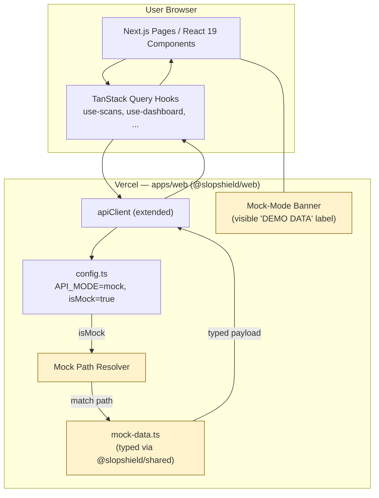
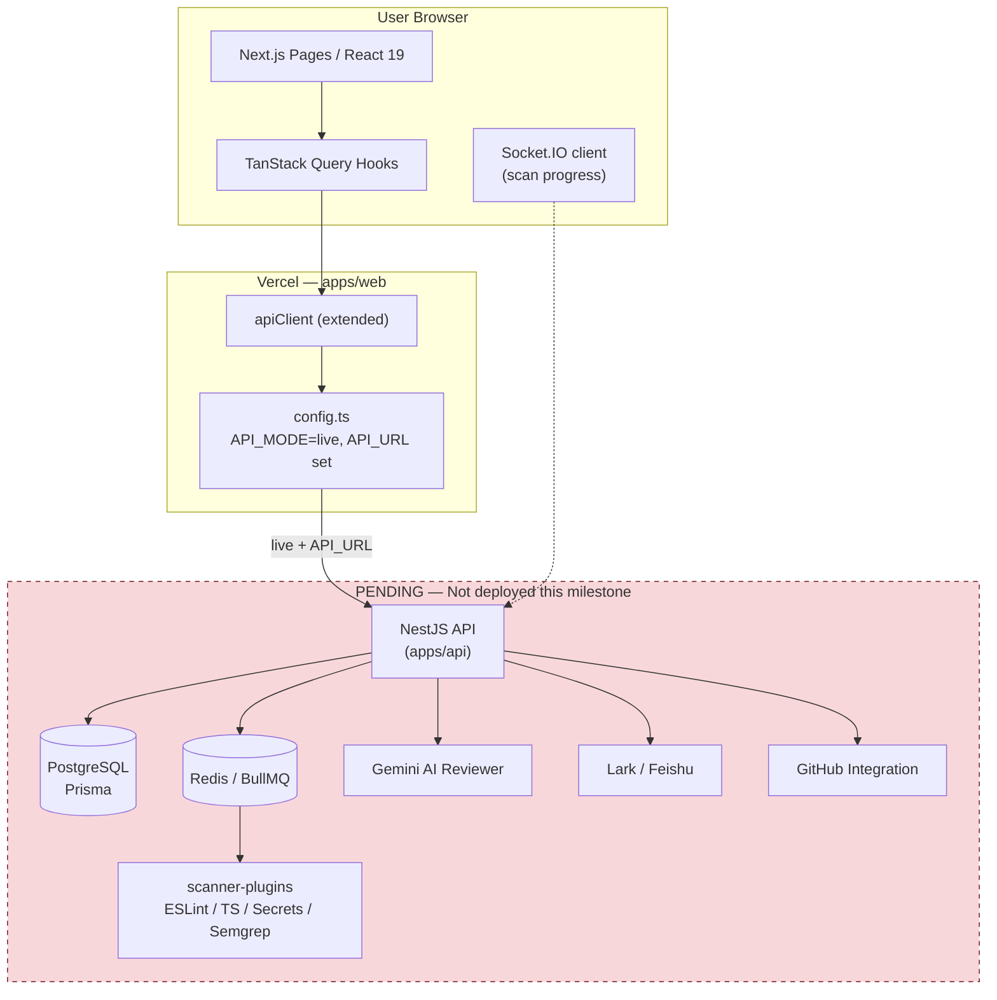
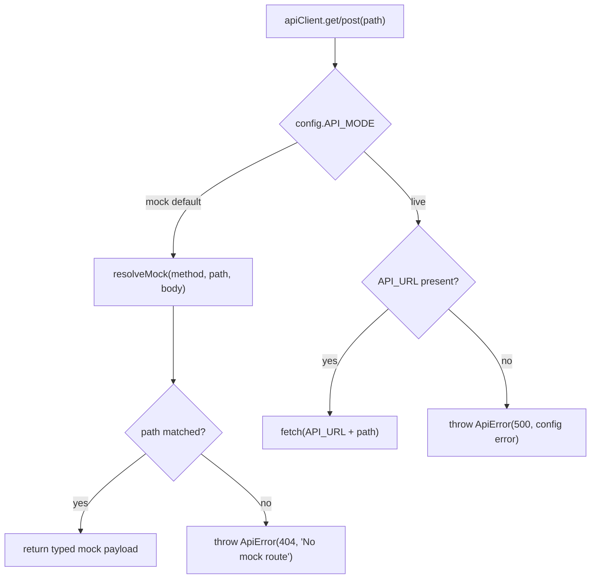

# Design Document: vercel-fast-deploy

## Overview

This feature ships the SlopShield AI frontend (`apps/web`) to Vercel **fast and safely**, well before the NestJS backend, PostgreSQL, Redis/BullMQ, Socket.IO, scanners, Gemini, and Lark integrations are deployed. The web app must render every page — home, dashboard, scans, scan detail, projects, rules, settings, auth — using clearly labeled **mock/demo data** when no backend is configured, and transparently switch to the **real backend** when `NEXT_PUBLIC_API_MODE=live` and `NEXT_PUBLIC_API_URL` are set.

The strategy is to introduce a thin, additive layer in front of the _existing_ `apiClient` rather than rewriting it. A new **config module** (`config.ts`) decides the runtime mode. A new **mock data module** (`mock-data.ts`) supplies demo payloads typed against `@slopshield/shared`. The existing `apiClient` is extended with a **mock-routing resolver** that matches the REST-style paths TanStack Query hooks already use (`/scans?page=1&limit=10`, `/scans/:id`, `/dashboard/summary`, etc.) and resolves them from `mock-data` without ever touching the network. In live mode the client keeps its current `fetch`-based behavior.

The guiding constraints: the build must never fail because backend env vars are missing (default mode is `mock`), no hardcoded production URLs, mock mode must be visibly labeled so nobody mistakes it for production readiness, and the long-term production architecture (NestJS + Postgres + Redis + scanners + Gemini + Lark) is preserved in the design and explicitly marked **PENDING** for a later milestone.

---

## Architecture

High-level architecture for both runtime modes.

### Mock Mode (this milestone — what actually deploys)

In mock mode the entire stack lives inside the Vercel-hosted Next.js app. No network egress to a backend occurs; the API client short-circuits to the in-memory mock store.



### Live Mode (configured later — production target)

When `NEXT_PUBLIC_API_MODE=live`, the same `apiClient` surface forwards REST calls to the deployed NestJS API. Everything to the right of the API boundary is **PENDING** after this milestone.



### Mode-Selection Decision Flow



---

## Components and Interfaces

### Component 1: Config Module (`apps/web/src/lib/config.ts`) — NEW

**Purpose**: Single source of truth for runtime mode and app metadata, derived from `NEXT_PUBLIC_*` env vars at build time. Pure module, no side effects, safe to import anywhere (client or server component).

**Interface**:

```typescript
export type ApiMode = "mock" | "live";

export interface AppConfig {
  /** Resolved mode; defaults to "mock" when unset/invalid. */
  readonly apiMode: ApiMode;
  /** true when apiMode === "mock". Convenience flag for UI + client. */
  readonly isMock: boolean;
  /** Backend base URL. Empty string when not configured. */
  readonly apiUrl: string;
  /** Display name for headers / titles. */
  readonly appName: string;
}

export const config: AppConfig;

/** Throws a descriptive error if live mode is selected without a URL. */
export function assertLiveConfig(c?: AppConfig): void;
```

**Responsibilities**:

- Read `NEXT_PUBLIC_API_MODE` (default `"mock"`), `NEXT_PUBLIC_API_URL` (default `""`), `NEXT_PUBLIC_APP_NAME` (default `"SlopShield AI"`).
- Normalize/validate the mode; any value other than `"live"` resolves to `"mock"`.
- Never throw at import time so the build can never break on missing env vars.

### Component 2: Mock Data Module (`apps/web/src/lib/mock-data.ts`) — NEW

**Purpose**: In-memory, deterministic demo dataset typed against `@slopshield/shared`. Powers every page when `isMock` is true.

**Interface**:

```typescript
export const mockScanJobs: ScanJob[];
export const mockFindingsByScanId: Record<string, Finding[]>;
export const mockCategoryScoresByScanId: Record<string, CategoryScores>;
export const mockScanScoreByScanId: Record<string, ScanScore>;

export const mockDashboardSummary: DashboardSummary;
export const mockDashboardTrends: DashboardTrendPoint[];
export const mockDashboardTopIssues: TopIssue[];
export const mockDashboardStandards: StandardCompliance[];

export const mockProjects: Project[];
export const mockRules: Rule[];
export const mockNotificationSettings: NotificationSettings;
export const mockLarkCardPreview: LarkScanSummary;
export const mockMe: DemoUser;
```

**Responsibilities**:

- Provide at least 3–5 scan jobs spanning statuses (`completed`, `failed`, `scanning`, `queued`) and verdicts (`passed`, `needs-cleanup`, `blocked`).
- Provide findings across severities/categories that reference the shared enums, so dashboard aggregates are internally consistent.
- Provide a `LarkScanSummary` preview payload validated by `LarkScanSummarySchema`.
- Be pure data — no functions with side effects, no `Date.now()` at module scope that would break SSR determinism (use fixed ISO timestamps).

### Component 3: Extended API Client (`apps/web/src/lib/api-client.ts`) — MODIFIED

**Purpose**: Keep the **exact public surface** hooks depend on (`apiClient.get/post/patch/delete`, `ApiError`) while routing to mock data in mock mode.

**Interface (unchanged public surface)**:

```typescript
export class ApiError extends Error {
  /* unchanged */
}

export const apiClient: {
  get<T>(path: string): Promise<T>;
  post<T>(path: string, body?: unknown): Promise<T>;
  patch<T>(path: string, body?: unknown): Promise<T>;
  delete<T>(path: string): Promise<T>;
};
```

**Responsibilities**:

- In mock mode: delegate to `resolveMock(method, path, body)` and return the typed payload (with a small artificial delay to mimic latency for loading states). Never call `fetch`.
- In live mode: existing `fetch` behavior, but `BASE_URL` now comes from `config.apiUrl`; call `assertLiveConfig()` first so a missing URL surfaces a clear `ApiError` instead of fetching a malformed URL.
- Preserve auth-header attachment, `204` handling, and `ApiError` throwing semantics.

### Component 4: Mock Path Resolver (`apps/web/src/lib/mock-resolver.ts`) — NEW (internal)

**Purpose**: Map REST-style request paths to mock payloads using ordered pattern matching, so hooks need **no changes**.

**Interface**:

```typescript
export interface MockRoute {
  method: "GET" | "POST" | "PATCH" | "DELETE";
  /** Pattern with :params, matched against the pathname (query stripped). */
  pattern: string;
  resolve(ctx: MockMatchContext): unknown;
}

export interface MockMatchContext {
  params: Record<string, string>; // e.g. { id: "scan_001" }
  query: URLSearchParams; // e.g. page, limit, projectId, status
  body?: unknown;
}

export function resolveMock<T>(method: string, path: string, body?: unknown): T;
```

**Responsibilities**:

- Split `path` into pathname + query string.
- Find the first `MockRoute` whose method + pattern matches; extract `:params`.
- Apply query params (pagination/filtering) to shape the response (e.g. paginate `/scans`).
- Throw `ApiError(404, "No mock route for METHOD path")` when nothing matches, so gaps are obvious during development.

### Component 5: Mock-Mode Banner (`apps/web/src/components/mock-mode-banner.tsx`) — NEW

**Purpose**: Honest labeling. A persistent, visible banner ("Demo data — backend not connected") rendered in the app layout whenever `config.isMock` is true. Prevents anyone from mistaking the deploy for production.

**Responsibilities**:

- Render nothing in live mode.
- Render a non-dismissible (or session-dismissible) banner with clear demo-mode copy in mock mode.

---

## Data Models

Mock data shapes. Shared types are reused directly from `@slopshield/shared` (`ScanJob`, `Finding`, `CategoryScores`, `ScanScore`, `LarkScanSummary`, `Rule`, plus their Zod schemas). Dashboard and a few UI-only shapes have no shared schema yet, so this milestone defines lightweight **frontend-local** types in `mock-data.ts` (to be reconciled with backend DTOs in the live milestone).

### Reused from `@slopshield/shared`

| Type                          | Source schema       | Used by                  |
| ----------------------------- | ------------------- | ------------------------ |
| `ScanJob`                     | `scan.schema.ts`    | `/scans`, `/scans/:id`   |
| `Finding`                     | `finding.schema.ts` | `/scans/:id/findings`    |
| `CategoryScores`, `ScanScore` | `score.schema.ts`   | scan detail score panels |
| `LarkScanSummary`             | `lark.schema.ts`    | Lark card preview        |
| `Rule`                        | `rule.schema.ts`    | `/rules`                 |

### Frontend-local mock shapes (no shared schema yet — PENDING reconciliation)

```typescript
/** GET /scans — paginated envelope returned to useScans(). */
interface PaginatedScans {
  data: ScanJob[];
  page: number;
  limit: number;
  total: number;
}

/** GET /dashboard/summary */
interface DashboardSummary {
  totalScans: number;
  averageScore: number; // 0–100
  blockedCount: number;
  openFindings: number;
  scansByVerdict: Record<string, number>; // keyed by ScanStatusResult
}

/** GET /dashboard/trends — one point per day. */
interface DashboardTrendPoint {
  date: string; // ISO date
  averageScore: number; // 0–100
  scanCount: number;
}

/** GET /dashboard/top-issues */
interface TopIssue {
  title: string;
  category: FindingCategory; // from shared
  severity: FindingSeverity; // from shared
  count: number;
}

/** GET /dashboard/standards */
interface StandardCompliance {
  standard: string; // e.g. "OWASP A01:2021"
  passed: number;
  failed: number;
}

/** GET /projects */
interface Project {
  id: string;
  name: string;
  repositoryUrl?: string;
  createdAt: string;
}

/** GET /users/notifications */
interface NotificationSettings {
  larkEnabled: boolean;
  emailEnabled: boolean;
  notifyOnBlocked: boolean;
}

/** GET /auth/me */
interface DemoUser {
  id: string;
  name: string;
  email: string;
  role: string;
}
```

**Validation rules**:

- Every `ScanJob`, `Finding`, `ScanScore`, `LarkScanSummary` literal must `.parse()` cleanly against its shared Zod schema (enforced by a unit test).
- Dashboard aggregates must be internally consistent with the mock scans/findings (e.g. `totalScans === mockScanJobs.length`).
- All timestamps are fixed ISO strings (no runtime clock) for SSR determinism.

---

## Low-Level Design

Language: **TypeScript** (matches the existing `apps/web` codebase). Paths use the real `apps/web/src/*` layout and the `@/*` alias.

### `apps/web/src/lib/config.ts`

```typescript
export type ApiMode = "mock" | "live";

export interface AppConfig {
  readonly apiMode: ApiMode;
  readonly isMock: boolean;
  readonly apiUrl: string;
  readonly appName: string;
}

function resolveMode(raw: string | undefined): ApiMode {
  // Anything that isn't explicitly "live" falls back to the safe default.
  return raw?.trim().toLowerCase() === "live" ? "live" : "mock";
}

const apiMode = resolveMode(process.env.NEXT_PUBLIC_API_MODE);

export const config: AppConfig = {
  apiMode,
  isMock: apiMode === "mock",
  apiUrl: (process.env.NEXT_PUBLIC_API_URL ?? "").trim(),
  appName: (process.env.NEXT_PUBLIC_APP_NAME ?? "SlopShield AI").trim(),
};

/**
 * Guard called by the API client before any live request.
 * Never invoked in mock mode, so it cannot break the demo build.
 */
export function assertLiveConfig(c: AppConfig = config): void {
  if (c.apiMode === "live" && c.apiUrl.length === 0) {
    throw new Error(
      "[config] API_MODE=live but NEXT_PUBLIC_API_URL is not set. " +
        "Set NEXT_PUBLIC_API_URL to the deployed API base URL, or use API_MODE=mock.",
    );
  }
}
```

**Preconditions**: none (pure read of `process.env`).
**Postconditions**: `config` is fully populated; `apiMode` is always a valid `ApiMode`; importing the module never throws.

### `apps/web/src/lib/mock-resolver.ts`

```typescript
import { ApiError } from "./api-client";
import * as mock from "./mock-data";

export interface MockMatchContext {
  params: Record<string, string>;
  query: URLSearchParams;
  body?: unknown;
}

interface MockRoute {
  method: "GET" | "POST" | "PATCH" | "DELETE";
  pattern: string; // e.g. "/scans/:id/findings"
  resolve(ctx: MockMatchContext): unknown;
}

/** Compile "/scans/:id" -> regex + ordered param names. */
function compile(pattern: string): { re: RegExp; keys: string[] } {
  const keys: string[] = [];
  const re = new RegExp(
    "^" +
      pattern.replace(/:[^/]+/g, (m) => {
        keys.push(m.slice(1));
        return "([^/]+)";
      }) +
      "$",
  );
  return { re, keys };
}

const routes: MockRoute[] = [
  {
    method: "GET",
    pattern: "/scans",
    resolve: ({ query }) => {
      const page = Number(query.get("page") ?? "1");
      const limit = Number(query.get("limit") ?? "10");
      const projectId = query.get("projectId") ?? undefined;
      const status = query.get("status") ?? undefined;
      let rows = mock.mockScanJobs;
      if (projectId) rows = rows.filter((s) => s.projectId === projectId);
      if (status) rows = rows.filter((s) => s.status === status);
      const start = (page - 1) * limit;
      return {
        data: rows.slice(start, start + limit),
        page,
        limit,
        total: rows.length,
      };
    },
  },
  {
    method: "GET",
    pattern: "/scans/:id",
    resolve: ({ params }) => {
      const job = mock.mockScanJobs.find((s) => s.id === params.id);
      if (!job) throw new ApiError(404, "Scan not found");
      return job;
    },
  },
  {
    method: "GET",
    pattern: "/scans/:id/findings",
    resolve: ({ params, query }) => {
      let rows = mock.mockFindingsByScanId[params.id] ?? [];
      const category = query.get("category");
      const severity = query.get("severity");
      if (category) rows = rows.filter((f) => f.category === category);
      if (severity) rows = rows.filter((f) => f.severity === severity);
      return rows;
    },
  },
  {
    method: "POST",
    pattern: "/scans",
    resolve: ({ body }) => createMockScan(body),
  },
  {
    method: "POST",
    pattern: "/scans/:id/cancel",
    resolve: ({ params }) => cancelMockScan(params.id),
  },

  {
    method: "GET",
    pattern: "/dashboard/summary",
    resolve: () => mock.mockDashboardSummary,
  },
  {
    method: "GET",
    pattern: "/dashboard/trends",
    resolve: () => mock.mockDashboardTrends,
  },
  {
    method: "GET",
    pattern: "/dashboard/top-issues",
    resolve: () => mock.mockDashboardTopIssues,
  },
  {
    method: "GET",
    pattern: "/dashboard/standards",
    resolve: () => mock.mockDashboardStandards,
  },

  { method: "GET", pattern: "/projects", resolve: () => mock.mockProjects },
  {
    method: "GET",
    pattern: "/projects/:id",
    resolve: ({ params }) => findOr404(mock.mockProjects, params.id),
  },

  { method: "GET", pattern: "/rules", resolve: () => mock.mockRules },
  { method: "GET", pattern: "/auth/me", resolve: () => mock.mockMe },
  {
    method: "GET",
    pattern: "/users/notifications",
    resolve: () => mock.mockNotificationSettings,
  },
];

export function resolveMock<T>(
  method: string,
  path: string,
  body?: unknown,
): T {
  const [pathname, qs = ""] = path.split("?");
  const query = new URLSearchParams(qs);

  for (const route of routes) {
    if (route.method !== method) continue;
    const { re, keys } = compile(route.pattern);
    const m = re.exec(pathname);
    if (!m) continue;
    const params: Record<string, string> = {};
    keys.forEach((k, i) => (params[k] = decodeURIComponent(m[i + 1])));
    return route.resolve({ params, query, body }) as T;
  }

  // Mutations we don't model yet succeed as no-ops so demo flows don't crash.
  if (method !== "GET") return undefined as T;

  throw new ApiError(404, `No mock route for ${method} ${pathname}`);
}
```

**Preconditions**: `path` is a REST-style path beginning with `/` (optionally with a query string).
**Postconditions**: returns a typed mock payload for a matched route; throws `ApiError(404, ...)` for unmatched GETs; never performs network I/O.
**Loop invariant**: at each iteration the first matching `(method, pattern)` route wins; route order encodes precedence (more specific patterns are listed before broader ones where they could overlap).

### `apps/web/src/lib/api-client.ts` (modified)

```typescript
import { config, assertLiveConfig } from "./config";
import { resolveMock } from "./mock-resolver";

export class ApiError extends Error {
  constructor(
    public readonly statusCode: number,
    message: string,
    public readonly error?: string,
  ) {
    super(message);
    this.name = "ApiError";
  }
}

/** Mimic network latency so loading skeletons render in demo mode. */
function delay(ms = 150): Promise<void> {
  return new Promise((resolve) => setTimeout(resolve, ms));
}

async function request<T>(
  method: string,
  path: string,
  body?: unknown,
): Promise<T> {
  // ---- Mock mode: never hit the network ----
  if (config.isMock) {
    await delay();
    return resolveMock<T>(method, path, body);
  }

  // ---- Live mode: surface a clear config error before fetching ----
  assertLiveConfig(); // throws if API_URL missing

  const headers: Record<string, string> = {};
  const isFormData =
    typeof globalThis.window !== "undefined" && body instanceof FormData;
  if (!isFormData) headers["Content-Type"] = "application/json";

  if (typeof globalThis.window !== "undefined") {
    const token = localStorage.getItem("slopshield_token");
    if (token) headers["Authorization"] = `Bearer ${token}`;
  }

  const serializedBody =
    body === undefined
      ? undefined
      : isFormData
        ? (body as BodyInit)
        : JSON.stringify(body);

  const res = await fetch(`${config.apiUrl}${path}`, {
    method,
    headers,
    body: serializedBody,
  });

  if (res.status === 204) return undefined as T;
  const json = await res.json().catch(() => null);
  if (!res.ok) {
    throw new ApiError(
      res.status,
      json?.message ?? res.statusText,
      json?.error ?? undefined,
    );
  }
  return json as T;
}

export const apiClient = {
  get<T>(path: string): Promise<T> {
    return request<T>("GET", path);
  },
  post<T>(path: string, body?: unknown): Promise<T> {
    return request<T>("POST", path, body);
  },
  patch<T>(path: string, body?: unknown): Promise<T> {
    return request<T>("PATCH", path, body);
  },
  delete<T>(path: string): Promise<T> {
    return request<T>("DELETE", path);
  },
};
```

Note: `BASE_URL` is no longer computed at module scope; it now reads `config.apiUrl` per request. This removes the hardcoded `http://localhost:3001/api` fallback in favor of an explicit config error in live mode and pure mock resolution otherwise. The public surface (`apiClient.get/post/patch/delete`, `ApiError`) is unchanged, so existing hooks need no edits.

### Example Usage

```typescript
// hooks/use-scans.ts — UNCHANGED. Works identically in mock and live mode.
const { data } = useScans(1, 10);
// mock mode -> resolveMock("GET", "/scans?page=1&limit=10") -> PaginatedScans
// live mode -> fetch(`${config.apiUrl}/scans?page=1&limit=10`)

// app/layout.tsx — honest labeling
import { config } from "@/lib/config";
import { MockModeBanner } from "@/components/mock-mode-banner";
// ...
{config.isMock && <MockModeBanner />}
```

## Correctness Properties

The properties below are the testable invariants this design must uphold (see Testing Strategy for how each is verified):

### Property 1: No network in mock mode

When `config.isMock` is true, no request path triggers `fetch`. For all `(method, path)`, `request` resolves entirely from `resolveMock`.

**Validates: Requirements 1.1** (placeholder; requirements derived later in this design-first spec)

### Property 2: Hook surface stability

Every REST path the existing hooks emit (`/scans`, `/scans/:id`, `/scans/:id/findings`, `/dashboard/*`, `/projects`, `/projects/:id`, `/rules`, `/auth/me`, `/users/notifications`) resolves to a defined mock payload — no `404` on the happy path.

**Validates: Requirements 1.1** (placeholder; requirements derived later in this design-first spec)

### Property 3: Schema validity

All shared-typed mock literals validate against their `@slopshield/shared` Zod schemas (`ScanJobSchema`, `FindingSchema`, `ScanScoreSchema`, `LarkScanSummarySchema`, `RuleSchema`).

**Validates: Requirements 1.1** (placeholder; requirements derived later in this design-first spec)

### Property 4: Live config safety

When `apiMode === "live"` and `apiUrl === ""`, the first request throws a descriptive error and never calls `fetch` with a malformed URL.

**Validates: Requirements 1.1** (placeholder; requirements derived later in this design-first spec)

### Property 5: Build determinism

With all `NEXT_PUBLIC_*` vars unset, `config.ts` and `mock-data.ts` import without throwing and the app resolves to mock mode, so the build never breaks.

**Validates: Requirements 1.1** (placeholder; requirements derived later in this design-first spec)

---

## Error Handling

### Scenario 1: Live mode selected, `NEXT_PUBLIC_API_URL` missing

**Condition**: `NEXT_PUBLIC_API_MODE=live` but no URL provided.
**Response**: `assertLiveConfig()` throws a descriptive `Error` on the first request; TanStack Query surfaces it as an error state. The **build still succeeds** (the guard runs at request time, not import time).
**Recovery**: operator sets `NEXT_PUBLIC_API_URL` and redeploys, or reverts to `API_MODE=mock`.

### Scenario 2: Unmatched mock route (GET)

**Condition**: a hook requests a path with no mock route.
**Response**: `resolveMock` throws `ApiError(404, "No mock route for GET <path>")` — loud and obvious during development.
**Recovery**: add a `MockRoute` entry for the path.

### Scenario 3: Unmatched mock route (mutation)

**Condition**: a `POST/PATCH/DELETE` with no modeled route.
**Response**: resolver returns a no-op `undefined` so demo flows (e.g. settings save) don't crash.
**Recovery**: add an explicit route when realistic behavior is needed.

### Scenario 4: Backend env vars entirely absent (the default demo deploy)

**Condition**: clean Vercel project, only `NEXT_PUBLIC_API_MODE=mock` + `NEXT_PUBLIC_APP_NAME` set.
**Response**: app runs fully on mock data; banner shows demo mode.
**Recovery**: n/a — this is the intended fast-deploy state.

---

## Testing Strategy

### Unit Testing

- `config.ts`: mode resolution table (`undefined`/`""`/`"mock"`/`"LIVE"`/garbage → expected `apiMode`/`isMock`); `assertLiveConfig` throws only when `live` + empty URL.
- `mock-resolver.ts`: each hook path resolves to a payload of the expected shape; pagination math for `/scans`; param extraction for `/scans/:id`; query filtering for findings; `404` for an unknown GET path.
- `mock-data.ts`: every shared-typed literal `.parse()`-es against its Zod schema (`ScanJobSchema`, `FindingSchema`, `ScanScoreSchema`, `LarkScanSummarySchema`, `RuleSchema`); dashboard aggregates are consistent with the mock scan/finding set.

### Property-Based Testing

**Library**: `fast-check`.

- Generate random `(page, limit)` pairs and assert `/scans` pagination returns at most `limit` rows, never overlaps pages, and covers all rows across pages (P2 + pagination correctness).
- Generate arbitrary unmatched GET pathnames and assert `resolveMock` always throws `ApiError` with `statusCode === 404` (P1/P2 boundary).
- Generate random `category`/`severity` filters and assert every returned finding matches the filter.

### Integration Testing

- Render the dashboard and scans pages with `config.isMock = true` (React Testing Library) and assert mock content renders without any `fetch` call (spy on `globalThis.fetch` and assert zero calls — proves P1).
- Snapshot the mock-mode banner presence in mock mode and absence in live mode.

### Build Verification

- CI step: run `pnpm --filter @slopshield/web build` with **no** backend env vars set and assert exit code 0 (proves P5). Then `pnpm --filter @slopshield/web typecheck`.

---

## Vercel Deployment Design

**Project settings**

- **Root Directory**: `apps/web`
- **Framework Preset**: Next.js (auto-detected)
- **Install Command**: `pnpm install` run at the **repo root** (Vercel detects the pnpm workspace via `pnpm-lock.yaml`); do not scope install to `apps/web` or the `@slopshield/shared` workspace dependency won't resolve.
- **Build Command**: default (`next build`). Turborepo is optional here; the single-app build works directly.
- **Node**: 20.x (matches Next 15 / React 19 support).

**Environment variables (Production + Preview)**
| Key | Value | Notes |
|-----|-------|-------|
| `NEXT_PUBLIC_API_MODE` | `mock` | the safe default for this milestone |
| `NEXT_PUBLIC_APP_NAME` | `SlopShield AI` | display name |
| `NEXT_PUBLIC_API_URL` | _(unset)_ | only set when flipping to live mode later |

**Monorepo considerations**

- `@slopshield/shared` is a `workspace:*` dependency and is already declared in `next.config.ts` via `transpilePackages: ["@slopshield/shared"]`, so Next transpiles its TS source at build time — no separate prebuild of the shared package is required for the web app.
- The web app must **not** import any server-only backend code (`apps/api/*`), Prisma, Redis, or BullMQ. Mock data depends only on `@slopshield/shared` types/schemas, which are isomorphic (Zod + plain TS).
- No `apps/api` build is triggered by the Vercel project because Root Directory is scoped to `apps/web`.

---

## Out of Scope / Pending After This Milestone

The following are intentionally **not** part of this milestone. Mock mode stands in for all of them, clearly labeled as demo data:

- **NestJS API (`apps/api`) deployment** — REST endpoints behind every mocked path.
- **PostgreSQL + Prisma** — persistence, migrations, seeding.
- **Redis + BullMQ** — scan job queue and worker pipeline.
- **Socket.IO real-time** — live scan progress (`use-scan-progress.ts`); mock mode shows static/simulated progress only.
- **Scanner plugins** (`packages/scanner-plugins`) — ESLint, TS diagnostics, secret scanning, Semgrep-compatible analysis.
- **Gemini AI reviewer** — AI-generated findings and fix plans.
- **Lark / Feishu integration** — real interactive notification cards (only a static preview payload is mocked).
- **GitHub integration** — repository ingestion, PR/webhook triggers.
- **Authentication & authorization** — real login/register/JWT; mock mode returns a demo user and does not enforce auth.
- **Security hardening** — CORS, rate limiting, secrets management, production observability for the backend.
- **Live-mode end-to-end wiring** — flipping `NEXT_PUBLIC_API_MODE=live` and pointing `NEXT_PUBLIC_API_URL` at the deployed API; covered by a later milestone once the backend is live.

> Reminder: the `.kiro/steering` files (`product.md`, `tech.md`, `structure.md`, `deployment.md`) should also exist for this project. They are noted here for context but are out of scope for this design document.
